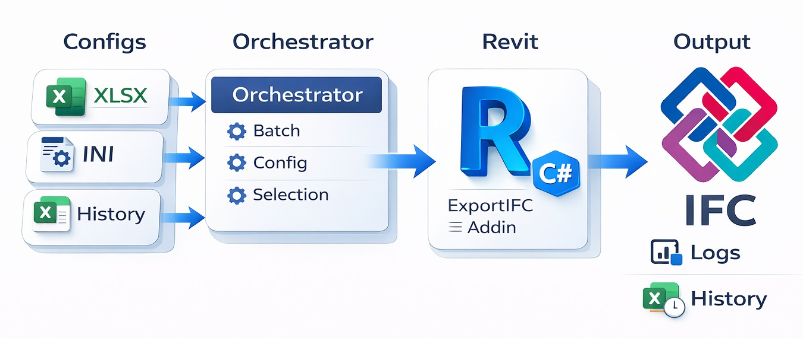
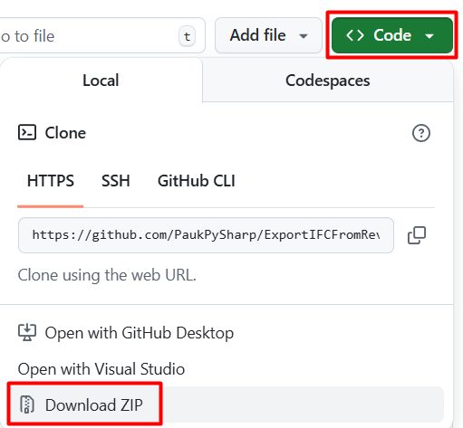

# ExportIFCFromRevit-CSharp

[](LICENSE)
[](https://github.com/PaukPySharp/ExportIFCFromRevit-CSharp/releases)
[](https://github.com/PaukPySharp/ExportIFCFromRevit-CSharp/actions/workflows/release.yml)

Пакетная выгрузка IFC из Autodesk Revit через внешний orchestrator на C#/.NET
и batch add-in для Revit.

<p align="center">
  
</p>

---

## Назначение

ExportIFCFromRevit-CSharp — это система пакетной IFC-выгрузки из Autodesk Revit,
в которой внешний orchestrator на C#/.NET управляет batch-сценарием,
а реальный экспорт выполняется через add-in внутри Revit.

Проект нужен там, где IFC должна выгружаться не вручную по одной модели,
а как повторяемый, проверяемый и управляемый процесс:
по списку моделей, по согласованным конфигам, с предсказуемыми выходными
папками, диагностикой и рабочей историей состояний.

Что делает проект особенно удобным в эксплуатации:

- отбор моделей идёт по `manage.xlsx`, `history.xlsx`
  и фактической свежести IFC на диске;
- один рабочий контур может обслуживать несколько версий Revit;
- dry-run позволяет проверить контур без запуска Revit;
- повторный экспорт можно осознанно форсировать через `history.xlsx`,
  не удаляя IFC вручную по папкам.

Это не интерактивная кнопка для единичной выгрузки из уже открытой модели.
Базовый сценарий проекта — централизованный batch-процесс, который
сопровождает BIM-координатор, BIM-администратор или разработчик.

---

## Для кого этот проект

Проект в первую очередь рассчитан на тех, кто отвечает
за настройку и устойчивую работу процесса выгрузки:

- BIM-координаторов и BIM-менеджеров;
- BIM-администраторов;
- разработчиков и тех, кто поддерживает внутренние BIM-инструменты.

Проектировщику обычно не требуется работать с репозиторием,
конфигурацией и Excel-таблицами напрямую. Для него целевой результат
намного проще: модели обрабатываются по согласованным правилам,
а IFC появляются в нужных папках без ручной рутины.

---

## С чего начать

README нужен как короткая входная точка. Дальше маршрут зависит от задачи:

- нужен первый запуск из готового релиза —
  читайте [Быстрый старт](#быстрый-старт),
  [Как запускать orchestrator](#как-запускать-orchestrator)
  и затем [основной manual](_docs/ExportIFC_manual.md);
- нужно понять эксплуатационный контур и правила отбора моделей —
  начните с [Сценария работы](#сценарий-работы),
  [Где настраивается поведение](#где-настраивается-поведение)
  и затем переходите в [основной manual](_docs/ExportIFC_manual.md);
- нужно дорабатывать проект из исходников —
  смотрите [Состав решения](#состав-решения),
  [Структуру репозитория](#структура-репозитория),
  [руководство для разработчиков](_docs/ExportIFC_developer_guide.md)
  и [README по служебным инструментам](tools/README.md).

---

## Состав решения

Решение состоит из двух основных компонентов.

### Orchestrator

Это внешнее приложение на .NET 8, которое:

- читает `_settings/settings.ini`;
- загружает `admin_data/manage.xlsx`
  и `admin_data/history/history.xlsx`;
- определяет, какие модели действительно нужно обрабатывать;
- группирует задания по версиям Revit;
- формирует batch-пакеты и служебные файлы передачи;
- запускает нужные версии Revit;
- фиксирует результаты и диагностическую информацию.

Именно orchestrator отвечает за отбор задач, маршрутизацию, запуск
и контроль общего процесса.

Исходный проект: `src/ExportIfc.Orchestrator`.

### Revit add-in

Этот компонент работает уже внутри процесса Revit и выполняет сам экспорт:

- получает подготовленный пакет заданий;
- открывает модели;
- находит заданный 3D-вид;
- применяет JSON- и TXT-конфигурации IFC;
- выполняет экспорт;
- возвращает статус обработки.

В репозитории поддерживаются две сборки add-in:

- `src/ExportIfc.RevitAddin.Net48` — для Revit 2022–2024;
- `src/ExportIfc.RevitAddin.Net8` — для Revit 2025–2026.

Общая логика находится в `src/ExportIfc.RevitAddin.Shared`.

---

## Совместимость

| Компонент | Платформа |
| --- | --- |
| Orchestrator | .NET 8 |
| Revit add-in для Revit 2022–2024 | .NET Framework 4.8 |
| Revit add-in для Revit 2025–2026 | .NET 8 |
| Рабочая ОС | Windows 10 / 11 |

---

## Ключевые возможности

- Пакетная выгрузка IFC по списку каталогов с RVT-моделями.
- Поддержка нескольких версий Revit на одной машине.
- Разделение batch-пакетов по версиям Revit.
- Управление через `settings.ini`, Excel и каталог IFC-конфигов.
- Запуск по расписанию через Планировщик задач Windows или вручную.
- Дополнительный no-map-маршрут IFC-экспорта с отдельным JSON.
- Отбор моделей по `history.xlsx` и фактической свежести IFC на диске.
- Управляемый повторный экспорт через рабочую историю в `history.xlsx`.
- Консольное и файловое логирование для диагностики.
- Dry-run для проверки конфигурации без запуска Revit.

Это даёт не просто экспорт «по списку», а управляемую систему,
в которой видно, что именно планировалось к обработке,
что реально произошло и где процесс остановился.

---

## Сценарий работы

Общая схема выглядит так:

1. Orchestrator загружает `_settings/settings.ini`.
2. Читает рабочие строки из `manage.xlsx` и исключения из `IgnoreList`.
3. Сверяет модели с рабочей историей состояний в `history.xlsx`
   и фактической актуальностью IFC на диске.
4. В batch оставляет только модели, которым действительно нужен экспорт:
   пропускает только те, у которых одновременно актуальны и `history.xlsx`,
   и все требуемые IFC; при устаревшей или удалённой записи истории
   модель снова уходит в полноценную выгрузку.
5. Группирует их по версиям Revit.
6. Формирует для каждого пакета служебные файлы передачи.
7. В режиме real-run запускает нужные версии Revit.
8. Add-in внутри Revit выполняет экспорт IFC.
9. Orchestrator обновляет рабочую историю состояний моделей
   и сохраняет диагностику.

Практический смысл этого разделения простой: внешняя часть отвечает
за отбор, маршрутизацию и контроль процесса, а сам экспорт выполняется
внутри Revit, где для этого есть нужный API.

---

## Где настраивается поведение

### `_settings/settings.ini`

Глобальные параметры запуска:

- путь к каталогу IFC-конфигов;
- путь к `admin_data`;
- режим `is_prod_mode`;
- запуск Revit или dry-run через `run_revit`;
- дополнительный no-map-маршрут с отдельным JSON;
- список доступных версий запуска Revit;
- имя 3D-вида для экспорта;
- имена листов Excel;
- базовые имена и подпапки в структуре IFC-конфигов.

### `admin_data/manage.xlsx`

Оперативное управление составом выгрузки:

- откуда брать RVT-модели;
- куда выгружать IFC с маппингом;
- какие проектные IFC-настройки использовать;
- какой TXT-файл маппинга применять;
- куда писать IFC по дополнительному no-map-маршруту;
- какой отдельный JSON использовать для этого no-map-маршрута.

По умолчанию используются листы:

- `Path` — рабочие строки выгрузки;
- `IgnoreList` — абсолютные пути, которые нужно исключить.

Лист `Path` обязателен: если он отсутствует, запуск считается
ошибкой конфигурации. Лист `IgnoreList` остаётся мягким и может отсутствовать.

### `admin_data/history/history.xlsx`

Это не журнал запусков и не «отчёт вообще», а рабочая история состояний RVT-моделей.
В книге хранятся записи вида
«нормализованный путь к RVT + дата и время модификации файла с точностью до минуты».
Для решения, нужна ли повторная выгрузка, runtime использует
последнее известное состояние по каждому пути и фактическую свежесть IFC на диске.

Модель пропускается только тогда, когда одновременно актуальны
и запись в `history.xlsx`, и все требуемые IFC.
Если запись в истории удалить или сделать старее текущего `mtime` модели,
это сознательно форсирует повторную выгрузку
даже при наличии свежих IFC на диске.

Именно эта книга используется при решении,
нужно ли включать модель в повторную выгрузку.

### Каталог IFC-конфигов

Файловая структура с JSON- и TXT-настройками экспорта.
За основу можно брать `_examples/IFC_Export_Config_example`.

Типовая схема:

- `00_Common` — общие JSON-конфиги;
- `01_Export_Layers` — TXT-файлы сопоставления категорий Revit
  и классов IFC;
- `02_Project_*` — проектные папки с `Export_Settings.json`
  и связанными файлами вроде `Property_Mapping.txt`.
  Для порядка их обычно держат рядом, хотя фактический путь
  к `Property_Mapping.txt` берётся из самого `Export_Settings.json`.

---

## Что получается на выходе

После корректно настроенного запуска пользователь получает:

- IFC-файлы в целевых папках, заданных в `manage.xlsx`;
- обновлённую рабочую историю состояний моделей
  в `admin_data/history/history.xlsx`;
- ежедневные рабочие логи в `admin_data/_logs`;
- технические логи в `admin_data/_logs/_tech`;
- при dry-run — проверенный состав batch-пакетов без фактического
  запуска Revit.

Это позволяет использовать инструмент не только как «экспортёр»,
но и как воспроизводимую систему контроля: видно,
что именно планировалось к обработке, что реально было выгружено
и на каком этапе возникли ошибки.

---

## Требования

Минимально требуется следующее:

- **ОС:** Windows 10 / 11;
- **Revit:** установленные версии Revit, в которых будут открываться модели;
- установленный add-in для используемых версий Revit;
- доступ к рабочим папкам моделей, папке `admin_data`
  и файлам конфигурации IFC;
- .NET 8 SDK — если планируется запуск или сборка из исходников;
- установленные плагины и зависимости, которые требуются
  для корректного открытия моделей.

Важно: batch-машина должна быть готова к автоматическому открытию моделей
без блокирующих диалогов со стороны сторонних плагинов и зависимостей.
Иначе автоматизация очень быстро превращается обратно в ручной режим —
просто с более длинным маршрутом.

---

## Какой сценарий запуска вы используете

ExportIFC поддерживает два дисциплинированных сценария старта:

- **Release-сценарий** — вы используете готовые пакеты из Releases:
  отдельный orchestrator-пакет и отдельный add-in-пакет
  под нужные версии Revit;
- **Dev-сценарий** — вы работаете из исходников репозитория,
  собираете проект локально и используете dev-инструменты из `tools/`.

Дальше в quick start и install-разделах читайте только тот маршрут,
который соответствует вашему сценарию. Не смешивайте release-пакет
и запуск из исходников как будто это один и тот же способ установки.

---

## Быстрый старт

Этот маршрут подходит и для запуска из release-пакета, и для работы из исходников.
Для release-сценария точкой входа служат пакеты со страницы
[Releases](https://github.com/PaukPySharp/ExportIFCFromRevit-CSharp/releases).
Для dev-сценария точкой входа служит корень репозитория.

### 1. Получите проект

Можно выбрать любой удобный вариант:

- клонировать репозиторий:

```bash
  git clone https://github.com/PaukPySharp/ExportIFCFromRevit-CSharp.git
```

- скачать исходники архивом через GitHub: `Code → Download ZIP`;

<p align="center">
  
</p>

- использовать готовый release-пакет, если нужен запуск без сборки
  из исходников. В orchestrator-пакете практической точкой входа
  будет не только `README.txt`, но и `_docs/ExportIFC_manual_ru.docx`.

Если вы работаете с исходниками репозитория, точкой входа является его корень
вместе с папками `_settings`, `admin_data`, `_examples` и документацией.

### 2. Установите add-in

Для эксплуатационного сценария обычно используется готовый add-in-пакет
релиза с собственным установочным скриптом.

Если вы работаете из исходников репозитория, для локальной установки add-in
используйте `tools/install-addin.ps1`.

После установки add-in один раз вручную откройте каждую нужную версию Revit
и при появлении окна подтверждения загрузки add-in нажмите
`Загружать всегда`. Без этого первый batch-запуск может остановиться
на таком окне ожидания.

Назначение и параметры этого сценария описаны в
[README по служебным инструментам](tools/README.md).

### 3. Настройте `_settings/settings.ini`

Минимально нужно заполнить и проверить:

- `dir_export_config` — путь к каталогу IFC-конфигов;
- `dir_admin_data` — путь к рабочей папке `admin_data`;
- `is_prod_mode` — откуда брать `admin_data`;
- `run_revit` — реальный запуск или dry-run;
- `enable_unmapped_export` — нужен ли дополнительный no-map-маршрут с отдельным JSON;
  если он включён и заполнены колонки **B** и **E**, каталоги выгрузки должны различаться,
  иначе оба маршрута будут писать один и тот же IFC-файл;
- `revit_versions` — какие версии запуска Revit доступны этому контуру;
- `export_view3d_name` — имя 3D-вида для экспорта.

Это минимальный набор, который лучше проверить руками ещё до первого dry-run:
именно здесь чаще всего возникают ошибки первого запуска.

При этом базовый и дисциплинированный сценарий запуска не меняется:
работать из одного понятного runtime-корня. В опубликованном пакете он уже готов.
В репозитории можно либо запускать orchestrator из исходников, либо осознанно
держать собранный `ExportIfc.Orchestrator.exe` в корне рядом с `_settings`
и `admin_data`. Передача пути к `settings.ini` аргументом полезна как усиление
явности, но не заменяет правильную раскладку.

В локальном режиме итоговая `admin_data` вычисляется относительно
расположения `settings.ini`: если ini лежит в штатной папке `_settings`,
локальная `admin_data` оказывается рядом с корнем текущей раскладки.

Описание всех параметров приведено в
[README по настройкам](_settings/README.md)
и в [основном manual](_docs/ExportIFC_manual.md).

### 4. Подготовьте IFC-конфиги

Если своей структуры ещё нет, возьмите за основу:

- `_examples/IFC_Export_Config_example`

Для первого запуска обычно достаточно:

- проверить содержимое `00_Common`;
- убедиться, что в `01_Export_Layers` есть нужный TXT-файл
  сопоставления категорий Revit и классов IFC;
- создать проектную папку вида `02_Project_*` с
  `Export_Settings.json` и, если он нужен проекту,
  `Property_Mapping.txt`.

Подробности по структуре каталога приведены в
[описании структуры IFC-конфигов](_examples/IFC_Export_Config_structure.md)
и в [основном manual](_docs/ExportIFC_manual.md).

### 5. Заполните `admin_data/manage.xlsx`

Основной лист по умолчанию называется `Path`.

В одной строке описывается один набор правил для каталога моделей:

| Колонка | Назначение |
| --- | --- |
| A | Папка с файлами RVT |
| B | Папка для выгрузки IFC (с маппингом) |
| C | Папка настроек IFC-маппинга |
| D | Файл маппинга категорий Revit → классов IFC |
| E | Папка для выгрузки IFC (без маппинга) |
| F | Файл настроек экспорта (без маппинга) |

Дополнительно используется лист `IgnoreList`, где можно перечислить
абсолютные пути, которые нужно исключить из обработки.

Для quick start здесь важно помнить одно правило:
значения в колонках A, B, C и E — это абсолютные пути к папкам,
а значения в колонках D и F — имена конфигурационных файлов,
а не пути к ним.

Если одновременно используются оба маршрута выгрузки, папки из колонок **B** и **E**
должны быть разными. Программа не разводит имена IFC-файлов по режимам `mapping/nomap`,
поэтому одинаковый каталог приведёт к перезаписи результата одного маршрута другим.

Важно: no-map-маршрут не отменяет TXT-файл сопоставления категорий Revit
и классов IFC из колонки D. Для обоих маршрутов сохраняется один и тот же
`Layer_Mapping` / `IfcClassMappingFile`; меняется именно JSON-конфигурация
дополнительного маршрута.

### 6. Выполните первый запуск в dry-run

Для первого запуска безопаснее сначала не запускать Revit.

Рекомендуемый порядок:

1. В `_settings/settings.ini` установите `run_revit = False`.
2. Запустите orchestrator.
3. Убедитесь, что:
   - настройки читаются без ошибок;
   - `manage.xlsx` разбирается корректно;
   - модели распределяются по версиям Revit;
   - история записывается;
   - в логах нет ошибок по путям и конфигам.

Dry-run подготавливает batch-файлы, диагностические JSON-артефакты
и обновляет историю, но Revit не запускает.

Именно поэтому это лучший первый шаг: он позволяет проверить процесс
настройки без риска сразу переходить к реальному сценарию Revit.

Важно: dry-run тоже изменяет history.xlsx.
Не стоит бездумно гонять его по той же admin_data, которую использует
рабочий real-run или задача Планировщика.
Если нужен отдельный диагностический контур, безопаснее держать
отдельные settings.ini и admin_data.

### 7. Выполните реальный запуск

После проверки dry-run:

1. Установите `run_revit = True`.
2. Убедитесь, что add-in установлен для нужных версий Revit.
3. Если add-in установлен или переустановлен только что, вручную откройте
   нужные версии Revit и в окне подтверждения загрузки add-in нажмите
   `Загружать всегда`.
4. Запустите orchestrator повторно.
5. Проверьте:
   - целевые каталоги IFC;
   - `admin_data/history/history.xlsx`;
   - логи в `admin_data/_logs`.

Если процесс планируется использовать регулярно, после ручной проверки
его обычно переводят на запуск по расписанию через Планировщик задач
Windows. Пример такого сценария приведён в
[примере запуска по расписанию](_docs/Run_schedule_example.md).

---

## Как запускать orchestrator

С точки зрения процесса у orchestrator один главный вход:
запуск приложения с доступом к `_settings/settings.ini`.

Поддерживаются три базовых сценария:

- запуск опубликованного `ExportIfc.Orchestrator.exe`;
- запуск из IDE при разработке;
- запуск из исходников через `dotnet run`.

В эксплуатационном режиме orchestrator обычно запускается вручную
или по расписанию через Планировщик задач Windows.

Файл `settings.ini` можно:

- передать первым аргументом командной строки;
- передать через переменную окружения `EXPORTIFC_SETTINGS_INI`;
- не передавать явно — тогда orchestrator попытается найти
  `_settings/settings.ini` автоматически.

Для локальной проверки это особенно удобно в двух типовых случаях:

- запуск из корня репозитория;
- запуск опубликованной сборки с внешним `settings.ini`.

Подробные варианты команд и сценарии запуска описаны в основном manual.
README служит здесь краткой навигацией, а не дублем полного раздела
про запуск.

---

## Структура репозитория

### Пользовательски значимая часть

- `_settings/` — стартовая конфигурация и пояснения по настройкам;
- `admin_data/` — шаблон Excel-книг, история и логи;
- `_examples/` — пример структуры IFC-конфигов;
- `_docs/` — основная документация по проекту;
- `_git_images/` — изображения для README и сопроводительных материалов.

### Исходный код

- `src/ExportIfc.Orchestrator` — внешний orchestrator;
- `src/ExportIfc.RevitAddin.Net48` — add-in для Revit 2022–2024;
- `src/ExportIfc.RevitAddin.Net8` — add-in для Revit 2025–2026;
- `src/ExportIfc.RevitAddin.Shared` — общая batch-логика add-in;
- `src/ExportIfc.Common` — общие модели, настройки и инфраструктура;
- `src/ExportIfc.Tests` — тесты.

### Инструменты разработки

- `tools/` — локальная установка add-in и вспомогательные материалы
  для работы с исходниками.
- `_release_templates/` — package-local шаблоны для release-пакетов,
  которые затем дополняет GitHub Actions workflow.

---

## Когда использовать инструмент

ExportIFCFromRevit-CSharp особенно уместен, когда нужно:

- регулярно выгружать IFC из большого набора моделей;
- держать единые правила экспорта для нескольких проектов;
- обслуживать несколько версий Revit на одной машине;
- выполнять запуск вручную или по расписанию без ручного открытия
  каждой модели;
- перевести выгрузку из ручной рутины в повторяемый
  эксплуатационный процесс.

Если нужен интерактивный пользовательский инструмент в логике
«открыл модель → нажал кнопку → выгрузил один файл»,
это уже другой сценарий и другая архитектура.

### Когда лучше выбрать другой подход

Инструмент может оказаться избыточным, если нужно:

- выгрузить один IFC из одной уже открытой модели;
- дать запуск обычному проектировщику без сопровождения конфигурации;
- встроить экспорт в интерактивный пользовательский интерфейс внутри Revit;
- заменить полноценную среду управления данными или CDE-платформу.

В таких случаях удобнее отдельный пользовательский add-in
или другой, более локальный сценарий автоматизации.

---

## Логи и диагностика

Основные точки проверки:

- консоль orchestrator;
- `admin_data/_logs` — ежедневные рабочие логи;
- `admin_data/_logs/_tech` — технические логи orchestrator и add-in;
- `admin_data/history/history.xlsx` — рабочая история состояний моделей;
- dry-run артефакты пакетов — для проверки состава запуска.

Если IFC не появились в целевых папках, обычно проверка идёт
в таком порядке:

1. корректность строк и путей в `manage.xlsx`;
2. корректность `settings.ini` и IFC-конфигов;
3. установка add-in и наличие нужной версии Revit;
4. логи batch-запуска и текущее состояние `history.xlsx`.

Это хорошая практическая последовательность: сначала проверить то,
что управляется конфигурацией, и только потом идти глубже в Revit
и сам сценарий пакетного экспорта.

---

## Ограничения и важные условия

- Инструмент работает только на Windows.
- Batch-запуск требует установленного Revit соответствующих версий.
- Для автоматической выгрузки модели должны открываться
  без ручного решения сторонних диалогов.
- Имя экспортного 3D-вида должно быть согласовано
  с реальными моделями.
- Значения путей в `manage.xlsx` должны быть абсолютными.
- Имена конфигурационных файлов в Excel задаются
  как имена файлов, а не как полные пути.

Это те ограничения, которые лучше воспринимать не как формальность,
а как реальные эксплуатационные правила. Если их игнорировать,
проблемы обычно всплывают уже не в момент настройки,
а в самый неудобный момент batch-запуска.

---

## Документация по проекту

- [основной manual](_docs/ExportIFC_manual.md) — главный документ проекта,
  который описывает архитектуру, quick start, настройки, запуск,
  диагностику и связанные эксплуатационные правила;
- `ExportIFC_manual_ru.docx` в orchestrator release-пакете —
  сокращённая практическая версия для first-run, ручного запуска
  и быстрой диагностики без входа в полный Markdown-manual;
- [руководство для разработчиков](_docs/ExportIFC_developer_guide.md) —
  companion-doc по карте `src/`, dev-маршрутам и сопровождению документации;
- [README по настройкам](_settings/README.md) — краткая памятка по папке
  `_settings`, роли `settings.ini` и связи этой папки с рабочим корнем;
- [описание структуры IFC-конфигов](_examples/IFC_Export_Config_structure.md)
  — сопроводительный документ по каталогу IFC-конфигов, роли
  `Layer_Mapping.txt`, `Property_Mapping.txt` и общей файловой раскладке;
- [README по служебным инструментам](tools/README.md) — документ
  для разработчика по `tools/install-addin.ps1` и локальной установке
  add-in из репозитория;
- [пример запуска по расписанию](_docs/Run_schedule_example.md)
  — короткий сопроводительный документ к разделу manual
  про Планировщик задач.

Рекомендуемый маршрут чтения зависит от роли:

1. для BIM-специалиста и эксплуатационного контура:
   этот README → [основной manual](_docs/ExportIFC_manual.md) →
   [README по настройкам](_settings/README.md) →
   [описание структуры IFC-конфигов](_examples/IFC_Export_Config_structure.md);
2. для разработчика:
   этот README → [руководство для разработчиков](_docs/ExportIFC_developer_guide.md) →
   [README по служебным инструментам](tools/README.md) →
   [основной manual](_docs/ExportIFC_manual.md) по нужным разделам;
3. для настройки регулярного запуска:
   после освоения основного контура переходите к
   [примеру запуска по расписанию](_docs/Run_schedule_example.md).

---

## Сборка из исходников

Проект находится в решении:

- `src/ExportIFCFromRevit-CSharp.sln`

Ключевые целевые проекты:

- `ExportIfc.Orchestrator` — `net8.0`;
- `ExportIfc.RevitAddin.Net48` — `net48`;
- `ExportIfc.RevitAddin.Net8` — `net8.0-windows`.

Перед сборкой add-in нужно проверить ссылки на Revit API
в папке `tools/RevitAPI` и убедиться, что они соответствуют
используемым версиям Revit.

---

## Лицензия

Код проекта распространяется по лицензии MIT.
Подробности — в файле `LICENSE`.

Autodesk Revit, IFC Exporter и другие внешние компоненты
лицензируются отдельно и в лицензию репозитория не входят.
Краткая памятка по сторонним файлам репозитория — в [THIRD-PARTY-NOTICES](./THIRD-PARTY-NOTICES.md).

---

## Обратная связь и доработка

Если вы используете этот проект в своей компании и хотите:

- добавить новый сценарий экспорта;
- расширить конфигурации IFC;
- улучшить логирование или диагностику,

имеет смысл оформлять изменения в виде issue / pull request
или поддерживать свои форки синхронно с основной веткой.

За консультацией по настройке можно связаться с автором проекта.
Актуальные контакты, включая Telegram, указаны в профиле GitHub:
**[PaukPySharp](https://github.com/PaukPySharp)**.
