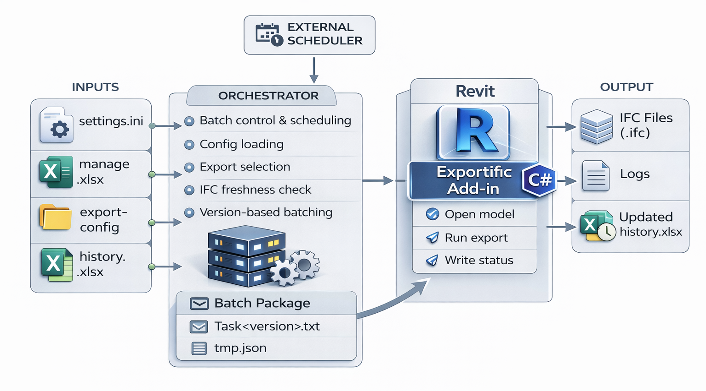

# ExportIFCFromRevit-CSharp — технический мануал

## Оглавление

- [1. Вступление и аудитория](#1-вступление-и-аудитория)
  - [1.1. Что такое ExportIFC](#11-что-такое-exportifc)
  - [1.2. Для кого предназначен этот документ](#12-для-кого-предназначен-этот-документ)
  - [1.3. Как пользоваться этим документом](#13-как-пользоваться-этим-документом)

- [2. Обзор архитектуры](#2-обзор-архитектуры)
  - [2.1. Общая схема работы](#21-общая-схема-работы)
  - [2.2. Крупные компоненты решения](#22-крупные-компоненты-решения)
  - [2.3. Внешний контур: orchestrator](#23-внешний-контур-orchestrator)
  - [2.4. Внутренний контур: Revit add-in](#24-внутренний-контур-revit-add-in)
  - [2.5. Основные файлы и данные в архитектуре](#25-основные-файлы-и-данные-в-архитектуре)
  - [2.6. Что важно запомнить из архитектуры](#26-что-важно-запомнить-из-архитектуры)

- [3. Быстрый старт](#3-быстрый-старт)
  - [3.1. Что должно получиться в конце](#31-что-должно-получиться-в-конце)
  - [3.2. Сначала выберите рабочий сценарий](#32-сначала-выберите-рабочий-сценарий)
  - [3.3. Что должно быть готово до начала](#33-что-должно-быть-готово-до-начала)
  - [3.4. Подготовьте рабочую раскладку](#34-подготовьте-рабочую-раскладку)
  - [3.5. Установите add-in](#35-установите-add-in)
  - [3.6. Минимально настройте `_settings/settings.ini`](#36-минимально-настройте-_settingssettingsini)
  - [3.7. Подготовьте IFC-конфиги на основе примера](#37-подготовьте-ifc-конфиги-на-основе-примера)
  - [3.8. Подготовьте `admin_data`](#38-подготовьте-admin_data)
  - [3.9. Минимально заполните `manage.xlsx`](#39-минимально-заполните-managexlsx)
  - [3.10. Проверьте модели перед первым запуском](#310-проверьте-модели-перед-первым-запуском)
  - [3.11. Выполните первый запуск в dry-run](#311-выполните-первый-запуск-в-dry-run)
  - [3.12. Выполните первый реальный запуск](#312-выполните-первый-реальный-запуск)
  - [3.13. Когда можно считать quick start успешным](#313-когда-можно-считать-quick-start-успешным)
  - [3.14. Что делать сразу после первого успешного запуска](#314-что-делать-сразу-после-первого-успешного-запуска)
  - [3.15. Когда переходить к запуску по расписанию](#315-когда-переходить-к-запуску-по-расписанию)

- [4. Требования к окружению и подготовка софта](#4-требования-к-окружению-и-подготовка-софта)
  - [4.1. Поддерживаемое окружение](#41-поддерживаемое-окружение)
  - [4.2. Revit и Revit add-in](#42-revit-и-revit-add-in)
  - [4.3. Эксплуатационная раскладка проекта](#43-эксплуатационная-раскладка-проекта)
  - [4.4. Права доступа и рабочие пути](#44-права-доступа-и-рабочие-пути)
  - [4.5. Сторонние плагины Revit и блокирующие окна](#45-сторонние-плагины-revit-и-блокирующие-окна)
  - [4.6. Требования к рабочей машине для batch-запуска](#46-требования-к-рабочей-машине-для-batch-запуска)
  - [4.7. Обновление окружения и совместимость](#47-обновление-окружения-и-совместимость)
  - [4.8. Итог по окружению](#48-итог-по-окружению)
  - [4.9. Полезные инструменты](#49-полезные-инструменты)

- [5. Структура проекта и назначение папок](#5-структура-проекта-и-назначение-папок)
  - [5.1. Общий вид репозитория](#51-общий-вид-репозитория)
  - [5.2. Исходный код и solution: `src/`](#52-исходный-код-и-solution-src)
  - [5.3. Пользовательские настройки: `_settings/`](#53-пользовательские-настройки-_settings)
  - [5.4. Рабочие данные проекта: `admin_data/`](#54-рабочие-данные-проекта-admin_data)
  - [5.5. Примеры IFC-конфигов и материалы по ним: `_examples/`](#55-примеры-ifc-конфигов-и-материалы-по-ним-_examples)
  - [5.6. Инструменты разработчика: `tools/`](#56-инструменты-разработчика-tools)
  - [5.7. Документация и иллюстрации: `_docs/` и `_git_images/`](#57-документация-и-иллюстрации-_docs-и-_git_images)
  - [5.8. Что важно запомнить из структуры проекта](#58-что-важно-запомнить-из-структуры-проекта)

- [6. Настройка `_settings/settings.ini`](#6-настройка-_settingssettingsini)
  - [6.1. Роль файла и как система его находит](#61-роль-файла-и-как-система-его-находит)
  - [6.2. Общие принципы редактирования](#62-общие-принципы-редактирования)
  - [6.3. `[Paths]`: пути к базовым папкам](#63-paths-пути-к-базовым-папкам)
  - [6.4. `[Files]`: базовые имена файлов](#64-files-базовые-имена-файлов)
  - [6.5. `[Settings]`: общие флаги и режимы](#65-settings-общие-флаги-и-режимы)
  - [6.6. `[Revit]`: версии Revit и экспортный 3D-вид](#66-revit-версии-revit-и-экспортный-3d-вид)
  - [6.7. `[Excel]`: имена рабочих листов](#67-excel-имена-рабочих-листов)
  - [6.8. `[Mapping]`: структура подпапок внутри `dir_export_config`](#68-mapping-структура-подпапок-внутри-dir_export_config)
  - [6.9. Пример минимальной рабочей конфигурации](#69-пример-минимальной-рабочей-конфигурации)
  - [6.10. Типичные ошибки и как они проявляются](#610-типичные-ошибки-и-как-они-проявляются)

- [7. Структура конфигов IFC](#7-структура-конфигов-ifc)
  - [7.1. Корень `dir_export_config`](#71-корень-dir_export_config)
  - [7.2. Папка `00_Common`: общие JSON-конфиги](#72-папка-00_common-общие-json-конфиги)
  - [7.3. Папка `01_Export_Layers`: файл сопоставления категорий Revit и классов IFC](#73-папка-01_export_layers-файл-сопоставления-категорий-revit-и-классов-ifc)
  - [7.4. Папки проектов с IFC-настройками (колонка C в `manage.xlsx`)](#74-папки-проектов-с-ifc-настройками-колонка-c-в-managexlsx)
  - [7.5. Как всё вместе связано с `manage.xlsx` и `_settings/settings.ini`](#75-как-всё-вместе-связано-с-managexlsx-и-_settingssettingsini)
  - [7.6. Практический сценарий: новый проект](#76-практический-сценарий-новый-проект)
  - [7.7. Что важно запомнить про конфиги IFC](#77-что-важно-запомнить-про-конфиги-ifc)

- [8. Папка `admin_data`, `manage.xlsx`, `history.xlsx` и текстовые логи](#8-папка-admin_data-managexlsx-historyxlsx-и-текстовые-логи)
  - [8.1. Назначение папки `admin_data`](#81-назначение-папки-admin_data)
  - [8.2. `manage.xlsx`: общая идея](#82-managexlsx-общая-идея)
  - [8.3. Лист `Path`: колонки A-F](#83-лист-path-колонки-af)
  - [8.4. Лист `IgnoreList`: какие модели пропускать](#84-лист-ignorelist-какие-модели-пропускать)
  - [8.5. `history/history.xlsx`: как хранится история](#85-historyhistoryxlsx-как-хранится-история)
  - [8.6. Как вместе работают `manage.xlsx`, `IgnoreList`, `history` и IFC-файлы](#86-как-вместе-работают-managexlsx-ignorelist-history-и-ifc-файлы)
  - [8.7. Как принудительно заставить модели перевыгрузиться](#87-как-принудительно-заставить-модели-перевыгрузиться)
  - [8.8. Папка `_logs` и типы текстовых логов](#88-папка-_logs-и-типы-текстовых-логов)

- [9. Требования к Revit-моделям](#9-требования-к-revit-моделям)
  - [9.1. Типы файлов и версии Revit](#91-типы-файлов-и-версии-revit)
  - [9.2. Центральные, локальные и отсоединённые модели](#92-центральные-локальные-и-отсоединённые-модели)
  - [9.3. Связи, рабочие наборы и опции проекта](#93-связи-рабочие-наборы-и-опции-проекта)
  - [9.4. 3D-вид для экспорта IFC](#94-3d-вид-для-экспорта-ifc)
  - [9.5. Параметры модели и маппинг в IFC](#95-параметры-модели-и-маппинг-в-ifc)
  - [9.6. «Здоровье» модели и блокирующие диалоги](#96-здоровье-модели-и-блокирующие-диалоги)
  - [9.7. Краткий чек-лист по модели перед подключением к ExportIFC](#97-краткий-чек-лист-по-модели-перед-подключением-к-exportifc)

- [10. Запуск и сценарии эксплуатации](#10-запуск-и-сценарии-эксплуатации)
  - [10.1. Варианты запуска](#101-варианты-запуска)
  - [10.2. Ручной запуск orchestrator](#102-ручной-запуск-orchestrator)
  - [10.3. Запуск по расписанию через Планировщик задач Windows](#103-запуск-по-расписанию-через-планировщик-задач-windows)
  - [10.4. Типовые эксплуатационные сценарии](#104-типовые-эксплуатационные-сценарии)

- [11. Диагностика и устранение неполадок](#11-диагностика-и-устранение-неполадок)
  - [11.1. Куда смотреть в первую очередь](#111-куда-смотреть-в-первую-очередь)
  - [11.2. Проблема: orchestrator не стартует или срывается до batch-этапа](#112-проблема-orchestrator-не-стартует-или-срывается-до-batch-этапа)
  - [11.3. Проблема: `manage.xlsx`, `history.xlsx` или Excel-данные читаются не так, как ожидалось](#113-проблема-managexlsx-historyxlsx-или-excel-данные-читаются-не-так-как-ожидалось)
  - [11.4. Проблема: модель пропущена ещё до запуска Revit](#114-проблема-модель-пропущена-ещё-до-запуска-revit)
  - [11.5. Проблема: Revit не запускается или add-in не подтверждает пакет](#115-проблема-revit-не-запускается-или-add-in-не-подтверждает-пакет)
  - [11.6. Проблема: Revit запускается, но IFC на выходе нет](#116-проблема-revit-запускается-но-ifc-на-выходе-нет)
  - [11.7. Проблема: не найден экспортный 3D-вид](#117-проблема-не-найден-экспортный-3d-вид)
  - [11.8. Проблема: batch блокируется окнами, предупреждениями или шумом UI](#118-проблема-batch-блокируется-окнами-предупреждениями-или-шумом-ui)
  - [11.9. Использование dry-run для диагностики](#119-использование-dry-run-для-диагностики)
  - [11.10. Что можно править руками, а что лучше не трогать](#1110-что-можно-править-руками-а-что-лучше-не-трогать)

- [12. Рекомендации и связанные документы](#12-рекомендации-и-связанные-документы)
  - [12.1. Роли и зоны ответственности](#121-роли-и-зоны-ответственности)
  - [12.2. Практические рекомендации по эксплуатации](#122-практические-рекомендации-по-эксплуатации)
  - [12.3. Связанные документы в репозитории](#123-связанные-документы-в-репозитории)

---

## 1. Вступление и аудитория

### 1.1. Что такое ExportIFC

**ExportIFC** — это инструмент для пакетной выгрузки IFC из моделей Revit в управляемом и
повторяемом сценарии.

Система состоит из двух рабочих частей:

- **orchestrator** — внешний управляющий контур, который читает настройки,
  Excel-файлы, IFC-конфиги, рабочую историю состояний RVT-моделей,
  формирует batch-задачи и запускает нужную версию Revit;
- **Revit add-in** — исполнитель внутри Revit, который получает подготовленный
  batch-контекст, открывает модели и выполняет экспорт IFC.

ExportIFC:

- берёт список моделей из **admin_data/manage.xlsx**;
- для каждой модели определяет нужную версию Revit;
- использует **settings.ini**, IFC-конфиги и правила маппинга;
- выполняет выгрузку IFC в заданные выходные папки;
- ведёт историю обработки и пишет эксплуатационные логи.

Основные пользовательские точки настройки:

- **_settings/settings.ini** — пути, рабочие флаги, версии Revit, имя экспортного 3D-вида и
  связанные параметры;
- **конфиги IFC** в каталоге **dir_export_config** — общие JSON-конфиги, маппинги и
  проектные настройки;
- **admin_data/manage.xlsx** — список источников моделей и маршрутов выгрузки;
- **admin_data/history/history.xlsx** — рабочая история состояний
  RVT-моделей по их времени модификации; она используется при решении,
  нужна ли повторная выгрузка, и не является журналом успешных запусков.

Этот файл — основной технический manual проекта. Краткий обзор, структура репозитория и
быстрые ссылки собраны в [README репозитория](../README.md). Здесь описаны архитектура,
настройка, эксплуатация и диагностика.

---

### 1.2. Для кого предназначен этот документ

Этот manual рассчитан на тех, кто отвечает за настройку, сопровождение и устойчивую работу
ExportIFC, а не просто пользуется результатом выгрузки.

Основные роли:

- **BIM-координатор / BIM-менеджер**:
  - понимает структуру моделей Revit в проекте;
  - участвует в настройке IFC-конфигов и требований к выгрузке;
  - проверяет корректность состава и результата IFC;

- **технический специалист / администратор**:
  - настраивает рабочую раскладку ExportIFC;
  - редактирует **settings.ini**;
  - поддерживает **admin_data**, логику batch-запуска и права доступа;
  - устанавливает и обновляет Revit add-in;
  - отвечает за запуск вручную и по расписанию;

- **разработчик или инженер автоматизации**:
  - разбирается в устройстве pipeline;
  - дорабатывает проект или переносит его в другую среду;
  - использует manual как описание архитектуры, пользовательских контрактов и
    эксплуатационных сценариев.

Кому этот документ обычно не нужен:

- **рядовым проектировщикам**, если они не участвуют в сопровождении выгрузки.

Для них обычно достаточно короткой прикладной инструкции: что проверять, если IFC не
обновился, и к кому обращаться, если автоматический запуск отработал некорректно.

---

### 1.3. Как пользоваться этим документом

Документ построен так, чтобы его можно было читать и последовательно, и выборочно.

- **Раздел 2. Обзор архитектуры** — объясняет, как устроена система: какие компоненты в ней
  есть, как они связаны и как проходит pipeline от входных данных до итогового IFC;

- **Раздел 3. Быстрый старт** — даёт практический маршрут для первой настройки и первого
  запуска;

- **Разделы 4–9** — справочная и опорная часть:
  - требования к окружению, подготовке софта и минимальным версиям (Раздел 4),
  - структура проекта и роли рабочих папок (Раздел 5),
  - настройка `_settings/settings.ini` (Раздел 6),
  - структура конфигов IFC (Раздел 7),
  - структура `admin_data`, а также логика работы `manage.xlsx`, `history.xlsx` и логов
    (Раздел 8),
  - требования к самим Revit-моделям (Раздел 9).

- **Раздел 10. Запуск и сценарии эксплуатации**:
  - ручной запуск orchestrator, dry-run, реальный batch-запуск и запуск по расписанию;
  - сценарий настройки нового проекта;
  - перенос готовой настройки на другую машину.

- **Раздел 11. Диагностика и устранение неполадок**:
  - как читать эксплуатационные и технические логи;
  - как использовать `history.xlsx` и связанные служебные файлы при разборе проблем;
  - типовые проблемы и пути их решения.

- **Раздел 12. Рекомендации и связанные документы**:
  - советы по структуре папок и путей;
  - ссылки на другие `.md` и примеры внутри репозитория;
  - ссылка на Word-версию manual, если она используется в компании.

#### 1.3.1. Если вы настраиваете систему с нуля

Рекомендуемая последовательность такая:

1. Прочитать **Раздел 2**, чтобы понять общую архитектуру.
2. Пройти **Раздел 3** как основной маршрут первого запуска.
3. По необходимости обращаться к:
   - **Разделу 4** — если нужно проверить окружение и зависимости;
   - **Разделу 6** — если настраивается **settings.ini**;
   - **Разделу 7** — если подготавливаются IFC-конфиги;
   - **Разделу 8** — если настраивается **admin_data**;
   - **Разделу 9** — если нужно проверить готовность моделей Revit.
4. После первичной настройки перейти к **Разделу 10** для выбора рабочего сценария
   эксплуатации.

#### 1.3.2. Если рабочий сценарий не выполняется

В этом случае лучше идти от симптомов:

1. Сначала открыть **Раздел 11** и определить, на каком участке pipeline возникает проблема.
2. Затем свериться с нужным тематическим разделом:
   - проблемы запуска — **Раздел 4** и **Раздел 10**;
   - проблемы с входными данными — **Раздел 6**, **Раздел 7** и **Раздел 8**;
   - проблемы с конкретными моделями — **Раздел 9**;
   - проблемы результата выгрузки — **Раздел 7** и **Раздел 11**.

#### 1.3.3. Если вы дорабатываете ExportIFC

Этот manual описывает систему на уровне архитектуры, пользовательских настроек, данных и
эксплуатационных контрактов.

Он не заменяет чтение исходного кода и не является подробной API-документацией по классам и
методам. Его задача — объяснить, как система устроена как инструмент, как она используется
на практике и где находятся основные точки настройки и диагностики.

---

## 2. Обзор архитектуры

### 2.1. Общая схема работы

ExportIFC построен как двухконтурная система:

1. **внешний управляющий контур** — **orchestrator**;
2. **внутренний исполнительный контур** — **Revit add-in**.

Такое разделение принципиально важно:

- **orchestrator** принимает решение, **что именно** нужно выгружать, **в какой версии
  Revit** это нужно запускать и **с какими параметрами** это должно быть передано во
  внутренний контур;
- **Revit add-in** не строит batch-план заново, а **исполняет** уже подготовленный сценарий
  внутри Revit.

Высокоуровнево цепочка выглядит так:

1. Пользователь или задача по расписанию запускает **orchestrator**.
2. Orchestrator находит и читает `_settings/settings.ini`.
3. Из `admin_data/manage.xlsx` читается список моделей, путей и правил выгрузки.
4. Из `admin_data/history/history.xlsx` читается рабочая история состояний моделей:
   записи с нормализованными путями к RVT и временем модификации файла, приведённым к точности минуты.
   На их основе orchestrator строит рабочий индекс последних известных состояний по путям.
5. Для каждой модели orchestrator:
   - проверяет, нужна ли повторная выгрузка;
   - определяет версию Revit по самому файлу `.rvt`;
   - формирует параметры будущего экспорта.
6. Модели группируются по поддерживаемым версиям Revit.
7. Для каждой версии orchestrator подготавливает batch-файлы и transport-данные.
8. Если включён реальный запуск, orchestrator запускает нужный `Revit.exe`.
9. Revit add-in подхватывает batch-контекст и выполняет экспорт IFC.
10. После завершения orchestrator сохраняет историю, пишет сводку и завершает цикл.

При следующем запуске система снова опирается на связку **`history.xlsx` + фактическое
состояние IFC-файлов на диске**, чтобы не перерабатывать модели без необходимости.

Схематично эта цепочка показана на диаграмме ниже.



---

### 2.2. Крупные компоненты решения

Система собрана из нескольких проектов solution, у каждого из
которых есть своя зона ответственности.

#### 2.2.1. `ExportIfc.Orchestrator`

Это внешний управляющий процесс и основная пользовательская точка входа в систему.

Его задачи:

- загрузить настройки и рабочие пути;
- прочитать `manage.xlsx`, `history.xlsx` и ignore-списки;
- определить, какие модели реально требуют выгрузки;
- определить версию Revit для каждой модели;
- сгруппировать модели по версиям Revit;
- подготовить batch-артефакты запуска;
- запустить нужный Revit;
- дождаться завершения add-in;
- сохранить историю и логи.

Именно orchestrator нужно считать главным процессом ExportIFC:

- он запускается первым;
- он собирает рабочий контекст;
- он принимает решения по составу batch;
- он управляет жизненным циклом запуска.

#### 2.2.2. `ExportIfc.RevitAddin.Shared`

Это общий слой внутреннего исполнительного контура.

Здесь сосредоточена логика, которая должна одинаково работать в разных поколениях Revit:

- чтение batch-контекста;
- проверка transport-данных;
- подготовка выполнения;
- открытие моделей;
- поиск 3D-вида;
- выполнение IFC-экспорта;
- логирование и фиксация статуса.

Иными словами, именно этот проект содержит **основной прикладной сценарий экспорта внутри
Revit**, без жёсткой привязки к конкретному target framework.

#### 2.2.3. `ExportIfc.RevitAddin.Net48`

Это адаптация add-in для Revit 2022–2024.

Проект нужен потому, что эти версии Revit работают в другом .NET-контуре, чем более новые
версии.

Его роль:

- подключить общий слой add-in к Revit 2022–2024;
- предоставить корректную точку входа `IExternalApplication`;
- обеспечить загрузку и выполнение batch-сценария в совместимом runtime.

#### 2.2.4. `ExportIfc.RevitAddin.Net8`

Это адаптация add-in для Revit 2025–2026.

По смыслу роль такая же, как у Net48-сборки, но под новый runtime и новые версии Revit.

Таким образом, внутри проекта не одна универсальная add-in-сборка, а **две эксплуатационные
сборки**, которые используют общий код, но обслуживают разные поколения Revit.

#### 2.2.5. `ExportIfc.Common`

Это общий библиотечный слой, на котором держатся и orchestrator, и add-in.

Здесь находятся общие сущности и инфраструктурные контракты:

- модели данных;
- работа с путями;
- чтение и нормализация настроек;
- работа с Excel;
- batch transfer-модели;
- служебные контракты для логики запуска;
- общие операции, которые не должны дублироваться во внешнем и внутреннем контуре.

Практически это означает следующее: если `ExportIfc.Orchestrator` — это управляющий процесс,
а `ExportIfc.RevitAddin.*` — исполнительный, то `ExportIfc.Common` — это **общий язык**, на
котором они описывают настройки, данные и batch-контекст.

#### 2.2.6. `ExportIfc.Tests`

Это проект автоматических проверок.

Он не участвует в рабочем запуске напрямую, но важен для сопровождения:

- фиксирует контракты общей логики;
- страхует поведение вспомогательных компонентов;
- снижает риск незаметной деградации после доработок.

Для обычного пользователя этот manual не является рабочей точкой настройки, но для
разработчика он важен как часть инженерной устойчивости системы.

---

### 2.3. Внешний контур: orchestrator

#### 2.3.1. Роль orchestrator

Orchestrator не экспортирует IFC самостоятельно.

Его задача — **подготовить, проверить и организовать** batch-запуск так, чтобы Revit получил
уже согласованный набор задач.

Это важно, потому что именно на внешнем контуре решаются вопросы:

- какие модели вообще попадают в работу;
- какие модели можно пропустить;
- какой Revit нужен для каждой модели;
- в какие выходные папки пойдёт результат;
- какие IFC-конфиги и mapping-файлы нужно использовать;
- нужен ли только основной mapped export или также дополнительный
  no-map-маршрут.

#### 2.3.2. Точка входа

Основная пользовательская точка входа — исполняемый файл orchestrator.

В release-сценарии это готовый `.exe` из release-пакета. В сценарии запуска из репозитория —
собранный `ExportIfc.Orchestrator.exe`.

Именно этот запуск следует считать штатным стартом системы.

#### 2.3.3. Что orchestrator делает по шагам

На своей стороне orchestrator выполняет несколько крупных стадий.

1. **Загрузка конфигурации**

   Находит `_settings/settings.ini`, загружает рабочие каталоги, поддерживаемые версии Revit,
   флаги запуска и другие базовые параметры среды.

2. **Чтение рабочих данных**

   Загружает:

   - `admin_data/manage.xlsx`;
   - `admin_data/history/history.xlsx`;
   - ignore-список из Excel.

3. **Анализ моделей**

   Для каждой модели:

   - проверяет наличие файла;
   - определяет необходимость повторной выгрузки;
   - определяет версию Revit;
   - анализирует состояние уже существующих IFC.

4. **Построение batch-плана**

   - группирует модели по версиям Revit;
   - отключает уже актуальные маршруты выгрузки, если повторный
     экспорт им не нужен;
   - формирует задания для запуска.

5. **Подготовка batch-контекста**

   Создаёт task-файлы, transport JSON и debug-артефакты dry-run.
   Технический статус-файл появляется только в real-run и пишется уже add-in внутри Revit.

6. **Реальный запуск или dry-run**

   - в dry-run Revit не запускается, но batch-план строится полностью;
   - в real-run запускается нужный `Revit.exe`, а затем ожидается результат add-in.

7. **Завершение цикла**

   - обновляется история;
   - пишутся логи и сводки;
   - фиксируется технический статус выполнения batch-пакета
     (в real-run его пишет add-in).

#### 2.3.4. Почему orchestrator нужен как отдельный контур

Теоретически часть этой логики можно было бы попытаться перенести внутрь Revit, но
практически это дало бы худшую систему.

Выделение orchestrator в отдельный внешний процесс даёт несколько плюсов:

- можно строить batch-план без запуска Revit;
- можно делать **dry-run**;
- можно заранее отсечь модели, которые не требуют переработки;
- можно сгруппировать запуск по версиям Revit;
- можно не смешивать эксплуатационную оркестрацию с внутренней логикой Revit API.

За счёт этого ExportIFC остаётся не просто add-in, а полноценной batch-системой.

---

### 2.4. Внутренний контур: Revit add-in

#### 2.4.1. Роль add-in

Add-in — это исполнительная часть системы внутри Revit.

Он не должен заново принимать архитектурные решения о составе batch-запуска. Его задача уже
уже и конкретнее:

- подхватить подготовленный batch-контекст;
- обработать список моделей для конкретной версии Revit;
- выполнить экспорт IFC;
- записать результат и диагностику;
- корректно завершить сеанс batch-запуска.

#### 2.4.2. Как add-in получает задание

Batch-контекст передаётся из orchestrator через служебные transport-данные и переменные
окружения.

Во внутренний контур передаются, в частности:

- путь к `settings.ini`;
- путь к `admin_data`;
- путь к task-файлу;
- идентификатор запуска;
- сведения о версии Revit;
- признак autorun-сценария.

За счёт этого add-in работает в том же проектном контуре, что и orchestrator, и не нуждается
в отдельной локальной настройке.

#### 2.4.3. Что add-in делает во время batch-запуска

Для каждой модели add-in:

- проверяет наличие файла;
- открывает документ Revit;
- находит 3D-вид по имени из `settings.ini`;
- загружает IFC-конфиг и mapping-файлы;
- подготавливает параметры экспорта;
- выполняет экспорт IFC;
- закрывает документ;
- пишет результат в логи.

В зависимости от настроек и данных из `manage.xlsx` могут использоваться два маршрута:

- **mapped export** — основной экспорт с маппингом;
- **unmapped export** — дополнительный no-map-маршрут с отдельным JSON.

Если один маршрут уже актуален, а второй требует обновления, система может выполнять только
нужную часть работы.

#### 2.4.4. Защитная логика add-in

Add-in не просто вызывает экспорт «в лоб».

В нём есть эксплуатационная и защитная логика, в том числе:

- проверка согласованности transport-данных и task-файла;
- логирование проблем открытия моделей;
- логирование случаев, когда не найден нужный 3D-вид;
- логирование ошибок IFC-экспорта;
- контроль статуса batch-запуска;
- повторная попытка экспорта в отдельных случаях, если результат выглядит подозрительно
  неполным.

Именно add-in ближе всего к Revit API, IFC Exporter и особенностям конкретной модели.

---

### 2.5. Основные файлы и данные в архитектуре

С точки зрения пользователя и сопровождающего инженера в системе есть несколько ключевых
групп данных.

#### 2.5.1. Конфигурация

Базовые настройки системы находятся в:

- `_settings/settings.ini`

Здесь задаются:

- основные каталоги;
- поддерживаемые версии Revit;
- имя 3D-вида для экспорта;
- флаги запуска;
- параметры batch-процесса.

Отдельный слой конфигурации составляют IFC-конфиги:

- общие JSON-конфиги;
- mapping-файлы;
- проектные JSON-конфиги;
- вспомогательная структура конфигов по каталогам.

#### 2.5.2. Управляющие Excel-файлы

Основной рабочий Excel-файл:

- `admin_data/manage.xlsx`

Он задаёт:

- где искать модели;
- куда складывать IFC;
- какие IFC-конфиги использовать;
- какие модели игнорировать.

История хранится в:

- `admin_data/history/history.xlsx`

Она используется как часть механизма отбора моделей, а не просто как журнал «для справки».

#### 2.5.3. Batch-артефакты

Во время подготовки запуска orchestrator создаёт:

- task-файлы по версиям Revit;
- transport JSON;
- диагностические файлы dry-run.

Технические статус-файлы сюда не входят:
их пишет add-in внутри Revit и только в real-run.

Эти артефакты нужны для согласованной передачи контекста между внешним и внутренним
контуром.

#### 2.5.4. Результаты и логи

На выходе система формирует:

- итоговые IFC-файлы;
- историю обработки;
- текстовые эксплуатационные логи;
- технические логи orchestrator и add-in.

Логи в `admin_data/_logs/` — это не второстепенный побочный результат, а полноценная часть
эксплуатации и диагностики.

---

### 2.6. Что важно запомнить из архитектуры

1. **Решение о том, что именно нужно экспортировать, принимает orchestrator,
   а не add-in.**

   Add-in выполняет уже подготовленный batch-сценарий внутри нужной версии
   Revit.

2. **`settings.ini`, Excel-файлы, IFC-конфиги и `admin_data` образуют единый
   рабочий контур.**

   Эти части нельзя воспринимать как независимые: изменение одной из них
   влияет на весь pipeline.

3. **`history.xlsx` сам по себе не является единственным источником истины.**

   Система также смотрит на фактическое состояние IFC-файлов на диске, чтобы
   не принимать неверные решения по повторной выгрузке.

4. **Dry-run — это полноценный рабочий режим, а не декоративная опция.**

   Он нужен для проверки конфигурации, batch-плана и состава моделей без
   фактического запуска Revit.

5. **Revit add-in — это исполнительный контур, а orchestrator —
   управляющий.**

   Это главное архитектурное различие, которое стоит держать в голове при
   чтении остальных разделов manual.

6. **Solution разделено не только по папкам, но и по ответственности.**

   `ExportIfc.Orchestrator` управляет запуском,
   `ExportIfc.RevitAddin.*` выполняет экспорт внутри Revit,
   `ExportIfc.Common` задаёт общие контракты и инфраструктурную основу.

[Раздел 3. Быстрый старт](#3-быстрый-старт) переводит эту архитектуру
в практическую последовательность: что именно нужно подготовить и
как сделать первый корректный запуск.

---

## 3. Быстрый старт

Этот раздел — практический маршрут для первого запуска ExportIFC с нуля.
Его задача — без лишних кругов провести вас от пустой рабочей раскладки
до первого осмысленного результата: сначала dry-run, затем real-run.

Подробные рабочие разборы по темам приведены в следующих разделах:

- требования к окружению, Revit и add-in — в [Разделе 4](#4-требования-к-окружению-и-подготовка-софта);
- структура проекта и рабочих папок — в [Разделе 5](#5-структура-проекта-и-назначение-папок);
- полный разбор `_settings/settings.ini` — в [Разделе 6](#6-настройка-_settingssettingsini);
- структура IFC-конфигов — в [Разделе 7](#7-структура-конфигов-ifc);
- устройство `admin_data`, `manage.xlsx` и `history.xlsx` — в [Разделе 8](#8-папка-admin_data-managexlsx-historyxlsx-и-текстовые-логи);
- требования к моделям Revit — в [Разделе 9](#9-требования-к-revit-моделям);
- рабочие сценарии запуска и расписание — в [Разделе 10](#10-запуск-и-сценарии-эксплуатации).

---

### 3.1. Что должно получиться в конце

Если пройти quick start до конца, у вас будет:

- установленный Revit add-in для нужных версий Revit;
- настроенный `_settings/settings.ini`;
- подготовленная папка с IFC-конфигами;
- рабочая папка `admin_data` с `manage.xlsx`, историей и логами;
- первый успешный dry-run без запуска Revit;
- первый реальный запуск с получением IFC в целевых папках.

Это и есть минимальная цель быстрого старта.

---

### 3.2. Сначала выберите рабочий сценарий

У ExportIFC есть два нормальных сценария первого знакомства.
Главное правило простое: на первом проходе не смешивайте
release-раскладку и dev-контур из репозитория.

#### 3.2.1. Вариант 1 — работа из готового release-пакета

Это обычно самый простой вариант для первого запуска. Он подходит,
если вам нужен рабочий контур без локальной сборки и без захода в код.

Для нормального release-сценария обычно нужны:

- опубликованный пакет orchestrator;
- add-in-пакет для Revit 2022–2024;
- add-in-пакет для Revit 2025–2026 — только если эти версии реально используются.

Важно правильно понимать состав раскладки:

- в published-пакете orchestrator лежат не только исполняемые файлы,
  но и стартовые материалы для first-run: `_settings`, `admin_data`,
  `run-local.cmd`, `_examples` и `_docs`
  с практическим Word-manual `ExportIFC_manual_ru.docx`, а также `LICENSE`;
- add-in поставляется отдельными пакетами по поколениям Revit;
- `install-addin.ps1` для release-сценария лежит внутри add-in-пакета,
  а не в dev-папке `tools/`.

Этого достаточно, чтобы пройти first-run без обязательной
зависимости от репозитория.

> Для первого знакомства это обычно лучший вариант: меньше шансов ошибиться
> на инфраструктурных шагах и перепутать пользовательский сценарий
> с dev-сценарием из репозитория.

#### 3.2.2. Вариант 2 — работа из исходников репозитория

Этот вариант нужен, если вы хотите изучать проект глубже,
планируете доработки, работаете как разработчик или BIM-автоматизатор
и собираетесь ставить add-in из локальной сборки.

В этом сценарии вы работаете с полным репозиторием:
исходниками, `_settings`, `_examples`, `admin_data`, `_docs` и `tools`.

Если задача сейчас только в том, чтобы запустить первую устойчивую выгрузку,
безопаснее сначала пройти quick start как пользователь, а уже потом
переходить к сценарию из исходников.

---

### 3.3. Что должно быть готово до начала

Перед тем как трогать `settings.ini`, Excel и IFC-конфиги, проверьте базовые условия.

#### 3.3.1. На машине установлен Revit нужных версий

ExportIFC не заменяет Revit и не умеет экспортировать IFC без него.
Он строит batch-сценарий и запускает нужную версию Revit.

Значит, на машине должны быть установлены именно те версии Revit,
которые реально встречаются в ваших моделях и которые вы потом укажете
в `revit_versions`.

Например, если в работе есть модели только 2023 и 2024 года,
не нужно сразу указывать 2022–2026 «про запас».

#### 3.3.2. Определите, какие ветки add-in понадобятся

Для batch-экспорта одного orchestrator недостаточно:
сам IFC-экспорт выполняется через add-in внутри Revit.

На этом шаге add-in ещё не обязан быть установлен.
Здесь важно заранее понять, какие ветки add-in понадобятся
под ваши рабочие версии Revit, чтобы дальше не смешать
release-установку с dev-установкой из репозитория.

Подробно схема веток разобрана в [разделе 4.2.2](#422-revit-add-in).
Порядок установки add-in описан в [шаге 3.5](#35-установите-add-in).

#### 3.3.3. У машины есть доступ ко всем рабочим путям

Пользователь, от которого будет запускаться ExportIFC, должен иметь права:

- читать папки с `.rvt`;
- читать папку с IFC-конфигами;
- читать и записывать `admin_data`;
- создавать и перезаписывать IFC в выходных папках.

Если дальше планируется запуск по расписанию, те же права должны быть
и у задачи Планировщика задач Windows.

#### 3.3.4. Машина в принципе пригодна для batch-запуска

На первом знакомстве многие забывают о банальной вещи:
модель должна не просто существовать, а **открываться в Revit
без ручного спасения процесса**.

Если на batch-машине при открытии моделей часто всплывают:

- блокирующие диалоги от внешних плагинов;
- проблемы с доступом к связанным файлам;
- лицензия Revit в подвешенном состоянии;
- иные окна, требующие ручного ответа,

то сначала нужно стабилизировать среду, а уже потом настраивать ExportIFC.
С некоторыми окнами программа может справиться, но не со всеми.

---

### 3.4. Подготовьте рабочую раскладку

#### 3.4.1. Если вы работаете из репозитория

Получить проект можно так:

- клонировать репозиторий:

```bash
git clone https://github.com/PaukPySharp/ExportIFCFromRevit-CSharp.git
```

- или скачать архив через GitHub: `Code → Download ZIP`.
  Пример можно посмотреть в разделе «Быстрый старт» в [README репозитория](../README.md),
  там приведён скриншот кнопки и пояснения.

После этого распакуйте или разместите проект в понятное место, например:

`D:\BIM\ExportIFCFromRevit-CSharp`

Для dev-сценария на этом шаге важно не только получить репозиторий,
но и довести его до локальной сборки add-in.
Подробная карта исходников и dev-маршрутов приведена в
[руководство для разработчиков](./ExportIFC_developer_guide.md)
и в [README репозитория](../README.md);
для quick start на этом этапе достаточно проверить следующее:

1. для Revit `2022–2024` собран проект `ExportIfc.RevitAddin.Net48`,
   для Revit `2025–2026` — `ExportIfc.RevitAddin.Net8`;

2. сборка выполнена в конфигурации `x64`;

3. build-output лежит в одной из папок:

   - `src/ExportIfc.RevitAddin.Net48/bin/x64/<Configuration>/`;
   - `src/ExportIfc.RevitAddin.Net8/bin/x64/<Configuration>/`.

Если у вас смешанная среда по поколениям Revit, заранее соберите обе нужные ветки.
Без этого установка add-in по сценарию работы из репозитория не сработает.

#### 3.4.2. Если вы работаете из release-пакета

Для нормального release-сценария подготовьте **обе части** раскладки:

1. распакуйте **опубликованный пакет orchestrator** в отдельную рабочую папку,
   например:

   `D:\BIM\ExportIFCFromRevit-CSharp`

2. отдельно распакуйте **нужный add-in-пакет** для вашего диапазона
   версий Revit.

После распаковки orchestrator-пакета рядом должны находиться:

- `ExportIfc.Orchestrator.exe`;
- `_settings`;
- `admin_data`;
- `_examples`;
- `_docs`;
- `run-local.cmd` и сопутствующие файлы published-пакета.

На этом шаге add-in ещё не устанавливается. Важный акцент здесь такой:
сначала собираете **рабочий контур orchestrator**, и только рядом с ним
кладёте **отдельный add-in-пакет**, из которого установка будет
выполняться следующим шагом.

Папка `_examples` в published-пакете нужна именно для **самодостаточного first-run**:
из неё можно сразу взять стартовый шаблон IFC-конфигов,
не возвращаясь в репозиторий.

Папка `_docs` в этом же published-пакете нужна как короткий
практический контур чтения: в ней лежит `ExportIFC_manual_ru.docx`,
который удобно открывать рядом с first-run, ручным запуском
и первичной диагностикой.

> Не переносите отдельные файлы published-пакета по одному.
> Для первого запуска безопаснее сохранять структуру такой,
> какой она была в архиве.

---

### 3.5. Установите add-in

#### 3.5.1. Если вы используете release-пакет

Используйте `install-addin.ps1`, который лежит
**внутри соответствующего add-in-пакета релиза**.

Это основной пользовательский сценарий.
Он не требует знания внутренней структуры репозитория.

Общая логика такая:

1. Откройте папку add-in для нужного диапазона версий Revit.

2. Найдите в ней файл `install-addin.ps1`.

3. Запустите его одним из способов:

   - **через Проводник Windows**: щёлкните по файлу правой кнопкой мыши
     и выберите запуск через PowerShell;

   - **через окно PowerShell**: откройте PowerShell в этой папке
     и выполните:

     `.\install-addin.ps1`

4. Если PowerShell блокирует запуск скрипта, сначала проверьте,
   не требует ли файл разблокировки. В типовом случае помогает открыть
   свойства файла и снять блокировку, если она есть.

5. Дождитесь завершения скрипта и убедитесь, что установка прошла без ошибок.

6. Повторите установку для всех нужных поколений Revit,
   если у вас смешанная среда.

7. После установки один раз вручную откройте каждую нужную версию Revit.
   Если Revit покажет окно подтверждения загрузки add-in, нажмите
   `Загружать всегда`.
   Без этого первый batch-запуск может остановиться на таком окне.

#### 3.5.2. Если вы работаете из исходников

Используйте:

`tools/install-addin.ps1`

Этот скрипт предназначен для локального репозитория
и ставит **локально собранный** add-in.

Его имеет смысл использовать, когда:

- проект уже собран;
- вы тестируете свою ветку;
- нужно быстро переустановить dev-сборку add-in.

Перед запуском проверьте:

- add-in-проект уже собран;
- сборка выполнена в конфигурации `x64`;
- вы понимаете, для какого года Revit ставите add-in.

Обязательным параметром здесь является `-Year`.

Сам скрипт определяет корень репозитория по собственному расположению,
но на практике удобнее всего запускать его из корня репозитория:
так проще не запутаться в build-output, конфигурации и относительных путях
из примеров ниже.

Примеры для корня репозитория:

```bash
powershell -ExecutionPolicy Bypass -File .\tools\install-addin.ps1 -Year 2024 -Configuration Debug
```

```bash
powershell -ExecutionPolicy Bypass -File .\tools\install-addin.ps1 -Year 2025 -Configuration Release
```

Логика выбора ветки такая:

- `2022–2024` → `ExportIfc.RevitAddin.Net48`;
- `2025–2026` → `ExportIfc.RevitAddin.Net8`.

Скрипт также поддерживает параметр `-AddinName`,
но без необходимости его лучше не менять.

После dev-установки add-in также нужно один раз вручную открыть нужную
версию Revit и при появлении окна подтверждения загрузки нажать
`Загружать всегда`.

Примеры запуска и описание параметров приведены в
[README по служебным инструментам](../tools/README.md).

Если PowerShell не даёт выполнить скрипт, сначала проверьте:

- не заблокирован ли сам `.ps1`-файл;
- если вы запускаете пример с путём `.\tools\install-addin.ps1`,
  открыт ли PowerShell в корне репозитория;
- существует ли локально собранный build-output нужной ветки add-in.

#### 3.5.3. Что нужно проверить после установки

После установки add-in полезно проверить:

- в `%APPDATA%\Autodesk\Revit\Addins\<Year>\` появился `.addin`-манифест;
- в пользовательской папке add-in появились DLL и сопутствующие файлы;
- нужная версия Revit стартует без ошибок загрузки add-in;
- при первом ручном старте Revit подтверждение загрузки add-in принято
  кнопкой `Загружать всегда`, если такое окно появлялось.

На этом этапе не нужен полноценный экспорт.
Нужно просто убедиться, что add-in **вообще установлен и виден Revit**.

---

### 3.6. Минимально настройте `_settings/settings.ini`

Файл `_settings/settings.ini` — главный конфигурационный файл проекта.
Для первого запуска не нужно настраивать всё подряд.
Достаточно заполнить минимальный набор ключей.

Именно с этого файла чаще всего и начинается осознанная настройка поведения ExportIFC.

Ниже приведены именно **примеры значений** для первого запуска.
Точные рабочие значения зависят от вашей раскладки, путей,
версий Revit и принятой схемы выгрузки.

#### 3.6.1. Укажите папку с IFC-конфигами

Секция `[Paths]`.

**Пример значения:**

`dir_export_config = D:\BIM\IFC_Configs`

Эта папка будет содержать структуру IFC-конфигов:

- `00_Common`;
- `01_Export_Layers`;
- проектные подпапки с конфигами.

В примерах репозитория используются имена вида `02_Project_*`,
но в реальной рабочей раскладке имена папок могут быть любыми.

На старте проще не собирать эту структуру вручную,
а скопировать готовый пример из:

`_examples/IFC_Export_Config_example`

> Если вы работаете из репозитория, этот каталог уже лежит
> в дереве проекта. Если вы работаете из published release-пакета,
> тот же `_examples` должен лежать рядом с `_settings`,
> `admin_data` и `ExportIfc.Orchestrator.exe`.

Подробности см. в [Разделе 3.7](#37-подготовьте-ifc-конфиги-на-основе-примера),
[Разделе 5](#5-структура-проекта-и-назначение-папок) и
[Разделе 7](#7-структура-конфигов-ifc).

#### 3.6.2. Укажите рабочую папку `admin_data`

Секция `[Paths]`.

**Примеры значений:**

`dir_admin_data = D:\BIM\admin_data`

`dir_admin_data = \\SERVER\BIM\admin_data`

Здесь будут лежать:

- `manage.xlsx`;
- папка `history` с `history.xlsx`;
- папка `_logs`;
- Task-файлы;
- dry-run JSON-артефакты;
- другие служебные файлы запуска.

Проще всего воспринимать эту папку как операционный центр контура:
здесь сходятся Excel, история, логи и служебные артефакты запуска.

Для первого знакомства обычно проще начать с локального пути,
а уже потом переходить к сетевой рабочей папке.

#### 3.6.3. Выберите режим работы с `admin_data`

Секция `[Settings]`.

**Примеры значений:**

`is_prod_mode = False`

`is_prod_mode = True`

Смысл такой:

- `False` — используется локальная `admin_data`, вычисляемая
  относительно расположения `settings.ini`;
- `True` — используется папка по пути из `dir_admin_data`.

Если совсем коротко: `False` обычно удобен для first-run и локального стенда,
`True` — для основного рабочего контура.

Для первого локального знакомства с проектом обычно удобен `False`.
Если собранный `ExportIfc.Orchestrator.exe`, `_settings` и локальная `admin_data`
лежат в одном рабочем корне, можно спокойно пройти first-run,
а потом переключиться на внешний рабочий путь через `dir_admin_data`.

Подробная логика разрешения локальной `admin_data` разобрана
в [разделе 6.3.2](#632-dir_admin_data).

#### 3.6.4. Для первого запуска включите dry-run

Секция `[Settings]`.

**Пример значения:**

`run_revit = False`

Это один из самых важных шагов быстрого старта.

При `run_revit = False` orchestrator:

- читает `settings.ini`;
- читает `manage.xlsx`;
- собирает модели;
- строит batch-план;
- пишет Task-файлы;
- пишет по версиям диагностические JSON-файлы;
- обновляет историю;

но **не запускает Revit**.

Для первого запуска это лучший режим:
он позволяет проверить почти весь внешний контур pipeline
без тяжёлого реального запуска Revit.

Важно помнить, что dry-run — не полностью «безвредный просмотр»:
он обновляет `history.xlsx` и может подготовить рабочие каталоги
для будущей выгрузки.

Когда dry-run станет предсказуемым и понятным,
можно переключиться на `run_revit = True`.

#### 3.6.5. Решите, нужен ли дополнительный no-map-маршрут

Секция `[Settings]`.

**Примеры значений:**

`enable_unmapped_export = True`

`enable_unmapped_export = False`

Для самого первого прогона вполне допустимо:

`enable_unmapped_export = False`

Это позволяет сначала стабилизировать основной маршрут экспорта
с маппингом, а уже потом подключать дополнительный no-map-сценарий.

Когда основной прогон станет предсказуемым и понятным,
`enable_unmapped_export` можно вернуть в `True`.

#### 3.6.6. Укажите только реальные версии Revit

Секция `[Revit]`.

**Пример значения:**

`revit_versions = 2022,2023,2026`

Указывайте только те версии, которые:

- реально установлены на машине;
- действительно встречаются в ваших моделях;
- реально должны обслуживаться этим экземпляром ExportIFC.

Не стоит перечислять лишние версии «на всякий случай».

Важно: `revit_versions` работает как список доступных запусков Revit,
а не как скрытый непрерывный диапазон.
Например, при `revit_versions = 2022,2023,2026`:

- модель 2022 пойдёт в Revit 2022;
- модель 2023 пойдёт в Revit 2023;
- модель 2024 или 2025 пойдёт в Revit 2026;
- модель новее 2026 уйдёт в диагностику как слишком новая.
Это не делает систему гибче, а только усложняет сопровождение и диагностику.

#### 3.6.7. Укажите имя 3D-вида для экспорта

Секция `[Revit]`.

**Пример значения:**

`export_view3d_name = Navisworks`

Это имя удобно использовать, потому что Navisworks по умолчанию
тоже часто работает с видом `Navisworks`, и один и тот же вид
можно использовать сразу в нескольких сценариях.

В каждой модели Revit должен существовать **не шаблонный** 3D-вид
с таким именем.

Если в модели такого вида нет, add-in не сможет выполнить экспорт
в ожидаемом режиме.

См. также [Раздел 3.10](#310-проверьте-модели-перед-первым-запуском)
и [Раздел 9](#9-требования-к-revit-моделям).

#### 3.6.8. Что на первом этапе можно не трогать

Для первого запуска не нужно глубоко разбирать все секции `settings.ini`.

На старте достаточно правильно заполнить:

- `dir_export_config`;
- `dir_admin_data`;
- `is_prod_mode`;
- `run_revit`;
- `enable_unmapped_export`;
- `revit_versions`;
- `export_view3d_name`.

Остальные параметры на первом этапе можно оставить без изменений
и вернуться к ним позже.

Подробный разбор всех ключей приведён в [Разделе 6](#6-настройка-_settingssettingsini)
и в [README по настройкам](../_settings/README.md).

---

### 3.7. Подготовьте IFC-конфиги на основе примера

Для первого запуска не надо собирать структуру IFC-конфигов с нуля.
Проще и безопаснее взять готовый пример.

#### 3.7.1. Возьмите пример из `_examples`

Используйте каталог:

`_examples/IFC_Export_Config_example`

Источник здесь зависит только от выбранного сценария:

- если вы работаете из репозитория, используйте `_examples`
  из дерева репозитория;
- если вы работаете из published release-пакета, используйте `_examples`,
  который лежит прямо в этой release-раскладке рядом с `_settings`
  и `admin_data`.

Скопируйте содержимое `IFC_Export_Config_example`
в папку, указанную в `dir_export_config`, например:

`D:\BIM\IFC_Configs`

После копирования у вас должна получиться примерно такая структура:

- `00_Common`;
- `01_Export_Layers`;
- `02_Project_example`.

#### 3.7.2. Что означают эти папки на старте

- `00_Common` — общие JSON-настройки экспорта;
- `01_Export_Layers` — TXT-файлы маппинга;
- `02_Project_example` — пример проектной папки,
  на которой удобно пройти первый запуск.

Это именно стартовый шаблон first-run, который теперь одинаково
доступен и в репозитории, и в published release-пакете.

#### 3.7.3. Что делать на самом первом прогоне

На первом прогоне лучше не усложнять конфигурацию:

- не переделывать весь пример сразу;
- не плодить много проектных папок;
- не экспериментировать одновременно с несколькими mapping-файлами.

Для первого запуска достаточно:

- скопировать `IFC_Export_Config_example` в рабочую папку,
  указанную в `dir_export_config`;
- оставить `00_Common` как есть;
- оставить `01_Export_Layers` как есть;
- использовать `02_Project_example` как основу для теста.

Когда первый экспорт успешно пройдёт, можно уже:

- создать собственную проектную папку;
- скопировать туда содержимое примера;
- адаптировать JSON и TXT под реальный проект.

---

### 3.8. Подготовьте `admin_data`

`admin_data` — один из центральных рабочих узлов системы.
Именно здесь лежат:

- `manage.xlsx` — что и как обрабатывать;
- `history/history.xlsx` — история состояний RVT-моделей,
  используемая при отборе на повторную выгрузку;
- `_logs` — куда смотреть при проблемах;
- Task-файлы и dry-run JSON-артефакты.

#### 3.8.1. Не создавайте `admin_data` с нуля вручную

Используйте готовую заготовку из проекта или из рабочей раскладки.
Не собирайте `admin_data` по памяти из отдельных файлов:
на first-run так проще всего потерять историю, логи или ожидаемую структуру папок.

#### 3.8.2. Что должно быть внутри на старте

Для первого запуска достаточно убедиться, что в рабочей `admin_data`
есть как минимум:

- `manage.xlsx`;
- папка `history`;
- папка `_logs`.

Этого достаточно, чтобы не стартовать вслепую.
Где именно будет жить эта `admin_data`,
уже определяется настройками `dir_admin_data` и `is_prod_mode`
из [разделов 3.6.2–3.6.3](#362-укажите-рабочую-папку-admin_data).

Полная структура папки и роль её артефактов подробно разобраны в
[разделе 8](#8-папка-admin_data-managexlsx-historyxlsx-и-текстовые-логи).

---

### 3.9. Минимально заполните `manage.xlsx`

Для первого запуска не нужно превращать `manage.xlsx`
в большую рабочую таблицу.
Достаточно корректно заполнить одну рабочую строку.

По умолчанию основной лист называется `Path`.

#### 3.9.1. Что означает одна строка

Одна непустая строка на листе `Path` описывает один набор правил:

- где искать `.rvt`;
- куда писать IFC;
- какие IFC-конфиги использовать;
- нужен ли дополнительный no-map-маршрут с отдельным JSON из колонки F.

#### 3.9.2. Какие колонки важны на старте

Для первого запуска достаточно понимать логику колонок A–D:

| Колонка | Назначение |
| --- | --- |
| A | Папка с файлами RVT |
| B | Папка для выгрузки IFC (с маппингом) |
| C | Папка настроек IFC-маппинга |
| D | Файл маппинга категорий Revit → классов IFC |

Колонки **E** и **F** относятся к дополнительному no-map-маршруту
и на старте обычно не нужны.

Полная расшифровка листа `Path` и всех колонок A–F приведена в
[разделе 8.3](#83-лист-path-колонки-af).

#### 3.9.3. Как заполнить первую строку

Для самого первого запуска достаточно правильно заполнить
основной маршрут с маппингом:

- **A** — абсолютный путь к папке, где лежат `.rvt`;
- **B** — абсолютный путь к папке для итоговых IFC;
- **C** — абсолютный путь к проектной папке IFC-конфигов;
- **D** — имя TXT-файла маппинга.

Например:

- в A — `D:\BIM\Models\TestProject`;
- в B — `D:\BIM\IFC_Out\TestProject`;
- в C — `D:\BIM\IFC_Configs\02_Project_example`;
- в D — `Layer_Mapping`.

#### 3.9.4. Что важно не упустить

1. **Пути в колонках A, B и C должны быть абсолютными.**

   Это должны быть реальные полные пути:

   - к папке с моделями Revit;
   - к папке выгрузки IFC;
   - к проектной папке IFC-конфигов.

   Относительные пути здесь использовать не нужно.

2. **В колонке D задаётся имя файла маппинга, а не полный путь.**

   Логика такая: путь к проектной папке задаёт колонка C,
   а имя конкретного mapping-файла задаёт колонка D.

3. **Поиск моделей идёт без рекурсии по подпапкам.**

   Система берёт `.rvt` только из той папки,
   которая указана в колонке A.

4. **Если дополнительный no-map-маршрут пока не нужен,
   колонки E и F можно не использовать.**

   Для первого запуска это даже проще.

#### 3.9.5. Лист `IgnoreList`

На листе `IgnoreList` можно перечислить **полные абсолютные пути**
к конкретным `.rvt`, которые нужно исключить из обработки.

Это полезно, если:

- файл лежит в рабочей папке, но временно не должен экспортироваться;
- в каталоге есть технические или проблемные модели;
- нужно быстро исключить отдельный файл,
  не меняя основную строку на листе `Path`.

---

### 3.10. Проверьте модели перед первым запуском

Перед первым реальным запуском стоит пройти короткую проверку,
чтобы убедиться, что модель и связанная с ней конфигурация
вообще готовы к batch-выгрузке.

Задача этого шага — не провести полный аудит модели,
а заранее отловить самые частые проблемы:
неверные пути, отсутствующие файлы, ошибочно заполненную колонку D,
неподходящий 3D-вид и сломанную структуру IFC-конфигов.

#### 3.10.1. Проверьте пути из `manage.xlsx`

Убедитесь, что пути, указанные в `manage.xlsx`, реальны и доступны:

- папка из колонки **A** действительно существует;
- папка из колонки **B** действительно существует
  или может быть использована для записи IFC;
- папка из колонки **C** действительно существует;
- у пользователя, от которого выполняется запуск,
  есть права чтения и записи там, где они нужны.

Здесь важно помнить, что в колонках **A**, **B** и **C**
должны быть указаны **абсолютные пути**.

Если путь выглядит правдоподобно, но фактически недоступен
для рабочего пользователя, для ExportIFC это всё равно ошибка.

#### 3.10.2. Убедитесь, что модели действительно готовы к выгрузке

Для первого запуска достаточно проверить хотя бы одну тестовую модель,
которая должна гарантированно пройти экспорт.

Полезно заранее убедиться, что:

- `.rvt` действительно лежит в папке из колонки **A**;
- это именно та модель, которую вы ожидаете увидеть
  в Task-файле и в dry-run-пакете;
- модель открывается на рабочей машине в нужной версии Revit
  без ручного спасения процесса.

Если модель формально лежит в нужной папке,
но на batch-машине открывается с проблемами,
first-run лучше сначала остановить и устранить это вручную.

#### 3.10.3. Проверьте 3D-вид для экспорта

В тестовой модели должен существовать 3D-вид:

- с именем, совпадающим с `export_view3d_name`
  из `_settings/settings.ini`;
- не шаблонный;
- не удалённый;
- не переименованный локально «для удобства».

Например, если в `settings.ini` указано:

`export_view3d_name = Navisworks`

то в модели должен существовать именно такой 3D-вид.

Если этого вида нет, real-run почти наверняка закончится проблемой,
которую потом придётся разбирать по логам.

#### 3.10.4. Проверьте IFC-конфиги и маппинг

Убедитесь, что конфиги и mapping-файлы реально существуют по тем путям,
которые ожидает система.

Для первой строки `manage.xlsx` это означает следующее:

- проектная папка из колонки **C** реально существует;
- в этой папке действительно лежит основной JSON-конфиг проекта;
- в колонке **D** указано имя TXT-файла сопоставления категорий Revit
  и классов IFC, без пути и без каталогов;
- соответствующий файл действительно существует в общей папке
  маппинга по схеме
  `<dir_export_config>/<dir_layers>/<значение_D>.txt`;
- если проектный JSON ссылается на `Property_Mapping.txt`
  или другие связанные файлы, для порядка их удобнее хранить
  рядом с проектным JSON, хотя технически это не жёсткое требование:
  важен корректный путь внутри `Export_Settings.json`.

Здесь важно не путать две разные сущности:

- колонка **D** отвечает за общий TXT-файл сопоставления категорий
  Revit и классов IFC;
- проектная папка из колонки **C** отвечает за проектный JSON
  и связанные с ним файлы вроде `Property_Mapping.txt`.

В нормальном варианте у вас должны быть:

- общая папка `00_Common`;
- общая папка `01_Export_Layers`;
- проектная папка с конфигами,
  реально существующая по абсолютному пути из колонки **C** `manage.xlsx`.

Чаще всего проектная папка лежит внутри `dir_export_config`,
но для системы принципиально не имя папки,
а корректность пути из колонки **C** и существование нужных файлов.

Префикс `02_` из примеров удобен для сортировки,
но обязательным не является.

#### 3.10.5. Минимальный итоговый чек-лист

Перед первым запуском полезно ответить на три вопроса:

1. **Система сможет найти модель?**

   Путь в колонке **A** корректен,
   модель реально существует,
   и у рабочего пользователя есть доступ к чтению.

2. **Система сможет собрать корректный маршрут экспорта?**

   Путь в колонке **B** пригоден для записи,
   путь в колонке **C** ведёт к реальной проектной папке конфигов,
   а в колонке **D** указано корректное имя существующего TXT-файла.

3. **Система сможет выполнить экспорт без очевидных сбоев?**

   В модели есть нужный 3D-вид,
   основной JSON проекта найден,
   файл из колонки **D** найден,
   а связанные project-level файлы вроде `Property_Mapping.txt`
   не потеряны и не рассинхронизированы.

Если на все три вопроса ответ положительный,
значит модель минимально готова к первому запуску.

Все формальные требования к моделям, видам и рабочей среде Revit
подробно разобраны в [Разделе 9](#9-требования-к-revit-моделям).
Здесь задача проще: минимально убедиться, что модель вообще готова к выгрузке.

---

### 3.11. Выполните первый запуск в dry-run

Теперь можно делать первый запуск.

#### 3.11.1. Почему именно dry-run первым

Dry-run нужен не для красоты,
а чтобы проверить, что весь внешний контур уже собран корректно:

- `settings.ini` читается;
- `manage.xlsx` разбирается;
- модели находятся;
- версии Revit определяются;
- batch-план строится;
- Task-файлы формируются;
- dry-run JSON пишется;
- история обновляется;
- грубых ошибок по путям и конфигам нет.

То есть dry-run позволяет отловить большую часть проблем
**до запуска Revit**.

#### 3.11.2. Что должно быть в `settings.ini`

На этот момент должно стоять:

`run_revit = False`

#### 3.11.3. Чем запускать

Для первого dry-run используйте **штатный orchestrator**, а не отдельный
«тестовый» вход. Это самый простой способ сразу проверить систему
в её реальном сценарии запуска.

Базовое правило такое:

- если вы работаете с **published release-пакетом**, используйте
  `run-local.cmd` в папке, где рядом лежат
  `ExportIfc.Orchestrator.exe`, `_settings`, `admin_data`
  и при необходимости `_docs` с практическим Word-manual;
- если вы работаете **из исходников**, запускайте orchestrator
  из корня репозитория, где лежит `_settings`.

Для release-раскладки основной и самый удобный вариант первого запуска — это:

`run-local.cmd`

Эта обёртка уже лежит рядом с `ExportIfc.Orchestrator.exe`
в published-пакете, запускает штатный orchestrator
и не закрывает консоль сразу после завершения.

Если `run-local.cmd` нужно восстановить вручную, его содержимое
может быть таким:

```text
@echo off
setlocal

cd /d "%~dp0"

"%~dp0ExportIfc.Orchestrator.exe"

echo.
echo Process finished. Press any key to close, or wait 600 seconds...
timeout /t 600 >nul
```

Если вы работаете с published-пакетом и хотите запускать напрямую
из консоли, используйте:

`ExportIfc.Orchestrator.exe "D:\BIM\ExportIFCFromRevit-CSharp\_settings\settings.ini"`

Если вы работаете из исходников, используйте, например:

`dotnet run --project .\src\ExportIfc.Orchestrator -- .\_settings\settings.ini`

Для первого dry-run достаточно зафиксировать только это:

1. release-пакет — сначала `run-local.cmd`;
2. исходники — сначала `dotnet run` из корня репозитория;
3. двойной щелчок по `.exe` для первой диагностики нежелателен,
   потому что консоль может закрыться слишком быстро.

Подробные варианты ручного запуска и дополнительные примеры команд
приведены в [разделе 10.2](#102-ручной-запуск-orchestrator)
и [разделе 10.2.2](#1022-прямой-запуск-из-exe-ide-или-dotnet-run).

#### 3.11.4. Что проверять после dry-run

После dry-run проверьте:

1. **Консольный вывод orchestrator**

   В нём не должно быть явных ошибок чтения настроек, Excel и путей.

2. **Папку `admin_data`**

   В ней должны появиться или обновиться:

   - `Task<версия>.txt` для найденных пакетов;
   - `tmp_<версия>.json` для dry-run-пакетов;
   - `history.xlsx`;
   - логи в `_logs`.

3. **Состав Task-файлов**

   Проверьте, что в пакет попали именно те модели,
   которые вы ожидали, и что они не ушли в неправильную версию Revit.

4. **Историю**

   Убедитесь, что `history.xlsx` обновляется и не повреждён.
   При этом dry-run подтверждает только корректность внешнего контура;
   реального экспорта IFC в этом режиме ещё нет.

> Если dry-run не проходит чисто, не переходите сразу к real-run.
> Сначала разберите ошибки по путям, Excel, конфигам и окружению.

---

### 3.12. Выполните первый реальный запуск

Если dry-run прошёл осмысленно и без грубых ошибок,
можно переходить к реальному запуску.

#### 3.12.1. Переключите режим в `settings.ini`

В `_settings/settings.ini` установите:

`run_revit = True`

#### 3.12.2. Ещё раз быстро проверьте критичные вещи

Перед real-run полезно ещё раз убедиться, что:

- add-in установлен для нужных версий Revit;
- на машине реально есть эти версии Revit;
- тестовая модель открывается;
- выходная папка доступна на запись;
- нужный 3D-вид существует.

#### 3.12.3. Запустите orchestrator повторно

Запуск выполняется тем же входом, что и dry-run,
но теперь orchestrator не только соберёт пакет,
а и запустит нужный `Revit.exe`.

Для ручной проверки в release-раскладке удобнее
использовать `run-local.cmd`, чтобы не потерять консольный вывод
после завершения процесса.

#### 3.12.4. Что должно получиться

После успешного real-run проверьте:

- появились ли IFC в папке из колонки **B**;
- если включён дополнительный no-map-маршрут,
  появились ли IFC и в папке из колонки **E**;
- обновился ли `history.xlsx`;
- появились ли записи в `admin_data/_logs`;
- нет ли ошибок по открытию модели, 3D-виду или экспорту.

Если IFC нет, а orchestrator завершился,
не надо гадать. Сразу смотрите:

1. `admin_data/_logs` и все подпапки;
2. `history.xlsx`;
3. корректность строк в `manage.xlsx`;
4. наличие add-in и нужной версии Revit.

Подробная диагностика разобрана в
[Разделе 11](#11-диагностика-и-устранение-неполадок).

---

### 3.13. Когда можно считать quick start успешным

Быстрый старт можно считать завершённым,
если выполнены все условия:

- orchestrator запускается без ошибок чтения настроек;
- dry-run создаёт Task-файлы и `tmp_<версия>.json`;
- real-run запускает нужный Revit;
- IFC появляются в целевых папках;
- `history.xlsx` обновляется;
- логи создаются и читаются;
- вы понимаете, чем удобно запускать систему вручную:
  - напрямую через `ExportIfc.Orchestrator.exe`;
  - через `run-local.cmd`;
  - или из консоли PowerShell / Terminal;
- вы понимаете, где менять:
  - пути;
  - состав моделей;
  - IFC-конфиги;
  - режимы запуска.

Если этот минимум достигнут, значит у вас уже не «непонятный набор файлов»,
а рабочий контур ExportIFC, который можно расширять дальше.

---

### 3.14. Что делать сразу после первого успешного запуска

После первого успешного запуска обычно имеет смысл:

1. привести в порядок собственную проектную папку IFC-конфигов;
2. расширить `manage.xlsx` с одной тестовой строки до рабочих строк;
3. решить, нужен ли дополнительный no-map-маршрут;
4. проверить рабочие логи на нескольких моделях;
5. только после этого переходить к запуску по расписанию.

---

### 3.15. Когда переходить к запуску по расписанию

Запуск по расписанию имеет смысл только после того,
как ручной сценарий уже стабильно работает.

Правильная последовательность такая:

1. сначала dry-run;
2. потом ручной real-run;
3. потом повторный ручной запуск;
4. и только затем — Планировщик задач Windows.

Иначе вы автоматизируете не рабочий процесс, а плохо понятную проблему.

Практические сценарии запуска по расписанию описаны в
[Разделе 10](#10-запуск-и-сценарии-эксплуатации)
и в отдельном документе
[Пример графика запуска ExportIFC](./Run_schedule_example.md).

---

## 4. Требования к окружению и подготовка софта

Этот раздел дополняет [README репозитория](../README.md) и [Раздел 3](#3-быстрый-старт)
более подробными требованиями к рабочей машине, версиям Revit, add-in, правам доступа,
сетевому окружению и эксплуатационной раскладке ExportIFC.

---

### 4.1. Поддерживаемое окружение

Минимальные условия, при которых ExportIFC вообще имеет смысл настраивать и запускать:

- **ОС:** Windows 10 / 11 (64-бит).
- **Права пользователя:**
  - запуск нужных версий Revit;
  - чтение и запись в:
    - папки с моделями Revit;
    - папку `admin_data` — локальную или сетевую;
    - папку с конфигами IFC (`dir_export_config`);
    - выходные каталоги для итоговых IFC;
    - временные каталоги, которые используются Revit и самим процессом запуска.
- **Сетевое окружение (если используется):**
  - стабильный доступ к файловому серверу;
  - отсутствие ограничений, которые периодически «отваливают» сетевые пути во время работы;
  - отсутствие агрессивных антивирусов, DLP-агентов и иных средств, которые могут
    блокировать запуск Revit, запись логов или создание IFC-файлов.

Если что-то из этого работает нестабильно — например, периодически пропадают сетевые диски,
ломается доступ к `admin_data`, Revit ограничен политиками или выходные каталоги только
иногда доступны на запись — автоматическая выгрузка будет работать непредсказуемо.

---

### 4.2. Revit и Revit add-in

#### 4.2.1. Поддерживаемые версии Revit

ExportIFC умеет работать сразу с несколькими версиями Revit.

Основные моменты:

- в `revit_versions` в `_settings/settings.ini` перечисляются версии, с которыми должен
  работать orchestrator, например: `revit_versions = 2022,2023,2026`;
- для **каждой версии** из списка соответствующий Revit должен быть установлен на этой
  машине;
- сами файлы `.rvt` могут быть разных версий — orchestrator определяет версию файла и
  отправляет модель в первую доступную версию Revit, которая не ниже версии модели;
- если версия файла новее, чем все версии из `revit_versions`, такая модель не сможет быть
  обработана этим экземпляром ExportIFC и должна попадать в логи как неподдерживаемая.

Рекомендуется:

- держать рабочие версии Revit на стабильных официальных обновлениях;
- не перечислять в `revit_versions` лишние версии «на всякий случай»;
- пересматривать список `revit_versions` при изменении фактически используемого
  парка Revit в компании.

#### 4.2.2. Revit add-in

Для batch-экспорта одного orchestrator недостаточно. Сам экспорт выполняется через add-in
внутри Revit.

Для add-in используются две ветки:

- для Revit 2022–2024;
- для Revit 2025–2026.

Что это означает на практике:

- если на машине должны обрабатываться модели 2023 и 2024 года, нужен add-in для ветки
  2022–2024;
- если должны обрабатываться модели 2025 и 2026 года, нужен add-in для ветки 2025–2026;
- если в эксплуатации участвуют обе группы версий, на машине должны быть подготовлены обе
  ветки add-in.

Установка add-in выполняется:

- либо через `install-addin.ps1` из release-пакета;
- либо через `tools/install-addin.ps1` при работе из исходников репозитория.

После установки стоит проверить:

- появился `.addin`-манифест в пользовательской папке Revit;
- add-in-файлы действительно разложены по ожидаемым каталогам;
- Revit стартует без ошибок загрузки add-in;
- при первом ручном старте каждой нужной версии Revit окно подтверждения
  загрузки add-in, если оно появляется, закрыто через `Загружать всегда`.

#### 4.2.3. Что важно понимать про сам экспорт

ExportIFC не заменяет штатный механизм открытия моделей в Revit и не делает Revit
«необязательным».

Система работает так:

- orchestrator строит batch-план;
- запускает нужный `Revit.exe`;
- add-in внутри Revit открывает модели и выполняет экспорт IFC.

Поэтому любые базовые проблемы самой среды Revit автоматически становятся проблемами
batch-экспорта:

- Revit не установлен;
- Revit не запускается;
- Revit запускается, но требует ручного вмешательства;
- add-in не загружается;
- модель не может быть открыта без диалогов и ошибок.

---

### 4.3. Эксплуатационная раскладка проекта

Для рабочего запуска у вас должна быть не просто «папка с exe», а целостная эксплуатационная
раскладка.

Минимально в ней должны быть согласованы:

- orchestrator;
- `_settings/settings.ini`;
- папка с IFC-конфигами;
- рабочая папка `admin_data`;
- установленные add-in для нужных версий Revit.

На практике используются два нормальных сценария.

#### 4.3.1. Работа из release-пакета

Это основной пользовательский сценарий.

Он подходит, если:

- не требуется менять код;
- нужен стабильный рабочий запуск;
- проект используется как эксплуатационный инструмент.

В этом сценарии важно:

- не разрывать структуру release-пакета;
- не переносить отдельные файлы «вручную по частям»;
- устанавливать add-in из того же релизного набора, что и orchestrator.

#### 4.3.2. Работа из исходников репозитория

Этот сценарий подходит для разработчиков и для тех, кто сопровождает собственную сборку.

В нём нужно дополнительно понимать:

- где лежит solution;
- какая сборка orchestrator используется;
- какой add-in ставится в Revit;
- соответствует ли установленный add-in текущему состоянию локальной сборки.

Для обычного эксплуатационного запуска release-сценарий почти всегда проще и безопаснее.

---

### 4.4. Права доступа и рабочие пути

Batch-экспорт очень чувствителен к правам доступа.
Это один из тех факторов, которые легко недооценить в начале,
а потом долго искать по логам и расписанию.

Даже если `settings.ini` заполнен правильно, система всё равно не будет работать
предсказуемо, если у запускающего пользователя нет реального доступа к рабочим путям.

Должны быть доступны:

- каталоги с `.rvt`;
- каталог `dir_export_config`;
- папка `admin_data`;
- выходные каталоги IFC;
- каталоги, где создаются служебные файлы и логи.

Отдельно важно понимать следующее:

- если запуск выполняется вручную от одной учётной записи, а по расписанию — от другой, то
  права нужно проверять именно у **обеих** учётных записей;
- если используются сетевые пути, задача Планировщика задач Windows должна видеть их так же,
  как видит их ручной пользователь;
- если у пользователя есть только чтение, а не запись, ExportIFC сможет найти модели, но не
  сможет нормально обновлять историю, логи или итоговые IFC;
- слишком длинные пути, нестандартные символы в именах и корпоративные
  ограничения со стороны антивируса или политик безопасности тоже могут
  ломать рабочий запуск, даже если путь формально существует.

Практическое правило простое: если есть сомнение в доступах, сначала проверьте руками, что
от имени рабочего пользователя можно:

- открыть модель;
- создать файл в папке вывода IFC;
- сохранить изменения в `admin_data`.

---

### 4.5. Сторонние плагины Revit и блокирующие окна

При автоматическом открытии моделей Revit действительно могут появляться
диалоги, которые мешают unattended batch-сценарию.

Здесь важно понимать практическую границу текущей реализации:

- ExportIFC не оставляет Revit полностью «без окон» при любых условиях;
- add-in умеет автоматически гасить часть известных и безопасных
  UI-диалогов Revit;
- warnings из `FailuresProcessing` также убираются автоматически;
- но неизвестные, нестабильные или неоднозначные модальные окна
  по умолчанию не закрываются вслепую.

Поэтому основной риск для batch-запуска — не сам факт появления
какого-либо окна, а ситуация, когда Revit доходит до диалога,
требующего осмысленного ручного решения.

Типовые причины таких окон:

- отсутствующие или обновлённые сторонние плагины;
- несовместимые надстройки;
- проблемы внешних зависимостей модели;
- нестандартные модальные сценарии конкретной рабочей среды Revit;
- редкие или плохо предсказуемые окна, для которых у add-in
  нет безопасного правила автообработки.

Рекомендации:

- на машине, где работает ExportIFC, должны быть установлены те плагины,
  от которых реально зависят ваши модели;
- если при ручном открытии модели Revit стабильно показывает диалог,
  сначала устраните причину вручную и только потом возвращайтесь
  к batch-экспорту;
- если есть возможность, не превращайте batch-машину в «тестовый полигон»
  для большого количества случайных пользовательских надстроек.

Практический критерий простой: модель на batch-машине должна открываться
без необходимости принимать вручную значимые решения по ходу запуска.

Если часть безопасных окон add-in закрывает автоматически — это штатная
часть текущей архитектуры. Но если открытие модели стабильно упирается
в окно стороннего плагина, repair/recovery, нестандартное подтверждение
или другой модальный сценарий без надёжного auto-dismiss-правила,
среда Revit ещё не готова к стабильному batch-режиму.

---

### 4.6. Требования к рабочей машине для batch-запуска

Даже если проект запускается вручную, полезно заранее относиться к рабочей машине как к
эксплуатационному узлу.

Это означает следующее:

- на машине не должно быть постоянной нехватки места на диске;
- Revit не должен регулярно зависать из-за фоновых политик, обновлений или нестабильной
  среды;
- пользовательская среда не должна меняться каждый день без контроля;
- пути к конфигам, моделям и `admin_data` должны быть устойчивыми;
- желательно, чтобы для одного рабочего набора `admin_data` использовалась одна основная
  машина запуска.

Особенно это важно, если дальше планируется запуск по расписанию. Планировщик задач Windows
не лечит нестабильную среду — он только регулярно воспроизводит её проблемы.

---

### 4.7. Обновление окружения и совместимость

Основные рекомендации при изменении среды такие.

#### 4.7.1. Добавили новую версию Revit

Если в компании появилась новая рабочая версия Revit:

1. Установите её на машину batch-запуска.
2. Установите соответствующий add-in.
3. Добавьте номер версии в `revit_versions` в `_settings/settings.ini`.
4. Выполните тестовый dry-run.
5. Затем выполните тестовый real-run хотя бы на одной модели этой версии.

Не стоит добавлять новую версию Revit в `revit_versions`, пока на машине действительно
подготовлен рабочий контур под эту версию.

#### 4.7.2. Вывод версии Revit из эксплуатации

Если версия Revit выводится из эксплуатации:

1. Убедитесь, что отсутствуют модели, которые должны открываться именно в этой версии.
2. Уберите её из `revit_versions`.
3. При необходимости удалите соответствующий add-in из пользовательской среды.

#### 4.7.3. Обновили сам ExportIFC

После обновления release-пакета или локальной сборки:

1. Убедитесь, что orchestrator и add-in обновлены согласованно.
2. Проверьте `settings.ini` на совместимость с новой версией.
3. Выполните dry-run на тестовом наборе моделей.
4. Переводите добавленную версию в регулярную эксплуатацию после успешной проверки.

#### 4.7.4. Изменили структуру путей

Если меняются:

- расположение `admin_data`;
- расположение IFC-конфигов;
- выходные каталоги IFC;
- сетевые шары или права доступа,

после таких изменений нужно обязательно проверить:

- что `settings.ini` обновлён;
- что `manage.xlsx` не ссылается на старые пути;
- что у рабочего пользователя сохраняется доступ;
- что dry-run и real-run проходят на тестовой модели.

---

### 4.8. Итог по окружению

Минимальный рабочий набор условий такой:

1. **Нужные версии Revit установлены.**
2. **Add-in установлен для всех нужных версий Revit.**
3. **`settings.ini`, `admin_data` и IFC-конфиги указывают на реальные пути.**
4. **У рабочего пользователя есть доступ к моделям, логам и папкам вывода.**
5. **Модели открываются на batch-машине без блокирующих диалогов.**
6. **Перед регулярной эксплуатацией выполнены dry-run и тестовый real-run.**

Если хотя бы один из этих пунктов не выполнен, сначала стабилизируйте окружение,
а уже потом переходите к тонкой настройке конфигов, Excel-файлов и расписания.

---

### 4.9. Полезные инструменты

Не является обязательным, но заметно упрощает настройку и сопровождение ExportIFC:

- **Visual Studio Code** — удобно править `settings.ini`, просматривать логи, работать с
  `.json`, `.md`, `.txt` и Git-репозиторием;
- **Notepad++** — удобен для быстрых правок `.ini`, `.txt`, `.log` и простого просмотра
  служебных файлов;
- **Excel** — нужен для работы с `manage.xlsx` и `history.xlsx`;
- **средство просмотра diff** — полезно при сравнении конфигов, логов и изменений в
  документации.

При необходимости сюда же можно добавить и корпоративные
инструменты: просмотрщики логов, средства контроля сетевых путей,
внутренние средства развёртывания и менеджеры Revit-плагинов.

---

## 5. Структура проекта и назначение папок

Этот раздел дополняет краткое описание из «Структура репозитория»
в [README репозитория](../README.md) и показывает, где лежат код,
конфигурация, рабочие Excel-файлы, логи и dev-инструменты.

ExportIFCFromRevit-CSharp — это не один скрипт, а репозиторий
с несколькими связанными контурами:

- исходный код и solution;
- пользовательские настройки и рабочие данные;
- примеры IFC-конфигов;
- документация;
- dev-инструменты.

---

### 5.1. Общий вид репозитория

Ниже показана рабочая структура корня репозитория `ExportIFCFromRevit-CSharp` — только те
папки и файлы, которые реально важны для понимания проекта, настройки и эксплуатации.

```text
    ExportIFCFromRevit-CSharp/
        README.md
        src/
        _settings/
        admin_data/
        _examples/
        _docs/
        _git_images/
        tools/
```

Коротко:

- `README.md` — README репозитория: основной обзор и первая точка входа;
- `src/` — solution и исходный код;
- `_settings/` — пользовательские настройки проекта;
- `admin_data/` — рабочие Excel-файлы, история и логи;
- `_examples/` — примеры IFC-конфигов и материалы по их структуре;
- `_docs/` — основной manual и связанные документы;
- `_git_images/` — изображения для README и документации;
- `tools/` — dev-инструменты и локальная подготовка окружения.

Следующие подразделы описывают эти части по группам и поясняют,
какую роль каждая из них играет в реальной работе проекта.

---

### 5.2. Исходный код и solution: `src/`

Папка `src/` — это основной кодовый контур проекта. Именно здесь находятся solution
и проекты, которые образуют текущую архитектуру ExportIFC.

Типичная структура верхнего уровня:

```text
    src/
        ExportIFCFromRevit-CSharp.sln
        Directory.Build.props
        ExportIfc.Common/
        ExportIfc.Orchestrator/
        ExportIfc.RevitAddin.Shared/
        ExportIfc.RevitAddin.Net48/
        ExportIfc.RevitAddin.Net8/
        ExportIfc.Tests/
```

Для эксплуатации batch-выгрузки сюда обычно лезть не нужно.
Для разработчика это главный рабочий контур.

Если нужен только обзор, достаточно понимать следующее:

- `ExportIFCFromRevit-CSharp.sln` и `Directory.Build.props` задают solution и общие build-настройки;
- `ExportIfc.Common` хранит общие контракты: настройки, модели, пути и transfer-данные;
- `ExportIfc.Orchestrator` — внешний управляющий контур и пользовательская точка входа;
- `ExportIfc.RevitAddin.Shared` — общий исполнительный слой, который работает внутри Revit;
- `ExportIfc.RevitAddin.Net48` и `ExportIfc.RevitAddin.Net8` подключают shared-слой
  к нужному runtime-контуру для разных поколений Revit;
- `ExportIfc.Tests` страхует проект от регрессий при доработках.

Подробная карта исходников, dev-маршруты, локальная установка add-in
и правила поддержки документации приведены в
[руководство для разработчиков и сопровождающих документацию](./ExportIFC_developer_guide.md).
Этот manual сфокусирован на настройке, запуске и эксплуатации.

---

### 5.3. Пользовательские настройки: `_settings/`

Папка `_settings/` — это не код и не рабочие Excel-файлы, а слой пользовательской
конфигурации проекта.
Именно сюда обычно приходят, когда нужно подстроить систему под конкретный стенд.

Текущее содержимое:

```text
    _settings/
        settings.ini
        README.md
```

Назначение:

- `settings.ini` — основной конфигурационный файл:
  - пути к `dir_export_config` и `dir_admin_data`;
  - список поддерживаемых версий Revit;
  - имя экспортного 3D-вида;
  - рабочие флаги вроде `is_prod_mode`, `run_revit`, `enable_unmapped_export` и другие
    настройки;
- `README.md` — README по настройкам: краткая памятка по `settings.ini`.

Важно:

- именно `settings.ini` — главная точка настройки поведения проекта;
- содержимое этой папки относится к пользовательской и эксплуатационной конфигурации;
- шаблон может храниться в Git, но реальные значения путей и режимов обычно подстраиваются
  под конкретную машину или стенд.

Подробный разбор содержимого `settings.ini` приведён в [Разделе 6](#6-настройка-_settingssettingsini) и
в [README по настройкам](../_settings/README.md).

---

### 5.4. Рабочие данные проекта: `admin_data/`

Папка `admin_data/` — это рабочая директория проекта. Здесь живут не исходники и не
конфигурационные шаблоны, а данные, с которыми реально работает batch-процесс.
Если говорить проще, именно здесь живёт повседневная эксплуатация ExportIFC.

Текущая структура шаблона:

```text
    admin_data/
        manage.xlsx
        history/
            history.xlsx
            _(ВАЖНО!) history.xlsx НЕ ДЕРЖАТЬ ОТКРЫТЫМ ПРИ ЭКСПОРТЕ.txt
        _logs/
            _tech/
                _console/
```

Назначение:

- `manage.xlsx` — основной Excel-файл, который задаёт:
  - где искать `.rvt`;
  - куда писать IFC;
  - какие IFC-конфиги использовать;
  - какие файлы игнорировать;
- `history/history.xlsx` — рабочая история состояний моделей,
  используемая при отборе на повторную выгрузку;
- текстовый файл-напоминание в `history/` — служебная памятка о том, что `history.xlsx`
  нельзя держать открытым во время выгрузки;
- `_logs/` — эксплуатационные и технические логи;
- `_logs/_tech/_console/` — технический контур консольных артефактов запуска.

Ключевые практические выводы:

- содержимое `admin_data` напрямую влияет на отбор моделей, диагностику
  и устойчивость batch-запуска;
- режим использования этой папки определяется связкой `is_prod_mode`
  и `dir_admin_data`;
- `history/` и `_logs/` не являются расходными каталогами, которые можно
  удалять без понимания последствий.

Подробно эксплуатационная логика `admin_data` разобрана в
[разделе 6.3.2](#632-dir_admin_data),
[разделе 6.5.1](#651-is_prod_mode)
и [разделе 8](#8-папка-admin_data-managexlsx-historyxlsx-и-текстовые-логи).

---

### 5.5. Примеры IFC-конфигов и материалы по ним: `_examples/`

Папка `_examples/` содержит готовые примеры IFC-конфигов и сопутствующую документацию.

Текущая структура:

```text
    _examples/
        IFC_Export_Config_example/
            00_Common/
                Export_Settings_NotAttributes.json
            01_Export_Layers/
                Layer_Mapping.txt
            02_Project_example/
                Export_Settings.json
                Property_Mapping.txt
        IFC_Export_Config_structure.md
        IFC_Export_Config_structure_notes_ru.docx
```

Основное назначение:

- `IFC_Export_Config_example/` — стартовый шаблон, который можно копировать в
  `dir_export_config`;
- `00_Common/` — общие JSON-настройки IFC-экспорта;
- `01_Export_Layers/` — пример TXT-файла маппинга;
- `02_Project_example/` — пример проектной папки с собственными JSON- и TXT-файлами;
- `IFC_Export_Config_structure.md` — отдельная инструкция по структуре IFC-конфигов;
- `IFC_Export_Config_structure_notes_ru.docx` — сопроводительный документ в Word-формате.

Связь с реальной конфигурацией такая:

- рабочие IFC-конфиги лежат не в `_examples/`, а в папке, указанной через
  `dir_export_config`;
- `_examples/` нужен как источник шаблонов и опорных примеров;
- на практике администратор обычно копирует `IFC_Export_Config_example` в рабочую папку
  конфигов и уже там адаптирует JSON- и TXT-файлы под проект.

Подробности см. в [Разделе 7](#7-структура-конфигов-ifc) и в документе [Описание структуры IFC-конфигов](../_examples/IFC_Export_Config_structure.md).

---

### 5.6. Инструменты разработчика: `tools/`

Папка `tools/` относится к dev-инфраструктуре проекта, а не к основной пользовательской
эксплуатации.

Текущее содержимое:

```text
    tools/
        README.md
        install-addin.ps1
        RevitAPI/
            2022/
            2026/
```

Назначение:

- `install-addin.ps1` — локальный PowerShell-скрипт разработчика, который устанавливает
  add-in из текущего репозитория;
- `README.md` — README по служебным инструментам: инструкция по dev-сценарию;
- `RevitAPI/` — локальные reference DLL для разработки и сборки add-in-проектов.

Важно правильно понимать границу:

- `tools/install-addin.ps1` — это сценарий **локальной разработки**;
- для конечного пользователя release-пакетов используются package-local `install-addin.ps1`,
  которые лежат уже **внутри release-архивов**.

То есть папка `tools/` — это не «основная кнопка установки», а специальный контур для
разработчика и сопровождающего инженера.

Подробности см. в [README по служебным инструментам](../tools/README.md).

---

### 5.7. Документация и иллюстрации: `_docs/` и `_git_images/`

#### 5.7.1. `_docs/`

Папка `_docs/` — основное место для документации проекта.

Текущее содержимое:

```text
    _docs/
        ExportIFC_manual.md
        ExportIFC_developer_guide.md
        ExportIFC_manual_ru.docx
        Run_schedule_example.md
```

Назначение:

- `ExportIFC_manual.md` — основной технический manual;
- `ExportIFC_developer_guide.md` — companion-doc для разработчиков и сопровождающих документацию;
- `ExportIFC_manual_ru.docx` — сокращённая практическая Word-версия
  «Краткий практический manual для эксплуатации и первого запуска»;
- `Run_schedule_example.md` — пример запуска по расписанию.

Официальные инструкции по эксплуатации ExportIFC собраны именно здесь,
чтобы структура репозитория, README репозитория и manual были согласованы между собой.

#### 5.7.2. `_git_images/`

Папка `_git_images/` нужна для иллюстраций, используемых в README репозитория и в документации.

Например:

- схемы pipeline;
- hero-изображения;
- скриншоты GitHub;
- social preview для репозитория.

На работу ExportIFC эта папка не влияет. Это только контур визуальных материалов для
документации.

---

### 5.8. Что важно запомнить из структуры проекта

Краткая рабочая схема такая:

- **`src/`** — исходный код и solution;
- **`_settings/`** — пользовательская конфигурация;
- **`admin_data/`** — рабочие Excel-файлы, история и логи;
- **`_examples/`** — шаблоны и справка по IFC-конфигам;
- **`tools/`** — dev-инструменты;
- **`_docs/`** — документация проекта;
- **`_git_images/`** — изображения для README и manual.

Практически это означает одно: ExportIFC живёт не только в `src/`.
Настройка и диагностика почти всегда затрагивают связку кода,
`settings.ini`, `admin_data`, IFC-конфигов и add-in.

[Раздел 6](#6-настройка-_settingssettingsini) описывает, как `_settings/settings.ini`
связывает эти части в единый рабочий контур.

---

## 6. Настройка `_settings/settings.ini`

`_settings/settings.ini` — главный конфигурационный файл ExportIFC.
Здесь задаются пути, режимы работы, список версий Revit,
имя 3D-вида для экспорта и имена рабочих листов Excel.

В обычной эксплуатации код менять не нужно: поведение системы
настраивается через `settings.ini`, IFC-конфиги и Excel-файлы.

Файл разбит на секции:

- `[Paths]` — пути к базовым папкам;
- `[Files]` — базовые имена конфигурационных файлов;
- `[Settings]` — общие флаги и режимы;
- `[Revit]` — версии Revit и имя экспортного 3D-вида;
- `[Excel]` — имена листов в `manage.xlsx` и `history.xlsx`;
- `[Mapping]` — имена подпапок внутри `dir_export_config`.

Ниже разберём каждую секцию и её практический смысл.

---

### 6.1. Роль файла и как система его находит

В стандартной рабочей и release-раскладке файл находится здесь:

`_settings/settings.ini`

Именно такое размещение считается штатным. Основной и дисциплинированный
сценарий запуска — из корня рабочего контура, где рядом лежат `_settings`,
`admin_data` и остальная раскладка проекта.

Технически orchestrator разрешает путь к `settings.ini` в таком порядке:

1. **явный путь из аргумента командной строки**;
2. **явный путь из переменной окружения** `EXPORTIFC_SETTINGS_INI`;
3. **автообнаружение** файла `_settings/settings.ini` по типовым стартовым каталогам.

Практически это означает следующее:

- если раскладка собрана правильно и запуск идёт из корня, чаще всего ничего
  дополнительно указывать не нужно;
- если нужен отдельный ini-файл или более явный сценарий старта, путь можно
  передать аргументом или через переменную окружения;
- явная передача пути — полезная дополнительная возможность, но не замена
  правильной раскладке рабочего корня;
- если явный путь указан неверно, это считается ошибкой конфигурации, а не поводом
  молча искать какой-то другой `settings.ini`.

В типовом сценарии система работает со штатным файлом:

`_settings/settings.ini`

---

### 6.2. Общие принципы редактирования

`settings.ini` — обычный INI-файл:

- каждая строка имеет вид `ключ = значение`;
- секции обозначаются как `[SectionName]`;
- комментарии начинаются с `;` или `#`.

Редактировать файл удобнее в Visual Studio Code, Notepad++
или любом обычном текстовом редакторе без «умного»
форматирования.

При работе с файлом рекомендуется не удалять существующие
ключи без необходимости. Если параметр временно не нужен,
безопаснее оставить строку как есть, чем убирать её полностью.
Комментарии не влияют на работу ExportIFC: для системы важны
только ключи и значения.

#### 6.2.1. Что можно менять руками, а что лучше не трогать без необходимости

Ключи, явно описанные в этом manual, можно менять по
рекомендациям соответствующих подразделов.

Если параметр не описан в manual и упоминается только
в комментариях внутри `settings.ini`, сначала нужно понять,
на что он влияет. Если влияние настройки неочевидно,
безопаснее оставить значение по умолчанию.

Практическое правило простое: сначала добиться стабильного
чтения `settings.ini`, корректного dry-run и корректного
real-run на базовой конфигурации, а уже потом переходить
к более тонкой настройке.

---

### 6.3. `[Paths]`: пути к базовым папкам

Секция `[Paths]` задаёт две ключевые директории:

- `dir_export_config`
- `dir_admin_data`

#### 6.3.1. `dir_export_config`

`dir_export_config` — это корневая папка с конфигурацией экспорта IFC.

**Примеры значений:**

`dir_export_config = D:\BIM\IFC_Configs`

`dir_export_config = \\SERVER\BIM\IFC_Configs`

Обычно сюда копируют пример из репозитория:

`_examples/IFC_Export_Config_example`

Внутри этой папки обычно используются:

- `00_Common` — общие JSON-конфиги экспорта;
- `01_Export_Layers` — TXT-файлы маппинга;
- проектные папки с конфигами конкретных проектов.

В примерах репозитория проектные папки имеют имена вида `02_Project_*`, но это только
соглашение из шаблона. Реальные имена могут быть любыми.

Практически `dir_export_config` нужен для двух вещей:

1. из него берутся **общие** подпапки, заданные в секции `[Mapping]`;
2. он служит базовой точкой для поиска:
   - TXT-файлов маппинга из колонки **D** `manage.xlsx`;
   - JSON-файлов no-map-экспорта из колонки **F** `manage.xlsx`.

Важно не перепутать две роли:

- `dir_export_config` отвечает за **общую базу** конфигов;
- колонка **C** `manage.xlsx` задаёт **конкретную проектную папку** абсолютным путём.

В сухом остатке правило простое:

- общие подпапки и общие файлы ищутся относительно `dir_export_config`;
- проектная папка для конкретной строки задаётся отдельно через колонку **C**;
- полная каноническая расшифровка колонок `A–F` приведена в
  [разделе 8.3](#83-лист-path-колонки-af).

#### 6.3.2. `dir_admin_data`

`dir_admin_data` — это путь к рабочей папке `admin_data`.

**Примеры значений:**

`dir_admin_data = D:\BIM\admin_data`

`dir_admin_data = \\SERVER\BIM\admin_data`

В этой папке должны находиться:

- `manage.xlsx`;
- `history/history.xlsx`;
- `_logs/`;
- task-файлы, dry-run JSON и другие служебные артефакты запуска.

Здесь есть важная связка с `is_prod_mode`:

- при `is_prod_mode = True` используется именно путь из `dir_admin_data`;
- при `is_prod_mode = False` значение `dir_admin_data` не используется как рабочее.

В локальном режиме итоговая папка `admin_data` вычисляется относительно
расположения `settings.ini`.

- Если `settings.ini` лежит в стандартной папке `_settings`, локальная
  `admin_data` берётся рядом с корнем рабочей раскладки.
- Если используется явно переданный `settings.ini` вне папки `_settings`,
  локальная `admin_data` ожидается рядом с каталогом этого ini-файла.

Иными словами:

- в рабочем режиме путь задаёте вы через `dir_admin_data`;
- в локальном режиме рабочая `admin_data` достраивается системой
  от фактического расположения `settings.ini`.

Из-за этого для устойчивого локального сценария особенно удобно
держать собранный или опубликованный `ExportIfc.Orchestrator.exe`,
`_settings` и локальную `admin_data` в одном рабочем корне.
Тогда переключение между
локальным и рабочим режимом сводится не к перестройке раскладки,
а в основном к смене `is_prod_mode` и, при необходимости,
актуализации `dir_admin_data`.

### 6.4. `[Files]`: базовые имена файлов

Сейчас секция `[Files]` содержит один ключ:

- `config_json`

#### 6.4.1. `config_json`

`config_json` — это базовое имя JSON-файла для основной выгрузки с маппингом.

**Пример значения:**

`config_json = Export_Settings`

Это означает, что в проектной папке конфигов система ожидает файл:

`Export_Settings.json`

Здесь важно не путать роли:

- колонка **C** в `manage.xlsx` задаёт путь к проектной папке;
- `config_json` задаёт базовое имя основного JSON;
- итоговый путь получается как: `колонка C + config_json + .json`.

Для обычной mapped-выгрузки это главный JSON-файл проекта.

Дополнительные JSON-файлы, например для дополнительного no-map-маршрута,
задаются отдельно через колонку **F** `manage.xlsx`
и напрямую от `config_json` не зависят.

---

### 6.5. `[Settings]`: общие флаги и режимы

Секция `[Settings]` управляет общим поведением orchestrator.

Здесь важны четыре ключа:

- `is_prod_mode`
- `run_revit`
- `enable_unmapped_export`
- `revit_batch_timeout_minutes`

#### 6.5.1. `is_prod_mode`

`is_prod_mode` переключает режим работы с `admin_data`.

**Примеры значений:**

`is_prod_mode = False`

`is_prod_mode = True`

Логика такая:

- `False` — **локальный режим**:
  - используется локальная `admin_data`, вычисляемая относительно
    расположения `settings.ini`;
  - режим удобен для первого знакомства, dry-run и тестов;

- `True` — **рабочий режим**:
  - используется путь из `dir_admin_data`;
  - обычно это общая рабочая папка на локальном диске или сервере.

Точная логика разрешения локальной `admin_data` разобрана в
[разделе 6.3.2](#632-dir_admin_data).

Обычно спокойный путь такой:

1. сначала пройти first-run в локальном режиме;
2. держать `ExportIfc.Orchestrator.exe`, `_settings`
   и локальную `admin_data` в одном понятном корне;
3. потом, когда локальный сценарий стабилен, вынести `admin_data`
   в рабочее место;
4. после этого переключить `is_prod_mode = True`.

Этот маршрут не единственный, но на практике обычно самый безболезненный:
сначала добираетесь до устойчивого локального сценария, а уже потом
переносите `admin_data` в рабочий контур.

#### 6.5.2. `run_revit`

`run_revit` определяет, будет ли orchestrator реально запускать Revit после подготовки
batch-пакетов.

**Примеры значений:**

`run_revit = False`

`run_revit = True`

Поведение:

- `False` — **dry-run**:
  - `settings.ini` читается;
  - `manage.xlsx` и `history.xlsx` обрабатываются;
  - строятся task-файлы;
  - пишутся по версиям dry-run JSON-файлы;
  - история обновляется;
  - Revit не запускается;

- `True` — **real-run**:
  - orchestrator готовит пакет;
  - запускает нужный `Revit.exe`;
  - передаёт batch-контекст add-in;
  - ждёт завершения процесса.

Для первого запуска рекомендуется начинать именно с:

`run_revit = False`

#### 6.5.3. `enable_unmapped_export`

`enable_unmapped_export` управляет тем, будет ли выполняться дополнительный
no-map-маршрут IFC-экспорта с отдельным JSON из колонки F.

**Примеры значений:**

`enable_unmapped_export = False`

`enable_unmapped_export = True`

Поведение:

- `False` — выполняется только основной маршрут с маппингом;
- `True` — для строки `manage.xlsx` может выполняться и основной маршрут, и дополнительный
  no-map-маршрут.

Важный нюанс:

если режим включён, то для no-map-маршрута колонки **E** и **F** должны быть согласованы. Они либо
заполнены обе, либо обе оставлены пустыми.

Если заполнена только одна из колонок **E** или **F**, строка `manage.xlsx` считается некорректной и пропускается целиком.
Такая модель не попадёт ни в основной маршрут с маппингом, ни в дополнительный no-map-маршрут.

Важно понимать и другое: `enable_unmapped_export` не отключает общий
TXT-файл сопоставления категорий Revit и классов IFC из колонки D.
Для основной и дополнительной выгрузки сохраняется один и тот же
`Layer_Mapping` / `IfcClassMappingFile`. Отличается прежде всего
JSON-конфигурация маршрута: основной маршрут берёт проектный JSON
из папки, указанной в колонке C, а дополнительный no-map-маршрут —
JSON из колонки F по схеме `dir_export_config / dir_common / <F>.json`.

Практический совет:

- сначала отладить основной экспорт;
- потом уже включать `enable_unmapped_export = True`, если второй маршрут действительно
  нужен.

#### 6.5.4. `revit_batch_timeout_minutes`

`revit_batch_timeout_minutes` задаёт таймаут ожидания batch-запуска Revit в минутах.

**Примеры значений:**

`revit_batch_timeout_minutes = 0`

`revit_batch_timeout_minutes = 120`

Логика такая:

- `0` — ждать без ограничения;
- значение больше нуля — считать пакет зависшим по истечении таймаута.

Этот параметр особенно полезен, если у вас есть риск зависания Revit на проблемных моделях
или на нестабильной машине.

На первом знакомстве обычно достаточно оставить:

`revit_batch_timeout_minutes = 0`

А уже в рабочей эксплуатации задавать таймаут осознанно.

---

### 6.6. `[Revit]`: версии Revit и экспортный 3D-вид

Секция `[Revit]` определяет, с какими версиями Revit работает система и какой 3D-вид
используется для выгрузки.

#### 6.6.1. `revit_versions`

`revit_versions` — список доступных версий запуска Revit через запятую.

**Пример значения:**

`revit_versions = 2022,2023,2024`

В шаблоне поставки может быть указан и более широкий набор, например
`2022,2023,2024,2025,2026`, но в рабочей машине лучше оставлять только то, что действительно
установлено и используется.

Важно:

- orchestrator определяет версию `.rvt` по самому файлу;
- для модели выбирается первая версия из `revit_versions`,
  которая не ниже версии самой модели;
- список может содержать пропуски между версиями:
  например, при `2022,2024,2026` модель 2023 пойдёт в Revit 2024;
- если версия файла новее всех поддерживаемых, она уйдёт в отдельную диагностику как
  неподдерживаемая.

#### 6.6.2. `export_view3d_name`

`export_view3d_name` — имя 3D-вида, из которого выполняется экспорт IFC.

**Пример значения:**

`export_view3d_name = Navisworks`

Это удобное имя по умолчанию, потому что такой вид часто уже используется и в сценариях,
связанных с Navisworks.

Требования к этому виду:

- это должен быть именно 3D-вид;
- он не должен быть шаблонным;
- имя должно точно совпадать со значением в `settings.ini`;
- этот вид должен существовать в каждой модели, которая реально идёт в экспорт.

Если подходящий вид не найден, export-сценарий для модели не выполняется корректно, и
проблему потом придётся разбирать по логам.

---

### 6.7. `[Excel]`: имена рабочих листов

Секция `[Excel]` задаёт имена листов, которые используются в `manage.xlsx` и `history.xlsx`.

Здесь есть три ключа:

- `sheet_path`
- `sheet_ignore`
- `sheet_history`

#### 6.7.1. `sheet_path`

`sheet_path` задаёт имя основного рабочего листа в `manage.xlsx`.
По умолчанию это:

`sheet_path = Path`

Именно этот лист содержит маршруты выгрузки по колонкам A–F.
Сами колонки и их практический смысл подробно разобраны в
[разделе 8.3](#83-лист-path-колонки-af), поэтому здесь нет смысла
повторять ту же таблицу второй раз.

#### 6.7.2. `sheet_ignore`

`sheet_ignore` — имя листа ignore-списка в `manage.xlsx`.

**Значение по умолчанию:**

`sheet_ignore = IgnoreList`

Здесь перечисляются абсолютные пути к `.rvt`, которые нужно исключить из обработки, даже
если они лежат в папках из колонки **A**.

#### 6.7.3. `sheet_history`

`sheet_history` — имя листа истории в `history.xlsx`.

**Значение по умолчанию:**

`sheet_history = History`

Этот лист ведётся самой системой и используется при решении, нужно ли перерабатывать модель
повторно.

Имена листов менять можно, но только если вы синхронно:

- переименовали листы в Excel-файлах;
- обновили значения в `settings.ini`.

Иначе система просто не найдёт нужные листы.

---

### 6.8. `[Mapping]`: структура подпапок внутри `dir_export_config`

Секция `[Mapping]` задаёт имена подпапок внутри корня `dir_export_config`.

Здесь важны два ключа:

- `dir_common`
- `dir_layers`

#### 6.8.1. `dir_common`

`dir_common` — папка с общими JSON-настройками экспорта.

**Значение по умолчанию:**

`dir_common = 00_Common`

Здесь обычно лежат:

- общие JSON-файлы;
- JSON-конфиги для дополнительного no-map-маршрута;
- прочие общие настройки, не привязанные к одной проектной папке.

#### 6.8.2. `dir_layers`

`dir_layers` — папка с TXT-файлами маппинга.

**Значение по умолчанию:**

`dir_layers = 01_Export_Layers`

Здесь обычно лежат:

- `Layer_Mapping.txt`;
- другие TXT-файлы сопоставления категорий Revit и классов IFC.

#### 6.8.3. Как это связано с `manage.xlsx`

Здесь важно не путаться, потому что в системе участвуют и абсолютные пути, и имена файлов
без путей.

Логика такая:

- колонка **C** в `manage.xlsx` — это **абсолютный путь** к проектной папке конфигов;
- колонка **D** — это **имя TXT-файла без каталога**;
- колонка **F** — это **имя JSON-файла без каталога** для no-map-маршрута.

Дальше система строит пути так:

- основной JSON с маппингом: берётся из проектной папки по схеме `колонка C + config_json +
  .json`;

- TXT-файл маппинга: ищется по схеме `dir_export_config / dir_layers / <колонка D>.txt`;

- JSON для no-map: ищется по схеме `dir_export_config / dir_common / <колонка F>.json`.

Очень важный нюанс:

значения в колонках D и F должны быть именно **именами файлов без каталогов**.

То есть корректно:

`Layer_Mapping`

и некорректно:

`D:\BIM\IFC_Configs\01_Export_Layers\Layer_Mapping.txt`

или

`01_Export_Layers\Layer_Mapping`

Для системы это разные вещи, и во втором случае строка будет считаться ошибочной.

---

### 6.9. Пример минимальной рабочей конфигурации

Ниже приведён пример минимального набора настроек `_settings/settings.ini` для первого запуска.

Это не полный справочник по всем нюансам `settings.ini`, а компактная
шпаргалка, которая помогает быстро увидеть базовую структуру файла
и ключи, без которых первый запуск обычно не обходится.

Конкретные значения путей, режимов и версий Revit нужно заменить
под свою машину, свою рабочую раскладку и свои модели.

```text
    [Paths]
    dir_export_config = D:\BIM\IFC_Configs
    dir_admin_data = D:\BIM\admin_data

    [Settings]
    is_prod_mode = False
    run_revit = False
    enable_unmapped_export = False
    revit_batch_timeout_minutes = 0

    [Revit]
    revit_versions = 2022,2023,2024,2025,2026
    export_view3d_name = Navisworks

    [Files]
    config_json = Export_Settings

    [Mapping]
    dir_common = 00_Common
    dir_layers = 01_Export_Layers

    [Excel]
    sheet_path = Path
    sheet_ignore = IgnoreList
    sheet_history = History
```

Смысл этой конфигурации такой:

- `dir_export_config` указывает на папку с IFC-конфигами;
- `dir_admin_data` уже задан, но в локальном режиме
  фактически не используется как рабочий путь;
- `run_revit = False` включает dry-run;
- `enable_unmapped_export = False` оставляет только
  основной маршрут;
- `revit_versions` ограничен реальными версиями
  для тестовой машины;
- `export_view3d_name = Navisworks` требует,
  чтобы в модели был такой 3D-вид;
- листы Excel и подпапки mapping оставлены стандартными.

Такого набора достаточно, чтобы пройти первый dry-run и проверить:

- что читаются пути;
- что `manage.xlsx` и `history.xlsx` открываются;
- что модели попадают в batch-план;
- что формируются task-файлы и dry-run JSON.

Если после этого dry-run проходит чисто,
можно переходить к real-run и уже потом
к более тонкой настройке параметров.

Дальше логичный маршрут такой:

1. отладить локальный сценарий;
2. убедиться, что dry-run и real-run предсказуемы;
3. только потом переносить рабочую `admin_data` в отдельный рабочий каталог;
4. после переноса переключать `is_prod_mode = True`
   и повторно проверять уже новую раскладку.

---

### 6.10. Типичные ошибки и как они проявляются

Ниже перечислены несколько частых проблем с `settings.ini`
и то, как они обычно выглядят во внешнем поведении системы.

#### 6.10.1. Неверный `dir_export_config`

Если путь не существует или внутри нет ожидаемой структуры
IFC-конфигов, ExportIFC не сможет найти JSON-файлы настроек
экспорта и файлы маппинга.

Как это проявляется:

- в консоли и логах появляются сообщения о том, что не найдены
  ожидаемые конфиги или отдельные файлы;
- при чтении `manage.xlsx` часть строк не проходит в формирование
  задач, потому что для них не удаётся собрать полный комплект
  входных данных;
- real-run либо не стартует корректно, либо стартует только
  для части моделей;
- на выходе оказывается меньше IFC, чем ожидалось по таблице
  `Path`.

Практически это почти всегда означает одно из трёх:

- неверен сам корневой путь;
- переименованы общие подпапки, но это не отражено в `[Mapping]`;
- структура на диске изменилась, а `manage.xlsx`
  и `settings.ini` указывают на раскладку, не соответствующую фактической структуре.

#### 6.10.2. Неверный `dir_admin_data`

Эта ошибка критична прежде всего тогда, когда
`is_prod_mode = True`.

Если путь указывает не туда, система не найдёт:

- `manage.xlsx`;
- `history/history.xlsx`;
- рабочую папку логов.

Как это проявляется:

- orchestrator останавливается ещё до формирования задач;
- в консоли и логах видна ошибка чтения `manage.xlsx`,
  `history.xlsx` или связанных рабочих папок;
- batch-процесс не доходит до запуска Revit;
- новые артефакты текущего запуска в `admin_data`
  не появляются либо появляются неполно.

Практически это означает, что нужно проверить не только сам путь,
но и фактическое содержимое папки: наличие `manage.xlsx`,
`history/history.xlsx` и ожидаемой рабочей структуры рядом с ними.

#### 6.10.3. Несогласованность `revit_versions`

Если в `revit_versions` нет подходящей версии запуска Revit,
часть моделей не сможет обрабатываться штатно.

Важно уточнить семантику: речь идёт не о точном совпадении версии модели
с одним из чисел в списке, а о наличии подходящей версии запуска.
Если в списке есть более новая доступная версия Revit, модель может быть
отправлена именно в неё.

Как это проявляется:

- такие модели попадают в диагностику как неподдерживаемые;
- по ним не формируются задачи экспорта;
- остальные поддерживаемые версии при этом могут продолжать
  работать нормально.

При этом запуск получает ошибочный статус:
если хотя бы часть моделей ушла в `3_revit_version_not_found`
или `4_revit_version_too_new`, итоговый код завершения будет ошибочным.
Поэтому эту настройку
полезно проверять не по одной удачной модели, а по реальному набору
версий `.rvt`, который приходит в batch.

#### 6.10.4. Неверное `export_view3d_name`

Если в `settings.ini` указано имя вида, которого нет
в обрабатываемых моделях, проблема проявится уже внутри add-in
на этапе фактического экспорта.

Как это проявляется:

- модель открывается и внешний контур выглядит рабочим;
- задача доходит до попытки экспорта, но нужный 3D-вид
  не находится;
- IFC для такой модели не появляется;
- в логах фиксируется ошибка или предупреждение,
  связанное с поиском экспортного вида.

Это один из самых коварных сценариев: orchestrator и запуск Revit
могут выглядеть исправными, но полезного результата на выходе
всё равно не будет.

#### 6.10.5. Рассинхрон между `settings.ini` и Excel

Если вы переименовали листы Excel, изменили соглашения по папкам
или скорректировали структуру IFC-конфигов, но не обновили
`settings.ini`, система начнёт искать данные не там, где они
лежат фактически.

Как это проявляется:

- не находятся листы `Path`, `IgnoreList` или `History`;
- не находятся ожидаемые общие подпапки IFC-конфигов;
- формально нужные файлы лежат рядом, но их имена,
  пути или внутренняя структура уже не совпадают
  с текущим контрактом;
- часть строк `manage.xlsx` не попадает в обработку,
  хотя на первый взгляд все исходные данные «на месте».

Практический вывод простой: `settings.ini` — это центральный
контракт между orchestrator, add-in, Excel-файлами и структурой
IFC-конфигов. Любые изменения в нём сначала проверяйте через
dry-run, а затем через real-run.

---

## 7. Структура конфигов IFC

Этот раздел отвечает на вопрос, из каких файлов состоит настройка IFC и как
она связана с `dir_export_config`, `_settings/settings.ini` и строками
`manage.xlsx`.

Физически общие IFC-конфиги — общие JSON-настройки экспорта и общие файлы
маппинга категорий — лежат в папке, указанной в параметре
`dir_export_config`. Проектные конфиги берутся по абсолютным путям из
`manage.xlsx`: в типовом сценарии их тоже размещают рядом с общими папками,
но это не обязательное условие.

Логически конфиги делятся на три уровня:

- **общие JSON-конфиги экспорта** в папке `00_Common`;
- **общие файлы маппинга категорий Revit → классов IFC** в папке
  `01_Export_Layers`;
- **проектные папки с собственными IFC-настройками**, на которые строки
  `manage.xlsx` ссылаются абсолютным путём через колонку **C**.

Подробная техническая шпаргалка по структуре конфигов приведена в отдельном
документе [Описание структуры IFC-конфигов](../_examples/IFC_Export_Config_structure.md).
В этом разделе дан сжатый рабочий разбор, завязанный на работу ExportIFC,
`settings.ini` и `manage.xlsx`.

---

### 7.1. Корень `dir_export_config`

В `_settings/settings.ini`:

- `dir_export_config` — путь к корню конфигурации IFC.

По умолчанию обычно используется структура, похожая на пример:

```text
<dir_export_config>/
    00_Common/
        Export_Settings_NotAttributes.json
        ... (другие общие JSON-конфиги)
    01_Export_Layers/
        Layer_Mapping.txt
        ... (другие файлы маппинга категорий)
    02_Project_example/
        Export_Settings.json
        Property_Mapping.txt
        ... (доп. файлы проекта, если нужны)
    03_<Ваш_проект_1>/
        Export_Settings.json
        Property_Mapping.txt
    04_<Ваш_проект_2>/
        ...
```

**Кратко:**

- папки `00_Common` и `01_Export_Layers` считаются общими для всех проектов;
- папки проектов под `dir_export_config` — в примере это `02_Project_*`,
  `03_*` и т. п. — представляют отдельные проекты со своей парой основных
  файлов:
  - `Export_Settings.json` — базовый набор параметров выгрузки IFC;
  - `Property_Mapping.txt` — маппинг параметров Revit в IFC Property Sets.

Сами имена общих папок задаются в секции `[Mapping]` файла
`_settings/settings.ini` через `dir_common` и `dir_layers`. Их можно
переименовать, но логика «общие настройки → общий маппинг категорий →
проектные папки» должна сохраняться.

Имена проектных папок в этом примере не зашиты в код. Это только типовая
раскладка для понимания структуры.

Детальный контракт проектной папки из колонки **C** `manage.xlsx` —
абсолютный путь, связь с `<config_json>.json`, роль `Property_Mapping.txt`
и допустимое расположение папки — разобран отдельно в
[разделе 7.4](#74-папки-проектов-с-ifc-настройками-колонка-c-в-managexlsx).

---

### 7.2. Папка `00_Common`: общие JSON-конфиги

**Назначение папки:**

- хранит общие JSON-файлы конфигурации IFC, которые могут использоваться
  несколькими проектами;
- сюда логично складывать базовые шаблоны конфигураций и облегчённые варианты
  экспорта, например без дополнительных свойств.

В примере из `_examples/IFC_Export_Config_example/00_Common` есть файл:

- `Export_Settings_NotAttributes.json` — конфигурация для выгрузки без
  атрибутов. Обычно такой файл получают прямо из Revit: в диалоге экспорта
  IFC через «Редактировать набор» выбирают нужные параметры, сохраняют набор
  и используют его как базовый профиль для дополнительного no-map-маршрута,
  принятый в организации.

**Связь с настройками:**

- имя папки задаётся параметром `dir_common` в секции `[Mapping]`;
- по умолчанию используется `dir_common = 00_Common`.

**Связь с `manage.xlsx`:**

Когда включён флаг `enable_unmapped_export = True`
([см. раздел 6.5.3](#653-enable_unmapped_export)), колонка **F** листа `Path`
в `manage.xlsx` хранит имя JSON-файла без расширения для дополнительного
no-map-маршрута, например:

- `Export_Settings_NotAttributes`

ExportIFC ищет такой файл строго по пути:

- `<dir_export_config>/<dir_common>/<значение_колонки_F>.json`

То есть для значения `Export_Settings_NotAttributes` это будет:

- `<dir_export_config>/00_Common/Export_Settings_NotAttributes.json`

**Важно:**

- в колонке **F** должно быть именно имя файла, а не путь к нему;
- add-in не использует эти JSON-файлы как «чёрный ящик»: файл читается,
  подготавливается к загрузке и затем десериализуется в конфигурацию
  IFC Exporter;
- в практическом смысле `00_Common` — это библиотека готовых профилей
  IFC-экспорта, которые можно переиспользовать в разных проектах.

---

### 7.3. Папка `01_Export_Layers`: файл сопоставления категорий Revit и классов IFC

**Назначение:**

Содержит общие TXT-файлы сопоставления категорий Revit и классов IFC.
Именно эти файлы используются для category/class mapping в IFC Exporter.

В примере из `_examples/IFC_Export_Config_example/01_Export_Layers`:

- `Layer_Mapping.txt` — типовой файл сопоставления категорий Revit
  и классов IFC.

**Формат файла:**

- это обычный текстовый файл, который понимает стандартный IFC Exporter;
- конкретный формат зависит от версии IFC Exporter и версии Revit.

**Связь с настройками:**

- имя папки задаётся параметром `dir_layers` в `[Mapping]`;
- по умолчанию используется `dir_layers = 01_Export_Layers`.

**Связь с `manage.xlsx`:**

Колонка **D** листа `Path` хранит имя файла сопоставления категорий Revit
и классов IFC без расширения, например:

- `Layer_Mapping`

ExportIFC ищет соответствующий файл по схеме:

- `<dir_export_config>/<dir_layers>/<значение_колонки_D>.txt`

То есть для `Layer_Mapping` это будет:

- `<dir_export_config>/01_Export_Layers/Layer_Mapping.txt`

**Особенности:**

- в колонке **D** должно быть только имя файла без каталогов;
- один и тот же `Layer_Mapping.txt` может использоваться несколькими
  проектами;
- если для нового проекта нужен свой вариант сопоставления категорий
  Revit и классов IFC, можно скопировать существующий файл под другим
  именем в `01_Export_Layers`, настроить его и указать новое имя в колонке **D**
  нужных строк `manage.xlsx`.

Важно не путать его с `Property_Mapping.txt`:

- `Layer_Mapping.txt` и другие файлы из `01_Export_Layers` отвечают за
  сопоставление категорий Revit и классов IFC;
- `Property_Mapping.txt` отвечает за маппинг свойств и задаётся уже внутри
  проектного `Export_Settings.json`, а не через колонку **D**.

Подробности см. в документации IFC Exporter и в документе
[Описание структуры IFC-конфигов](../_examples/IFC_Export_Config_structure.md).

---

### 7.4. Папки проектов с IFC-настройками (колонка C в `manage.xlsx`)

Обычно каждая отдельная папка с IFC-настройками описывает один проект. В
примере проектные папки лежат внутри `dir_export_config` и называются по
шаблону `02_Project_*`, но это только соглашение.

В колонке C `manage.xlsx` указывается полный путь к папке с конфигами
проекта. Она может находиться как под `dir_export_config`, так и в любом
другом месте — главное, чтобы этот путь был абсолютным, корректным и
совпадал с фактическим расположением файлов.

Типичная структура проектной папки:

```text
<dir_export_config>/<Имя_папки_проекта>/
    Export_Settings.json
    Property_Mapping.txt
    ... (дополнительные файлы при необходимости)
```

**Роль основных файлов:**

- `Export_Settings.json` — базовый JSON-конфиг для выгрузки IFC с маппингом:
  - задаёт режимы экспорта, версию IFC, тип файла, состав данных и другие
    параметры IFC Exporter;
  - используется при основной выгрузке по колонкам A–D `manage.xlsx`.

- `Property_Mapping.txt` — файл маппинга свойств:
  - описывает, какие параметры Revit должны попасть в какие Property Sets /
    свойства IFC;
  - формат ориентирован на штатный механизм Property Mapping IFC Exporter;
  - интерпретацией этого файла занимается IFC Exporter.

**Связь с настройками:**

- имя JSON-файла берётся из параметра `config_json` в секции `[Files]`:
  - по умолчанию: `config_json = Export_Settings`;
- фактический путь к проектному JSON для конкретной строки строится как:
  - `<значение_колонки_C>/<config_json>.json`

  например:

  - `D:\BIM\IFC_Configs\02_Project_example\Export_Settings.json`

- путь к `Property_Mapping.txt` фиксируется внутри `Export_Settings.json`.
  Для порядка обычно удобнее хранить этот файл рядом с самим JSON,
  но для ExportIFC это рекомендация, а не жёсткое требование.
  Безопаснее всего настраивать эту связку через интерфейс Revit
  (диалог **«Экспорт IFC → Редактировать набор»**, выбор файла маппинга и
  последующее сохранение набора параметров).

ExportIFC не строит путь к `Property_Mapping.txt` по отдельному соглашению
из `settings.ini` или `manage.xlsx`. Для оркестратора важна папка проекта из
колонки C и JSON-файл `<config_json>.json`, а дальше путь к
`Property_Mapping.txt` и остальные параметры уже берутся из самого
`Export_Settings.json`.

**Связь с `manage.xlsx`:**

- колонка **C** листа `Path` хранит **абсолютный путь к папке с IFC-конфигом проекта**, например:
  - `C:\IFC_Export_Config\02_Project1\`
  - `D:\BIM\IFC_Configs\Retail_2025\`
  - `\\SERVER\BIM\IFC_Configs\03_ЖК_Север_Корпус1\`

Эти папки могут лежать в любом месте: на локальном диске или по сетевому
пути. Они не обязаны находиться внутри каталога, заданного как
`dir_export_config`: этот параметр нужен только для поиска общих папок
`00_Common` и `01_Export_Layers`.

Разные строки `manage.xlsx` могут ссылаться на один и тот же абсолютный путь
в колонке **C**, если им подходит один и тот же набор настроек IFC. Если
проектам нужны разные настройки, им создают разные папки с отдельными
наборами `Export_Settings.json` и `Property_Mapping.txt`.

---

### 7.5. Как всё вместе связано с `manage.xlsx` и `_settings/settings.ini`

Этот раздел не дублирует расшифровку колонок `A–F` из [раздела 8.3](#83-лист-path-колонки-af).
Там находится каноническое описание листа `Path`.

Здесь важен другой вопрос: **как одна строка `manage.xlsx` превращается
в реальные пути и batch-пакет**.

В сухом остатке orchestrator делает следующее:

1. Берёт папку моделей из колонки **A** и собирает из неё подходящие `.rvt`.

2. Берёт проектную папку конфигов из колонки **C** как есть:

   `PROJECT_DIR = <значение_колонки_C>`

3. Строит основной JSON для mapped-выгрузки:

   `MAPPED_JSON = PROJECT_DIR / (<config_json> + ".json")`

4. Строит путь к общему TXT-файлу маппинга по колонке **D**:

   `FAMILY_MAPPING = <dir_export_config>/<dir_layers>/<значение_колонки_D>.txt`

5. Если включён `enable_unmapped_export` и заполнены **E** и **F**,
   добавляет no-map-маршрут:

   `NOMAP_JSON = <dir_export_config>/<dir_common>/<значение_колонки_F>.json`

   а каталог вывода берёт из колонки **E**.

После этого orchestrator уже собирает пакет под нужную версию Revit:

- формирует `Task<версия>.txt` как человекочитаемое зеркало состава пакета;
- подготавливает JSON-пакет передачи с путями к моделям, папкам вывода
  и IFC-конфигам;
- в dry-run сохраняет `tmp_<версия>.json`;
- в real-run перед очередным пакетом перезаписывает общий `tmp.json`,
  который add-in читает как основной входной пакет.

Внутри Revit add-in уже работает не с Excel напрямую, а с этим
подготовленным transport-пакетом. По нему он:

- сверяет `RunId`, major-версию Revit и состав `Task<версия>.txt`;
- загружает `MAPPED_JSON` и, при необходимости, `NOMAP_JSON`;
- использует общий файл маппинга категорий и `Property_Mapping.txt`,
  на который ссылается `Export_Settings.json`;
- выполняет экспорт моделей, вошедших в текущий batch.

Ключевая мысль здесь простая:

- колонка **C** задаёт проектную папку напрямую;
- колонки **D** и **F** не хранят полные пути, а только имена файлов;
- общие папки `00_Common` и `01_Export_Layers` ищутся относительно `dir_export_config`;
- поэтому одна и та же проектная папка может жить где угодно, если Excel и `settings.ini`
  вместе указывают на неё без противоречий.

---

### 7.6. Практический сценарий: новый проект

Чтобы добавить новый проект, типичный порядок такой:

1. **Скопировать шаблон проектной папки.**

   Из `_examples/IFC_Export_Config_example/02_Project_example` скопировать
   папку в рабочий каталог конфигов, например:

   ```text
   D:\BIM\IFC_Configs\02_Project_MyAwesomeTower\
       Export_Settings.json
       Property_Mapping.txt
   ```

   Проектные папки удобно держать под `dir_export_config`, но это не
   обязательно. Главное — чтобы итоговый путь до папки потом один в один
   попал в колонку C `manage.xlsx`.

2. **Настроить `Export_Settings.json`.**

   Рекомендуемый вариант:

   - открыть модель проекта в Revit;
   - в диалоге экспорта IFC настроить параметры (версию IFC, тип файла, состав данных и т. п.);
   - через **«Редактировать набор → Сохранить выбранный набор параметров»**
     сохранить профиль прямо в `Export_Settings.json` внутри папки проекта.

   При хорошем понимании структуры IFC-конфига допускается аккуратная правка
   `Export_Settings.json` в текстовом редакторе. При сомнениях лучше править
   только через интерфейс Revit. При необходимости можно свериться с
   требованиями заказчика / BEP и с документом
   [Описание структуры IFC-конфигов](../_examples/IFC_Export_Config_structure.md).

3. **При необходимости поправить `Property_Mapping.txt`.**

   - задать, какие параметры Revit должны попадать в какие Property Sets IFC;
   - согласовать формат с требованиями проекта;
   - убедиться, что путь к этому файлу зафиксирован внутри `Export_Settings.json`.

4. **Опционально подготовить отдельный JSON в `00_Common`
   для дополнительного no-map-маршрута.**

   - скопировать, например,
     `<dir_export_config>/00_Common/Export_Settings_NotAttributes.json`;
   - при необходимости отредактировать и сохранить под новым именем;
   - это имя затем использовать в колонке **F** (без `.json`)
    для дополнительного no-map-маршрута.

5. **Добавить строку в `manage.xlsx`.**

   - **A** — папка, откуда брать `.rvt`;
   - **B** — папка вывода IFC с маппингом;
   - **C** — полный путь к папке проекта с конфигами;
   - **D** — имя файла маппинга категорий
     (например, `Layer_Mapping`, без `.txt`);
   - **E/F** — при необходимости дополнительный no-map-маршрут.

6. **Сначала прогнать сценарий в dry-run, затем в real-run.**

   На dry-run удобно проверить, что все пути корректны, нужные файлы
   находятся, а пакет формируется без ошибок. После этого уже имеет смысл
   переходить к реальной выгрузке IFC.

---

### 7.7. Что важно запомнить про конфиги IFC

- `settings.ini` и `manage.xlsx` вместе задают не «абстрактную настройку»,
  а конкретные правила поиска файлов на диске. Каноническая расшифровка
  строки `Path` — в [разделе 8.3](#83-лист-path-колонки-af), а здесь важно
  помнить сам принцип связки:
  - `dir_export_config`, `dir_common`, `dir_layers` отвечают за общие папки;
  - `config_json` задаёт базовое имя проектного JSON-файла;
  - колонка C хранит абсолютный путь к папке проекта;
  - колонки D и F хранят именно имена файлов без каталогов.

- Проектные папки не обязаны лежать внутри `dir_export_config`.
  Жёстко к нему привязаны только общие папки `00_Common` и
  `01_Export_Layers`.

- JSON-конфиг не просто «лежит рядом»:
  add-in читает его, нормализует отдельные значения и загружает настройки в
  конфигурацию IFC Exporter. Но практический смысл раздела 7 не в разборе
  каждого поля JSON, а в понимании того, откуда берутся нужные файлы и как
  они связываются между собой.

- Путь к `Property_Mapping.txt` не задаётся отдельной колонкой Excel.
  Он хранится внутри `Export_Settings.json`, поэтому изменения в связке
  `Export_Settings.json` ↔ `Property_Mapping.txt` безопаснее всего делать
  через интерфейс Revit и сохранение набора параметров.

- Префиксы `00_`, `01_`, `02_` — это соглашение для сортировки, а не жёсткое
  требование. Код опирается на имена общих папок из `settings.ini` и на
  полный путь из колонки C `manage.xlsx`, а не на шаблон имени проектной
  папки.

- Примеры в `_examples/IFC_Export_Config_example` — это шаблон, а не рабочая
  папка по умолчанию. Для реальных проектов рекомендуется копировать этот
  пример в рабочий каталог конфигов и адаптировать уже там.

[Раздел 8](#8-папка-admin_data-managexlsx-historyxlsx-и-текстовые-логи)
рассматривает `admin_data/manage.xlsx` и `history.xlsx`
с точки зрения того, как строки Excel превращаются в задачи
экспорта и историю выгрузок.

---

## 8. Папка `admin_data`, `manage.xlsx`, `history.xlsx` и текстовые логи

Этот раздел отвечает на вопросы:

- **где лежат управляющие Excel-файлы**;
- **как по ним решается, какие модели выгружать**;
- **как работает история и что будет, если её править вручную**;
- **какие текстовые логи появляются при проблемах**;
- **какие служебные batch-артефакты возникают рядом с `admin_data` в dry-run и real-run**.

---

### 8.1. Назначение папки `admin_data`

Папка `admin_data` — это рабочий узел внешнего контура ExportIFC.
Именно здесь лежат управляющие Excel-файлы, история, текстовые логи
и служебные артефакты batch-запуска.

Связанные настройки уже разбирались в [разделе 6.3.2](#632-dir_admin_data)
и [разделе 6.5.1](#651-is_prod_mode). Здесь важно зафиксировать
практическую роль самой папки.

Типовая структура выглядит так:

```text
admin_data/
    manage.xlsx
    history/
        history.xlsx
    _logs/
        0_not_found_3dview_<ИмяВида>_YYYY.MM.DD.txt
        1_opening_errors_YYYY.MM.DD.txt
        2_export_errors_YYYY.MM.DD.txt
        3_revit_version_not_found_YYYY.MM.DD.txt
        4_revit_version_too_new_YYYY.MM.DD.txt
        5_mtime_issues_YYYY.MM.DD.txt
        _tech/
            tech_addin_startup.txt
            tech_addin_fatal.txt
            tech_addin_status.txt
            _console/
                <RunId>_tech_orchestrator_console.txt
    Task2022.txt
    Task2023.txt
    tmp.json
    tmp_2022.json
    tmp_2023.json
```

Смысл элементов:

- `manage.xlsx` — рабочий реестр: какие папки с моделями брать,
  куда писать IFC и какие IFC-конфиги использовать;
- `history/history.xlsx` — рабочая история состояний моделей,
  используемая при отборе на повторную выгрузку;
- `_logs/` — ежедневные диагностические txt-логи по проблемам прогона;
- `_logs/_tech/` — технические txt-логи orchestrator и add-in;
- `Task<версия>.txt` — человекочитаемые списки моделей текущих batch-пакетов;
- `tmp.json` — общий transport-файл real-run;
- `tmp_<версия>.json` — диагностические JSON-пакеты dry-run.

Важно понимать разницу между постоянными и временными файлами:

- `manage.xlsx` и `history.xlsx` — постоянная рабочая часть `admin_data`;
- `Task<версия>.txt` и JSON-пакеты передачи — служебные артефакты запуска;
- в real-run общий `tmp.json` используется как временный файл передачи и
  удаляется после завершения прогона;
- в dry-run вместо него сохраняются `tmp_<версия>.json`, чтобы оставить
  на диске диагностические пакеты по версиям Revit.

Папки `history`, `_logs`, `_logs/_tech` и `_logs/_tech/_console` вручную
создавать не требуется: они появляются по мере работы системы.

Подробная расшифровка логов `_logs` приведена в [разделе 8.8](#88-папка-_logs-и-типы-текстовых-логов).
В этом подразделе рассматривается их роль в общем рабочем контуре `admin_data`.

---

### 8.2. `manage.xlsx`: общая идея

`manage.xlsx` — главный Excel-реестр внешнего orchestration-контура.
По нему система понимает, где искать модели, какие IFC-конфиги к ним
привязывать и куда писать результат.
Без него системе буквально неоткуда взять рабочий список моделей и маршрутов выгрузки.

Имя файла фиксировано: orchestrator ожидает именно
`manage.xlsx`. При этом имена рабочих листов задаются через
`_settings/settings.ini` в секции `[Excel]`.

Практически orchestrator делает следующее:

- открывает `manage.xlsx` в режиме shared-read;
- читает основной лист `Path`;
- читает лист `IgnoreList`;
- собирает модели и связанные с ними параметры выгрузки;
- передаёт этот набор дальше в этап отбора, пакетирования и batch-запуска.

Из кода здесь важны несколько практических нюансов:

- лист `Path` читается до первой полностью пустой строки;
- лист `IgnoreList` читается по занятому диапазону;
- отсутствие листа `Path` считается фатальной ошибкой конфигурации;
- отсутствие листа `IgnoreList` не валит запуск;
- если файл открыт в Excel с несохранёнными изменениями, orchestrator
  увидит только последнюю сохранённую версию на диске;
- если книга захвачена эксклюзивной блокировкой, чтение может не выполниться;
- полностью дублирующиеся строки `Path` не размножают задачи:
  такие конфигурации пропускаются как дубликаты.

В типовом шаблоне книги может встречаться и служебный лист вроде
`Пример таблицы Path`, но runtime-логика опирается только на те листы,
которые указаны в `sheet_path` и `sheet_ignore`.

Именно после чтения `manage.xlsx` система получает для каждой найденной
модели набор данных, достаточный для дальнейшей проверки актуальности,
формирования batch-пакета и экспорта IFC.

---

### 8.3. Лист `Path`: колонки A–F

Основная рабочая вкладка `manage.xlsx` — лист `Path` (или другой лист, заданный в `sheet_path`).

Это **каноническая расшифровка** строки `Path` для всего manual.
Ниже — тот самый эталон, на который дальше ссылаются разделы про IFC-конфиги,
отбор моделей, dry-run и диагностику.

Шапка типового листа:

- **A** — «Папка с файлами RVT»;
- **B** — «Папка для выгрузки IFC (с маппингом)»;
- **C** — «Папка настроек IFC-маппинга»;
- **D** — «Файл маппинга категорий Revit → классов IFC»;
- **E** — «Папка для выгрузки IFC (без маппинга)»;
- **F** — «Файл настроек экспорта (без маппинга)».

Проще говоря, одна непустая строка `Path` задаёт один набор правил
для целой папки моделей. Если в папке **A** лежит несколько `.rvt`,
из одной строки потом получится несколько задач.

#### A. Папка с файлами RVT

Абсолютный путь к каталогу с моделями Revit.

Практически это значит следующее:

- orchestrator ищет `.rvt` только в верхнем уровне этой папки;
- рекурсивный обход подпапок не выполняется;
- временные и неподходящие RVT-файлы отбрасываются ещё на этапе сбора;
- если время модификации файла определить не удалось, модель не попадёт
  в задачи, а информация уйдёт в `5_mtime_issues_YYYY.MM.DD.txt`.

#### B. Папка для выгрузки IFC (с маппингом)

Абсолютный путь к каталогу для основной mapped-выгрузки.

Каталог может ещё не существовать на момент чтения Excel. Это нормально:
он будет создан позже, перед batch-этапом, если модель действительно
попадёт в план выгрузки.

Примеры:

- `C:\Projects\IFC_Out\Project1_Mapped\`
- `\\Server\IFC\Project2\Mapped\`

#### C. Папка настроек IFC-маппинга

Абсолютный путь к проектной папке IFC-настроек. Обычно такие папки лежат
рядом с общими конфигами под `dir_export_config`, но это не обязательное
условие. Для системы важен не шаблон имени, а корректный абсолютный путь.

В этой папке должен существовать основной JSON-конфиг проекта:

- `<config_json>.json`, где базовое имя задаётся параметром `config_json`
в `_settings/settings.ini`;
- по умолчанию это `Export_Settings.json`.

Примеры:

- `C:\IFC_Export_Config\02_Project1\`
- `D:\BIM\IFC_Configs\Retail_2025\`
- `\\Server\BIM\IFC_Configs\03_ЖК_Север_Корпус1\`

Именно эта папка уже подробно разбиралась в
[разделе 7.4](#74-папки-проектов-с-ifc-настройками-колонка-c-в-managexlsx).

Практический нюанс важный: если сама папка **C** не найдена,
строка будет пропущена с предупреждением. Но если папка найдена,
а обязательный проектный JSON внутри отсутствует, это уже не мягкая
ошибка строки, а фатальная проблема конфигурации запуска.

#### D. Файл маппинга категорий Revit → классов IFC

Здесь указывается не путь, а только имя файла без расширения.
Полный путь строится так:

- `<dir_export_config>/<dir_layers>/<значение_D>.txt`

Например, значение `Layer_Mapping` означает файл:

- `<dir_export_config>/01_Export_Layers/Layer_Mapping.txt`

Это общий файл из папки `01_Export_Layers`, разобранной в
[разделе 7.3](#73-папка-01_export_layers-файл-сопоставления-категорий-revit-и-классов-ifc).

Если в **D** указан путь вместо имени файла или если нужный `.txt`
отсутствует, запуск не продолжится штатно: это уже нарушение
конфигурационного контракта строки.

#### E. Папка для выгрузки IFC (без маппинга)

Абсолютный путь к каталогу для дополнительного no-map-маршрута.
Колонка используется только если в `settings.ini` включён флаг
[enable_unmapped_export](#653-enable_unmapped_export).

Как и для колонки **B**, каталог может отсутствовать заранее:
при необходимости он будет создан перед экспортом.

Если одновременно включены оба маршрута выгрузки, каталог из **E** должен отличаться
от каталога из **B**. Режимы `mapping` и `nomap` используют одно и то же базовое имя IFC-файла,
поэтому одинаковая папка приведёт к перезаписи результата одного маршрута другим.

#### F. Файл настроек экспорта (без маппинга)

Здесь тоже указывается только имя файла без расширения.
Полный путь строится так:

- `<dir_export_config>/<dir_common>/<значение_F>.json`

Например, `Export_Settings_NotAttributes` означает файл:

- `<dir_export_config>/00_Common/Export_Settings_NotAttributes.json`

Это JSON из общей папки `00_Common`, разобранной в
[разделе 7.2](#72-папка-00_common-общие-json-конфиги).

Если `enable_unmapped_export = False`, колонки **E** и **F** можно оставить пустыми.
Если режим включён, но заполнена только одна из них, строка считается
некорректной и пропускается целиком.

**Запомнить удобно так:**

- A/B/C/E — абсолютные пути к папкам;
- D/F — только имена файлов без каталогов;
- C указывает на проектную папку IFC-настроек;
- D и F разрешаются через `dir_export_config` и подпапки из `settings.ini`;
- B и E должны различаться, если оба маршрута выгрузки включены одновременно.

---

### 8.4. Лист `IgnoreList`: какие модели пропускать

Лист `IgnoreList` нужен для точечного исключения конкретных моделей
без переписывания строк на листе `Path`.

Шапка типового листа:

- **A** — «Игнорируемые файлы (абсолютный путь)».

Каждая непустая строка — это полный путь к одному `.rvt`-файлу,
который нужно исключить из обработки.

Алгоритм простой:

1. orchestrator собирает модели по строкам `Path`;
2. затем сравнивает полный путь каждой модели со списком из `IgnoreList`;
3. совпавшие модели исключаются ещё до этапа отбора на экспорт.

Практически это означает, что модель из `IgnoreList`:

- не участвует в проверке актуальности;
- не попадает в batch-пакеты;
- не влияет на обновление `history.xlsx` в текущем прогоне.

Полезные рекомендации:

- указывать путь нужно в абсолютном виде;
- безопаснее копировать путь в том же виде, как он реально существует
  на диске или в проводнике;
- для временного исключения проблемной модели `IgnoreList` обычно удобнее,
  чем ручная перестройка строк на листе `Path`.

Если лист `IgnoreList` отсутствует, это не фатальная ошибка:
orchestrator просто отработает без ignore-фильтра и напишет предупреждение
в лог.

---

### 8.5. `history/history.xlsx`: как хранится история

`history.xlsx` — это не журнал успешных/неуспешных экспортов,
а снимок состояния RVT-моделей, который помогает не гонять повторно
то, что уже выглядит актуальным.

Рабочий лист истории по умолчанию называется `History`
(имя задаётся через `sheet_history`).

Шапка листа:

- **A** — «Файл RVT (полный путь)»;
- **B** — «Дата модификации файла».

Что именно хранится:

- нормализованный путь к модели;
- время модификации `.rvt` с точностью до минуты.

Важно различать два уровня:

- в `history.xlsx` сохраняются строки истории состояний;
  по одной модели в книге может существовать не только одна запись;
- при runtime-проверке orchestrator использует последнее известное
  состояние по каждому пути, то есть рабочий индекс вида
  «путь к RVT → последнее известное время модификации с точностью до минуты»

Это значит, что два сохранения в пределах одной и той же минуты
для истории считаются одним и тем же состоянием файла. Если модель
пересохранили, но timestamp остался в той же минуте, следующий запуск
может не увидеть такую правку как более новую только по `history.xlsx`.

Как это работает:

1. при старте orchestrator читает `history.xlsx`;
2. если файла нет, история считается пустой;
3. если лист истории не найден, история тоже считается пустой,
   но в лог пишется предупреждение;
4. в памяти история нормализуется и на её основе строится рабочий
   индекс последних состояний по путям;
5. при построении batch-плана запись по модели обновляется в памяти,
   как только для неё удалось определить версию Revit;
6. в конце прогона лист истории пересобирается и сохраняется целиком.

Отсюда следуют два важных вывода.

Во-первых, `history.xlsx` не знает ничего об IFC-файлах и не является
самостоятельным признаком успешной выгрузки.

Во-вторых, даже если экспорт внутри Revit завершился с ошибкой,
следующий запуск всё равно сверяет историю с фактическим состоянием IFC
на диске. Если нужного IFC нет или он старее модели, файл снова попадёт
в выгрузку, даже если в истории уже записана новая дата RVT.

Практические замечания:

- `history.xlsx` запрещено держать открытым на запись во время прогона;
- при несохранённых изменениях Excel orchestrator увидит только ту версию,
  которая реально сохранена на диск;
- если сохранить историю в конце не удалось, прогон будет считаться
  завершённым с ошибкой.

---

### 8.6. Как вместе работают `manage.xlsx`, `IgnoreList`, `history` и IFC-файлы

Связка работает так:

1. **Чтение `manage.xlsx`.**
   Из листа `Path` orchestrator собирает строки конфигурации,
   а затем перечисляет модели в папках из колонки A.

2. **Применение `IgnoreList`.**
   Из списка собранных моделей исключаются пути, явно перечисленные
   на листе ignore.

3. **Загрузка истории.**
   `history.xlsx` читается как снимок прошлого состояния моделей.

4. **Проверка актуальности.**
   Для каждой модели оцениваются:
   - совпадает ли её текущее время модификации с историей;
   - существует ли актуальный mapped IFC;
   - существует ли актуальный IFC для дополнительного no-map-маршрута,
    если этот маршрут вообще нужен.

5. **Формирование решения о выгрузке.**
   Если история и все требуемые IFC выглядят актуальными, модель
   пропускается. Если хотя бы одно направление неактуально,
   модель попадает в список на экспорт.

6. **Построение batch-плана.**
   Для моделей на экспорт определяется версия Revit, после чего:
   - модели группируются по версиям запуска;
   - неподдерживаемые или нераспознанные версии уходят в диагностику;
   - история обновляется в памяти для моделей, прошедших этот этап.

7. **Подготовка batch-артефактов.**
   Для каждого пакета orchestrator пишет:
   - `Task<версия>.txt` со списком моделей;
   - JSON-пакет передачи с путями к RVT, IFC и конфигам.

8. **Dry-run или real-run.**
   - в dry-run рядом с `admin_data` сохраняются `tmp_<версия>.json`,
     а Revit не запускается;
   - в real-run перед каждым пакетом перезаписывается общий `tmp.json`,
     после чего orchestrator запускает Revit с batch add-in.

9. **Финализация.**
   В конце прогона история сохраняется, а диагностические txt-логи
   дописываются и закрываются по правилам текущего запуска.

Если сжать всё до одной цепочки, получится так:

`manage.xlsx` → `IgnoreList` → проверка `history.xlsx` и IFC на диске →
пакеты по версиям Revit → batch-export → сохранение истории → txt-логи.

Именно поэтому `manage.xlsx`, `history.xlsx`, IFC-файлы на диске
и `_settings/settings.ini` нужно воспринимать как один связанный
контракт, а не как набор независимых файлов.

---

### 8.7. Как принудительно заставить модели перевыгрузиться

Иногда модель нужно прогнать заново, даже если она выглядит актуальной:
например, после изменения IFC-конфига, файла маппинга категорий,
`Property_Mapping.txt` или требований к результату.

Изменения конфигов сами по себе не меняют `mtime` файла `.rvt`,
поэтому обычная проверка свежести IFC их не увидит.
Для таких случаев `history.xlsx` можно использовать как управляющий сигнал:
если запись по модели удалена или сделана старее текущего `mtime` RVT,
модель снова попадёт в batch даже при наличии свежих IFC на диске.

Важно: `dry-run` тоже обновляет `history.xlsx`.
Если цель — именно перевыгрузить IFC, после правки history нужен normal-run,
а не только dry-run.

#### 8.7.1. Удалить записи из `history.xlsx`

Самый понятный и обычно самый безопасный вариант.

- Найти нужные строки по полному пути RVT.
- Удалить их из листа `History`.
- При следующем запуске эти модели снова попадут в batch
  и будут выгружены заново по настроенным маршрутам.

#### 8.7.2. Сделать дату в истории старее

Более точечный вариант.

- Оставить строку в `History`.
- Поставить дату модификации заведомо меньше фактической даты файла `.rvt`.

Тогда модель будет выглядеть более новой, чем её запись в истории,
и снова попадёт в отбор на полноценную выгрузку.

#### 8.7.3. Удалить или переименовать IFC-файлы

Практический способ, если нужно быстро пересчитать конкретные результаты,
не трогая саму историю.

- Удалите или переименуйте соответствующий IFC
  в mapped-папке или в папке дополнительного no-map-маршрута.
- При следующем запуске проверка актуальности увидит, что нужного файла нет
  или что он выбыл из ожидаемой связки.

Этот способ удобен для локальной диагностики, но требует аккуратности:
без бэкапа старый результат будет потерян.

В общем случае правило простое:

- для массового пересчёта удобнее работать через `history.xlsx`;
- для точечной проверки отдельных результатов бывает удобнее работать
  через удаление или переименование IFC-файлов.

---

### 8.8. Папка `_logs` и типы текстовых логов

Каталог `_logs` — это рабочая диагностическая папка текущего проекта.
Он нужен не только для разбора падений, но и для нормальной эксплуатации:
по нему видно, какие модели не открылись, где не определилась версия,
какие файлы выпали по mtime и что именно сорвалось на export-этапе.

#### 8.8.1. Основные ежедневные txt-логи

В `_logs` формируются ежедневные логи с суффиксом даты:

```text
_logs/
    0_not_found_3dview_<ИмяВида>_YYYY.MM.DD.txt
    1_opening_errors_YYYY.MM.DD.txt
    2_export_errors_YYYY.MM.DD.txt
    3_revit_version_not_found_YYYY.MM.DD.txt
    4_revit_version_too_new_YYYY.MM.DD.txt
    5_mtime_issues_YYYY.MM.DD.txt
```

Что они означают:

- `0_not_found_3dview_<ИмяВида>` — в модели не найден требуемый 3D-вид
  из `export_view3d_name`;
- `1_opening_errors` — ошибки при открытии моделей в Revit;
- `2_export_errors` — ошибки на этапе IFC-экспорта;
- `3_revit_version_not_found` — не удалось определить версию RVT;
- `4_revit_version_too_new` — версия модели выше всех доступных версий запуска Revit;
- `5_mtime_issues` — не удалось корректно определить время модификации
  модели при подготовке задач.

Наличие `3_revit_version_not_found` или `4_revit_version_too_new`
означает, что часть моделей была исключена из batch-плана,
и общий запуск считается ошибочным.

Логи `3`, `4` и `5` формируются на стороне orchestrator.
Логи `0`, `1` и `2` появляются уже внутри Revit add-in.

Если конкретный лог был затронут в текущем прогоне, в его конец
добавляется разделитель. Это помогает отличать блоки разных запусков
в пределах одного дня.

#### 8.8.2. Технические txt-логи в `_logs/_tech`

Помимо ежедневных логов, в `_logs/_tech` живут технические журналы,
которые не делятся по дням, а поддерживаются как постоянные рабочие файлы:

```text
_logs/_tech/
    tech_addin_startup.txt
    tech_addin_fatal.txt
    tech_addin_status.txt
    _console/
        <RunId>_tech_orchestrator_console.txt
```

Практический смысл этих файлов:

- `tech_addin_startup.txt` — стартовая диагностика add-in;
- `tech_addin_fatal.txt` — фатальные исключения add-in;
- `tech_addin_status.txt` — статусные записи add-in по batch-запускам;
- `_console/<RunId>_tech_orchestrator_console.txt` — зеркальный txt-лог
  консоли orchestrator для конкретного прогона.

Сюда же попадают защитные сообщения add-in о неконсистентных входных данных batch,
например если в add-in всё же пришла модель без активных маршрутов IFC-экспорта.

Это особенно полезно в ситуациях, когда общий daily-log уже намекнул
на проблему, но нужно понять, что происходило на уровне конкретного
run-id и конкретного batch-пакета.

#### 8.8.3. Как использовать логи на практике

Рабочая последовательность обычно такая:

1. проверить корректность строк в `manage.xlsx`;
2. проверить, не исключена ли модель через `IgnoreList`;
3. проверить `history.xlsx` и наличие ожидаемых IFC-файлов;
4. затем уже открывать `_logs` и `_logs/_tech`.

То есть логи — это не замена Excel-контролю и не отдельный мир,
а продолжение той же цепочки `manage.xlsx` → history → batch → IFC.

Подробный разбор того, как читать логи по конкретным сценариям,
лучше выносить в профильный диагностический раздел manual.
Здесь важно запомнить главное: `_logs` и `_logs/_tech` — это штатная
часть рабочего контура ExportIFC, а не случайные побочные файлы.

---

## 9. Требования к Revit-моделям

ExportIFC не навязывает моделям отдельный «BEP-стандарт», но для
стабильной автоматической выгрузки должны выполняться базовые условия:
модель должна открываться без блокирующих диалогов, в ней должен быть
корректный 3D-вид для экспорта, а параметры и IFC-конфиги — не спорить
друг с другом.

Этот раздел — практический чек-лист по самим моделям: что важно проверить
до того, как переводить проект на регулярный batch-экспорт.

---

### 9.1. Типы файлов и версии Revit

Минимальные требования:

- Поддерживаются только файлы формата `*.rvt`.
  Шаблоны (`*.rte`), семейства (`*.rfa`) и другие типы файлов ExportIFC
  не обрабатывает.
- Версия файла должна попадать в рабочую логику `revit_versions`
  в `_settings/settings.ini` (см. [раздел 4.2.1](#421-поддерживаемые-версии-revit)
  и [раздел 6.6.1](#661-revit_versions)):
  - major-версию `.rvt` orchestrator определяет по содержимому файла,
    а не по имени;
  - если версия модели новее всех доступных версий запуска из `revit_versions`,
    модель попадает в лог
    `admin_data/_logs/4_revit_version_too_new_YYYY.MM.DD.txt`
    и в экспорт не идёт;
  - если версия модели ниже минимальной поддерживаемой, файл
    может быть обработан: для запуска будет использована минимальная
    версия Revit из списка;
  - для таких более старых моделей стоит заранее проверить
    реальное открытие на batch-машине;
  - если версию файла определить не удалось, модель попадает в лог
    `admin_data/_logs/3_revit_version_not_found_YYYY.MM.DD.txt`
    и в экспорт не идёт.

Рекомендации по именам и путям:

- Используйте осмысленные имена файлов и не усложняйте структуру папок
  без необходимости: это не обязательное требование для ExportIFC,
  но сильно упрощает диагностику и сверку с `manage.xlsx`.
- Избегайте служебных Revit-имен, например `Model.0001.rvt`,
  `Title_AR.ifc.rvt` или `~$Temp.rvt`:
  - orchestrator отбирает пользовательские `.rvt`-модели и отсекает
    известные служебные шаблоны Revit;
  - обычные имена вроде `Model.KR.KM.rvt` допустимы и попадут в
    batch-подготовку;
  - простое соглашение вида `Project_AR.rvt` удобно для
    диагностики и ручной сверки, но не является обязательным.
- В колонке A `manage.xlsx` указывается абсолютный путь к папке с моделями.
  Важно понимать два практических ограничения:
  - ExportIFC просматривает только верхний уровень этой папки,
    без рекурсивного обхода подпапок;
  - если модели разложены по нескольким каталогам, для них лучше завести
    отдельные строки в `manage.xlsx`, а не рассчитывать, что система сама
    соберёт дерево целиком.
- Если вы перенесли или переименовали папку с моделями, путь в
  `manage.xlsx` нужно обновить. Если внутри уже указанной папки вы
  просто добавили, удалили или переименовали отдельные `*.rvt`,
  саму строку в `manage.xlsx` обычно менять не требуется.

---

### 9.2. Центральные, локальные и отсоединённые модели

ExportIFC не делит модели на «центральные», «локальные» и «технические»
на уровне `manage.xlsx`: orchestrator передаёт в batch все подходящие
`*.rvt`, найденные в указанной папке. Дальше уже add-in внутри Revit
открывает конкретный файл с batch-опциями.

Логика открытия такая:

- для совместно используемых моделей используется `DetachAndPreserveWorksets`;
- для таких моделей открываются все рабочие наборы;
- для обычных моделей используется прямое открытие
  без detach;
- разрешено открытие локального файла «не тем» пользователем;
- конфликты Extensible Storage не считаются причиной останавливать
  batch автоматически;
- внешние файлы открываются через стандартное поведение Revit.

Из этого следуют практические выводы:

- Центральные файлы можно использовать, потому что при batch-открытии
  совместно используемая модель будет открыта в режиме detach. Но это не делает
  сценарий автоматически идеальным с эксплуатационной точки зрения.
- Локальные файлы тоже можно использовать, если на машине выгрузки они
  лежат по стабильным путям и действительно предназначены для такого
  использования.
- Самый надёжный сценарий для регулярного экспорта — отдельные
  отсоединённые копии моделей, вынесенные в специальную папку под ExportIFC.
  Тогда рабочие модели проектировщиков не участвуют в регулярных
  batch-запусках напрямую.

К чему стоит отнестись аккуратно:

- Попытка экспорта действительно выполняется внутри транзакции Revit,
  которая затем откатывается. Это снижает риск случайных изменений
  модели со стороны самого ExportIFC.
- Но открытие модели, загрузка связей и работа сторонних плагинов живут
  шире одной экспортной транзакции. Поэтому сценарий, когда та же самая
  модель одновременно используется как рабочая и как источник для
  автоматического экспорта, всё равно остаётся рискованным.
- Если в компании есть строгая политика по центральным моделям,
  безопаснее не спорить с ней, а использовать отдельные технические копии.

---

### 9.3. Связи, рабочие наборы и опции проекта

При автоматическом открытии модели через ExportIFC:

- для совместно используемой модели открываются все рабочие наборы;
- Revit пытается подгрузить внешние связи по тем путям,
  которые сохранены в самой модели;
- design options, phases, фильтры и другие режимы отображения
  не переключаются ExportIFC отдельно, а определяются выбранным
  3D-видом экспорта.

Практические требования отсюда такие:

- Нельзя рассчитывать, что выгрузка пойдёт «только по одному рабочему
  набору», если это не обеспечено самим экспортным видом.
- Если на машине выгрузки недоступны сетевые пути к RVT/DWG/IFC-связям,
  Revit может показать блокирующие диалоги ещё до самого экспорта.
- В идеале при ручном открытии модели на машине выгрузки:
  - не должно быть диалогов по потерянным связям;
  - все нужные рабочие наборы должны открываться без ошибок;
  - нужная комбинация фаз, опций и фильтров уже должна быть зашита
    в экспортный вид.

Если модель стабильно не выдерживает открытие со всеми рабочими наборами
и связями, это плохой кандидат для прямого batch-экспорта. В таком случае
лучше использовать отдельную облегчённую копию модели под выгрузку.

---

### 9.4. 3D-вид для экспорта IFC

Это ключевое требование к каждой модели: в ней должен существовать 3D-вид
с именем из `export_view3d_name`
(см. [раздел 3.10.3](#3103-проверьте-3d-вид-для-экспорта)
и [раздел 6.6.2](#662-export_view3d_name)).
По умолчанию в примерах используется `Navisworks`.

Что важно:

- ExportIFC ищет именно `View3D`, а не план, разрез или лист.
- Шаблонные виды исключаются.
- Имя проверяется по точному совпадению, с учётом регистра.
  Лишние пробелы, другие символы и отличия в написании приведут
  к тому, что вид не будет найден.
- Практически лучше использовать обычный неперспективный рабочий 3D-вид,
  специально заведённый под экспорт IFC.

Именно этот вид определяет, что попадёт в IFC:

- категории и подкатегории;
- фильтры;
- видимость связей;
- phases, design options, дисциплины и другие режимы отображения.

Если вид не найден:

- модель не попадает в экспорт;
- путь к модели пишется в лог вида
  `admin_data/_logs/0_not_found_3dview_<ИмяВида>_YYYY.MM.DD.txt`;
- в startup-логе add-in дополнительно фиксируется, какой именно вид
  ожидался и для какой модели он не был найден.

Рекомендации по организации вида:

- Для каждого проекта лучше завести стандартный 3D-вид для IFC-экспорта,
  за который отвечает BIM-координатор.
- В шаблонах Revit удобно создавать такой вид сразу, вместе с нужными
  фильтрами, фазами и правилами видимости.
- Если одному проекту нужны разные IFC-срезы, надёжнее использовать
  разные экземпляры ExportIFC с разными `settings.ini` и разными
  `export_view3d_name`, чем пытаться одним видом покрыть несколько
  независимых сценариев.

---

### 9.5. Параметры модели и маппинг в IFC

IFC-конфиги участвуют в экспорте по двум разным линиям:
`Layer_Mapping.txt` и другие файлы из `01_Export_Layers` задают
сопоставление категорий Revit и классов IFC, а `Property_Mapping.txt`,
на который ссылается `Export_Settings.json`, задаёт маппинг параметров
Revit в IFC Property Sets.

Сама модель при этом не обязана соответствовать какому-то отдельному
формату ExportIFC, но категории, классы и данные параметров в ней должны
быть согласованы с выбранными IFC-конфигами.

Что важно проверить:

- Параметры, на которые ссылается `Property_Mapping.txt`, действительно
  существуют в шаблоне проекта, семействах или в общих/проектных
  параметрах модели.
- Отсутствие нужного параметра не всегда ломает экспорт, но даёт
  «тихий провал»: IFC будет выгружен, а часть свойств окажется пустой.
- `Export_Settings.json` должен оставаться валидным для IFC Exporter.
  Безопаснее всего получать такой JSON из интерфейса Revit, а не собирать
  вручную с нуля.
- Если для разных проектов нужны разные наборы параметров, для них лучше
  использовать разные проектные папки IFC-конфигов
  (см. [раздел 7.4](#74-папки-проектов-с-ifc-настройками-колонка-c-в-managexlsx)).

Подробности по структуре папок и ролям `Layer_Mapping.txt`,
`Export_Settings.json` и `Property_Mapping.txt` см. в
[разделе 7](#7-структура-конфигов-ifc) и в документе
[Описание структуры IFC-конфигов](../_examples/IFC_Export_Config_structure.md).

---

### 9.6. «Здоровье» модели и блокирующие диалоги

Даже если модель формально подходит под batch-экспорт, реальный запуск
может ломаться из-за проблем, которые всплывают только при открытии
в Revit:

- повреждение модели или требование repair/recovery;
- модальные окна по потерянным связям;
- обязательные окна сторонних плагинов;
- нестабильное открытие очень тяжёлых файлов.

Важно понимать текущую архитектуру:

- add-in действительно умеет автоматически гасить часть известных
  безопасных UI-диалогов и удалять warnings из `FailuresProcessing`;
- но неизвестные окна и неоднозначные модальные сценарии по умолчанию
  не закрываются «вслепую»;
- поэтому ручная проверка модели на машине выгрузки всё равно остаётся
  обязательной.

Практические рекомендации:

1. **Проверьте модель ручным открытием.**

   На той же машине и под тем же пользователем, от которого запускается
   ExportIFC, откройте модель в нужной версии Revit и убедитесь, что:

   - нет диалогов о повреждении модели и необходимости восстановления;
   - нет окон сторонних плагинов, которые требуют обязательного ручного
     подтверждения;
   - открытие не упирается в циклические просьбы сохранить,
     пересохранить или выбрать файл связи.

2. **Проверьте зависимость от плагинов.**

   Подробнее про сторонние плагины Revit и блокирующие окна см. в
   [разделе 4.5](#45-сторонние-плагины-revit-и-блокирующие-окна).

   Если модель зависит от стороннего плагина, этот плагин должен быть
   установлен и настроен на машине выгрузки. Если он всегда показывает
   модальное окно на старте, unattended batch-сценарий остаётся под
   вопросом, даже если всё остальное настроено правильно.

3. **Оцените время и стабильность открытия.**

   Очень тяжёлые модели могут не падать формально, но настолько долго
   открываться, что весь batch превращается в лотерею по времени.
   В таких случаях разумнее:

   - использовать облегчённые копии моделей под экспорт;
   - вычистить модель и стабилизировать её открытие;
   - при необходимости отдельно пересмотреть таймауты batch-запуска.

---

### 9.7. Краткий чек-лист по модели перед подключением к ExportIFC

Перед тем как добавить новую папку с моделями в колонку **A** `manage.xlsx`,
полезно пройтись по короткому чек-листу:

1. **Файл и версия**
   - это действительно `*.rvt`, а не шаблон, семейство или временная копия;
   - имя файла «чистое»: одна точка перед `.rvt`, без служебных хвостов;
   - версия модели попадает в рабочую логику `revit_versions`;
   - папка с моделями указана абсолютным путём и соответствует реальному
     расположению файлов.

2. **Открытие**
   - модель открывается на машине выгрузки без блокирующих диалогов;
   - нет окон сторонних плагинов, которые требуют ручных действий;
   - модель не требует repair/recovery при каждом открытии.

3. **Связи и рабочие наборы**
   - нужные связи доступны по тем же путям, что сохранены в модели;
   - открытие со всеми рабочими наборами не приводит к аварийным
     сценариям;
   - нужная комбинация фаз, опций и фильтров обеспечивается экспортным
     видом.

4. **3D-вид для экспорта**
   - в модели есть не-шаблонный `View3D` с точным именем
     `export_view3d_name`;
   - этот вид действительно отражает тот состав элементов,
     который должен попасть в IFC.

5. **Параметры и IFC-конфиги**
   - ключевые параметры из `Property_Mapping.txt` реально присутствуют
     в модели;
   - для модели выбрана корректная проектная папка IFC-конфигов
     из колонки C `manage.xlsx`;
   - `Export_Settings.json` и связанные mapping-файлы согласованы
     с требованиями проекта.

Если модель проходит этот чек-лист, она является нормальным кандидатом
для автоматической выгрузки. Порядок ручного запуска,
расписания и типовых рабочих сценариев описан в
[разделе 10](#10-запуск-и-сценарии-эксплуатации).

---

## 10. Запуск и сценарии эксплуатации

Этот раздел описывает практическое использование ExportIFC:

- как запускать orchestrator вручную;
- как настроить запуск по расписанию через Планировщик задач Windows;
- как типично использовать ExportIFC в жизни проекта;
- как безопасно переносить рабочую конфигурацию на другую машину.

---

### 10.1. Варианты запуска

В нормальной эксплуатации у ExportIFC два базовых режима запуска:

1. **Ручной запуск**
   - подходит для first-run, dry-run, диагностики и разовых выгрузок;
   - обычно выполняется из консоли или через локальную обёртку
     `run-local.cmd` в опубликованном пакете orchestrator.

2. **Запуск по расписанию**
   - подходит для ночной или периодической batch-выгрузки без ручного старта;
   - обычно настраивается через Планировщик задач Windows;
   - в рабочем сценарии рекомендуется запускать
     `ExportIfc.Orchestrator.exe` напрямую.

Если говорить совсем по-простому: вручную вы настраиваете и проверяете,
а по расписанию уже устойчиво эксплуатируете.

Ручной запуск важен для настройки и диагностики, но основной сценарий
ExportIFC — полностью автоматизированная работа по расписанию.
Именно под такой режим следует собирать рабочий контур, права доступа,
раскладку путей и правила сопровождения.

Главный вход у процесса один: **внешний orchestrator**.
Именно он запускает весь сценарий. Add-in внутри Revit не является
самостоятельной точкой старта и работает только как исполнитель
уже подготовленного пакета.

Поддерживаются три базовых способа запуска orchestrator:

- опубликованная сборка `ExportIfc.Orchestrator.exe`;
- локальная обёртка `run-local.cmd` рядом с опубликованной сборкой;
- запуск из исходников через IDE или `dotnet run`
  — это уже сценарий разработчика/администратора.

Логика поиска `settings.ini` описана в
[разделе 6.1](#61-роль-файла-и-как-система-его-находит).
Для эксплуатации достаточно помнить одно:

- для ручной диагностики автообнаружение обычно удобно;
- для расписания и воспроизводимых стендов надёжнее передавать
  путь к `settings.ini` явно.

---

### 10.2. Ручной запуск orchestrator

Ручной запуск нужен не только на первом знакомстве с системой.
Для ExportIFC это ещё и нормальный диагностический режим:

- при первичной настройке стенда;
- при проверке новой конфигурации `_settings/settings.ini`;
- при проверке изменений в `manage.xlsx` или IFC-конфигах;
- при разовой выгрузке перед выдачей IFC;
- при диагностике проблем в связке с dry-run и логами.

Минимальная последовательность:

1. **Проверьте подготовку окружения.**

   Если вы идёте по manual сверху вниз после quick start,
   считайте, что эта база уже подготовлена. Для отдельного ручного запуска
   перепроверьте только пять вещей:

   - окружение и версии Revit;
   - `_settings/settings.ini`;
   - IFC-конфиги;
   - `admin_data`, `manage.xlsx` и `history.xlsx`;
   - сами модели и экспортный 3D-вид.

   Детали по этим пунктам находятся здесь:

   - окружение и версии Revit —
     [раздел 4](#4-требования-к-окружению-и-подготовка-софта);
   - `_settings/settings.ini` —
     [раздел 6](#6-настройка-_settingssettingsini);
   - IFC-конфиги —
     [раздел 7](#7-структура-конфигов-ifc);
   - `admin_data`, `manage.xlsx` и `history.xlsx` —
     [раздел 8](#8-папка-admin_data-managexlsx-historyxlsx-и-текстовые-логи);
   - модели и экспортный 3D-вид —
     [раздел 9](#9-требования-к-revit-моделям).

   Если используется опубликованный add-in-пакет, add-in должен быть заранее
   установлен в нужные версии Revit. Если работа идёт из исходников,
   используйте локальный сценарий установки из [README по служебным инструментам](../tools/README.md).

2. **Откройте консоль.**

   Для диагностики лучше запускать orchestrator из уже открытой
   `cmd` или PowerShell-сессии, а не двойным щелчком по файлу.
   Так проще:

   - видеть полный вывод;
   - копировать сообщения об ошибках;
   - быстро повторять запуск после правок.

3. **Запустите orchestrator.**

   Для ручной проверки опубликованного пакета безопаснее всего
   открыть консоль в корне рабочего контура и запускать orchestrator
   именно оттуда. Такой же принцип стоит сохранять и для `run-local.cmd`.

   Самый удобный вариант для такого сценария:

   ```cmd
   run-local.cmd
   ```

   Прямой запуск опубликованной сборки с явным путём к `settings.ini`:

   ```cmd
   ExportIfc.Orchestrator.exe "D:\BIM\ExportIFCFromRevit-CSharp\_settings\settings.ini"
   ```

   `run-local.cmd` — это только локальная обёртка для удобства:
   она запускает `ExportIfc.Orchestrator.exe` рядом с собой
   и удерживает консоль открытой после завершения. Для ручной работы
   это удобно, для Планировщика задач — нет.

   Даже если путь к `settings.ini` передаётся аргументом, сам запуск
   всё равно лучше держать в корне рабочего контура. Аргумент делает
   старт явным, но не заменяет аккуратную раскладку проекта.

4. **Наблюдайте вывод в консоли.**

   В процессе запуска обычно видно:

   - что `settings.ini` успешно прочитан;
   - какой `admin_data` используется в текущем режиме;
   - сколько строк и моделей отобрано из `manage.xlsx`;
   - какие пакеты сформированы по версиям Revit;
   - идёт ли dry-run или реальный запуск Revit;
   - где искать txt-логи при ошибках.

   При серьёзных ошибках старта orchestrator завершает запуск
   как фатальную ошибку конфигурации или как ошибку выполнения.
   Подробная диагностика дальше уже читается по консоли
   и по логам из [раздела 11](#11-диагностика-и-устранение-неполадок).

5. **Проверьте результат.**

   После real-run имеет смысл проверить:

   - целевые папки IFC из колонок **B** и **E** `manage.xlsx`;
   - `admin_data/history/history.xlsx`;
   - `admin_data/_logs` и `admin_data/_logs/_tech`;
   - соответствие выгруженных IFC ожидаемому составу модели.

#### 10.2.1. Использование dry-run при ручном запуске

Для безопасной проверки конфигурации используйте dry-run:
это не «игрушечный» режим, а полноценная репетиция внешнего контура без старта Revit.

- в `_settings/settings.ini` установите `run_revit = False`;
- запускайте тот же orchestrator тем же способом,
  без отдельного скрипта и без отдельной точки входа.

В этом режиме orchestrator:

- читает `settings.ini`, `manage.xlsx` и `history.xlsx`;
- формирует `Task<версия>.txt` для найденных batch-пакетов;
- сохраняет по версиям JSON-артефакты вида `tmp_<версия>.json`;
- обновляет `history.xlsx`;
- может создать отсутствующие выходные каталоги для моделей, которые
  вошли в batch-план;
- не запускает Revit и не использует общий `tmp.json` real-run.

Dry-run особенно полезен, когда:

- вы добавили новые строки в `manage.xlsx`;
- поменяли пути, версии Revit или имена листов Excel;
- изменили IFC-конфиги и хотите сначала проверить состав пакетов;
- нужно убедиться, что в real-run не пойдут лишние модели.

Важно понимать эксплуатационный нюанс: **dry-run тоже обновляет
`history.xlsx`**. Поэтому для рабочих контуров не стоит бездумно
гонять dry-run по той же `admin_data`, которую использует рабочий
экспорт по расписанию. Если нужен отдельный диагностический dry-run,
безопаснее держать для него отдельный `settings.ini` и отдельную
рабочую `admin_data`.

После проверки верните `run_revit = True`, если дальше нужен
реальный экспорт IFC.

#### 10.2.2. Прямой запуск из EXE, IDE или `dotnet run`

Это сценарий для разработчиков и администраторов, которым нужно
запускать orchestrator без скрипта-обёртки.

Прямой запуск опубликованной сборки:

```cmd
ExportIfc.Orchestrator.exe "D:\BIM\ExportIFCFromRevit-CSharp\_settings\settings.ini"
```

Запуск из исходников:

```cmd
dotnet run --project .\src\ExportIfc.Orchestrator -- .\_settings\settings.ini
```

Поведение orchestrator при этом не меняется: отличаются только
оболочка запуска и способ передачи `settings.ini`.

Для отладки и расписания явный путь к `settings.ini` обычно удобнее,
чем автообнаружение. Автообнаружение хорошо работает в стандартной
раскладке проекта, но при переносе, публикации и нескольких стендах
лучше не оставлять это на догадки процесса.

---

### 10.3. Запуск по расписанию через Планировщик задач Windows

В рабочем сценарии ExportIFC обычно запускается автоматически
с одной выделенной машины: сервера выгрузок, мощной станции
координатора или отдельного технического ПК.
Именно к этому режиму в итоге и стремится вся предварительная настройка.

#### 10.3.1. Общие рекомендации

- **Одна рабочая машина на одну `admin_data`.**
  Если несколько машин одновременно пишут в одну и ту же
  `admin_data`, легко получить гонки по `history.xlsx`, логам
  и batch-артефактам.

- **Отдельный пользователь для запуска.**
  Учётная запись, от имени которой выполняется задача, должна:
  - видеть все пути из `manage.xlsx` и `_settings/settings.ini`;
  - иметь доступ к нужным версиям Revit;
  - иметь установленный add-in для этих версий Revit;
  - работать в том же сетевом окружении, что и при ручной проверке.

- **Проверенная интерактивность.**
  Сценарий «без активной сессии пользователя» в Windows возможен,
  но для Revit, сетевых лицензий и корпоративных плагинов его нужно
  проверять на вашем стенде отдельно. Не стоит считать такой запуск
  гарантированно рабочим только потому, что Планировщик задач его
  технически разрешает.

- **Для расписания запускайте EXE напрямую.**
  `run-local.cmd` удобен вручную, но не подходит как основная
  точка входа для Планировщика задач: обёртка специально удерживает
  консоль открытой после завершения.

- **Согласуйте график с реальной длительностью batch-запуска.**
  Внешнее расписание и внутренний `revit_batch_timeout_minutes`
  из `settings.ini` не должны спорить друг с другом. Если внутри
  orchestrator разрешено ждать пакет 120 минут, а Планировщик
  убивает задачу через 60 минут, стабильности не будет.

- **Фиксируйте расписание отдельно.**
  Удобно держать рядом с проектом и `admin_data`
  файл [Пример графика запуска ExportIFC](./Run_schedule_example.md)
  или собственный рабочий регламент с фактическими временами запуска.

#### 10.3.2. Базовая настройка задачи

Примерный порядок шагов для Windows 10/11:

1. Откройте **Планировщик задач**.

2. Создайте новую задачу через **«Создать задачу…»**,
   а не через упрощённый мастер.

3. На вкладке **Общие**:

   - задайте понятное имя задачи, например `ExportIFC_AutoExport`;
   - укажите пользователя, от имени которого будет запускаться процесс;
   - при необходимости включите повышенные права;
   - при необходимости включите запуск независимо
     от регистрации пользователя, но только после реальной проверки
     такого сценария на вашей машине.

4. На вкладке **Триггеры** задайте график запуска:

   - например, ежедневно ночью;
   - или каждые N часов в течение рабочего дня;
   - с учётом нагрузки на сеть, файловый сервер и Revit-машину.

5. На вкладке **Действия** используйте основной рекомендуемый вариант:

   **Программа/скрипт:**

   ```text
   [путь к корню проекта]\ExportIfc.Orchestrator.exe
   ```

   **Аргументы (опционально):**

   ```text
   "[путь к корню проекта]\_settings\settings.ini"
   ```

   **Рабочая папка:**

   ```text
   [путь к корню проекта]
   ```

   Короткое правило здесь такое: задача Планировщика должна смотреть
   в один понятный корень. `ExportIfc.Orchestrator.exe` лежит в корне
   контура, рабочая папка задачи указывает туда же, `_settings/settings.ini`
   остаётся в штатной папке `_settings`, а явный аргумент просто делает
   старт воспроизводимее. Переключение между локальной и рабочей
   `admin_data` лучше выполнять через `is_prod_mode`, а не перестройкой
   самой задачи.

6. На вкладках **Условия** и **Параметры** проверьте как минимум:

   - запрет параллельного запуска нескольких экземпляров задачи;
   - поведение при пропущенном старте;
   - максимальную длительность задачи;
   - политику повторного запуска после сбоя.

7. После сохранения обязательно выполните **ручной пробный запуск**
   прямо из Планировщика задач и проверьте:

   - что orchestrator действительно стартует;
   - что при `run_revit = True` реально запускается нужная версия Revit;
   - что обновляются IFC, `history.xlsx` и логи;
   - что после завершения не остаётся неожиданно зависших процессов.

#### 10.3.3. Отдельный dry-run по расписанию

Такой сценарий возможен, но его нужно настраивать аккуратно.

Главное правило: **не переключайте один и тот же `settings.ini`
между real-run и dry-run по расписанию на одной и той же рабочей
`admin_data`**. Dry-run тоже обновляет `history.xlsx`,
поэтому такой режим может смазать картину реальных выгрузок и повлиять
на последующий отбор моделей.

Если отдельный dry-run по расписанию действительно нужен,
безопаснее делать его как отдельный контур:

- с отдельным `settings.ini`;
- с отдельной `admin_data`;
- при необходимости — с отдельной копией проекта или опубликованного
  пакета orchestrator.

Если такой изоляции нет, лучше считать dry-run ручным
диагностическим инструментом и запускать его только при изменениях
конфигурации.

---

### 10.4. Типовые эксплуатационные сценарии

Ниже — несколько типовых схем использования ExportIFC.

#### 10.4.1. Ночная выгрузка IFC

- Одна выделенная машина запускает ExportIFC каждый день ночью.
- Команда к концу дня сохраняет модели в рабочие папки.
- Утром координатор получает свежие IFC в фиксированных каталогах.

Такой сценарий хорошо подходит, если:

- не нужна мгновенная реакция на каждое сохранение модели;
- batch-запуск Revit ночью не конфликтует
  с другими корпоративными задачами;
- длительность полного прогона укладывается в ночное окно.

#### 10.4.2. Периодический экспорт в течение дня

- Планировщик задач запускает orchestrator, например,
  каждый час в рабочее время.
- ExportIFC сравнивает модели с `history.xlsx` и актуальностью IFC.
- Уже актуальные модели пропускаются, а изменившиеся
  идут в новый batch.

Это удобно, когда IFC должны быть достаточно свежими в течение дня,
но нет смысла гонять Revit после каждого отдельного сохранения.

#### 10.4.3. Разовая ручная выгрузка

Для части проектов постоянное расписание не нужно.

В этом случае координатор или администратор запускает orchestrator
вручную:

- перед координационной сессией;
- перед выдачей IFC заказчику;
- после массового обновления IFC-конфигов;
- после исправления проблемных моделей.

Практический минимум перед таким запуском:

- `manage.xlsx` содержит актуальные строки;
- `history.xlsx` не заблокирован Excel так, что сохранение станет
  невозможным;
- пути к моделям, IFC и IFC-конфигам действительно доступны
  с машины выгрузки.

#### 10.4.4. Добавление нового проекта в существующую инфраструктуру

Типичный порядок действий:

1. Подготовить проектные IFC-конфиги
   ([раздел 7](#7-структура-конфигов-ifc)).
2. Добавить или скорректировать строку в `manage.xlsx`
   ([раздел 8](#8-папка-admin_data-managexlsx-historyxlsx-и-текстовые-логи)).
3. Проверить саму модель по чек-листу из
   [раздела 9](#9-требования-к-revit-моделям).
4. Выполнить dry-run и проверить:
   - какие пакеты сформированы;
   - нет ли ошибок по путям, версиям Revit и 3D-виду;
   - не попали ли в batch лишние модели.
5. Выполнить один ручной real-run.
6. Убедиться, что:
   - IFC появились в ожидаемых папках;
   - история обновилась;
   - логи не содержат критичных ошибок.
7. Только после этого включать проект в регулярное расписание.

#### 10.4.5. Перенос настройки на другую машину

Когда роль «машины экспорта» нужно перенести на другой ПК,
минимальная последовательность такая:

1. На новой машине подготовить окружение из
   [раздела 4](#4-требования-к-окружению-и-подготовка-софта):
   - нужные версии Revit;
   - установленный add-in;
   - доступ к тем же сетевым путям, что и на старой машине.

2. Развернуть orchestrator в том виде, который используется у вас
   в эксплуатации:
   - опубликованный пакет с `ExportIfc.Orchestrator.exe`;
   - либо рабочую копию репозитория, если это осознанно
     dev/admin-сценарий.

3. Перенести или заново настроить `_settings/settings.ini`
   и рабочую `admin_data`.

4. Выполнить ручной dry-run, затем ручной real-run,
   и только после этого переносить расписание.

5. Отключить старую задачу в Планировщике задач,
   чтобы две машины не начали писать в одну и ту же `admin_data`.

6. Создать и протестировать задачу на новой машине.

Если перенос выполняется из исходников, а не из готового пакета,
не забывайте различать dev-инструменты и пользовательский сценарий:
`tools/install-addin.ps1` относится к работе с репозиторием,
а для готовых release-пакетов используются уже package-local
скрипты установки add-in.

---

## 11. Диагностика и устранение неполадок

Этот раздел нужен не для «общих советов по отладке», а для
практического разбора реальных сбоев ExportIFC.

Его задача — быстро понять:

- на каком этапе возникает проблема: старт orchestrator, чтение
  `settings.ini`, Excel, отбор моделей, batch-запуск Revit,
  работа add-in или сам IFC-экспорт;
- куда смотреть в первую очередь: в консоль, `admin_data/_logs`,
  `admin_data/_logs/_tech`, `manage.xlsx`, `history.xlsx`,
  `Task<версия>.txt` и `tmp_<версия>.json`;
- что можно исправить на уровне конфигурации и данных,
  а что уже требует проверки модели, Revit или add-in.

Разделы [8](#8-папка-admin_data-managexlsx-historyxlsx-и-текстовые-логи),
[9](#9-требования-к-revit-моделям) и [10](#10-запуск-и-сценарии-эксплуатации) уже объясняют,
как устроен нормальный рабочий контур. Здесь внимание сосредоточено
именно на отклонениях от этого нормального сценария.

---

### 11.1. Куда смотреть в первую очередь

При любой непонятной ситуации полезно идти не «куда попало»,
а по простому порядку.

1. **Консоль текущего запуска или история задачи Планировщика.**

   Сначала важно понять, дошёл ли процесс хотя бы до загрузки
   настроек и построения runtime-контекста.

   Если orchestrator срывается совсем рано, проблема обычно связана
   с путём к `settings.ini`, разбором ini-параметров или доступом
   к ключевым каталогам. В таком сценарии `admin_data/_logs`
   может ещё не успеть наполниться полезной диагностикой.

2. **Ежедневные txt-логи в `admin_data/_logs`.**

   Это первый слой прикладной диагностики текущего проекта.
   Полный состав daily-логов и назначение каждого файла уже
   разобраны в [разделе 8.8.1](#881-основные-ежедневные-txt-логи).

   Для быстрой диагностики разделяйте их так:
   логи `3`, `4` и `5` пишет orchestrator,
   а логи `0`, `1` и `2` появляются уже на стороне Revit add-in.

3. **Технические логи в `admin_data/_logs/_tech`.**

   Если daily-логи уже намекнули на проблему, но не объяснили
   механику сбоя, переходите сюда:

   - `tech_addin_startup.txt` — стартовая диагностика add-in;
   - `tech_addin_fatal.txt` — фатальные исключения add-in;
   - `tech_addin_status.txt` — итоговые статусы batch-пакетов;
   - `_console/<RunId>_tech_orchestrator_console.txt` — зеркало
     консольного вывода orchestrator для конкретного прогона.

   Эти файлы особенно полезны для запуска по расписанию и для случаев,
   когда пользователь не видит живую консоль.

4. **`manage.xlsx` и `history/history.xlsx`.**

   Очень часто проблема живёт не в Revit и не в add-in,
   а в управляющих данных:

   - ошибочный путь в листе `Path`;
   - забытая строка в `IgnoreList`;
   - некорректное имя JSON-файла или mapping-файла;
   - устаревшее состояние `history.xlsx`;
   - Excel-файл открыт, но не сохранён на диск.

5. **Служебные batch-артефакты рядом с `admin_data`.**

   Если нужен более предметный разбор пакета, проверяйте:

   - `Task<версия>.txt` — человекочитаемый состав пакета;
   - `tmp.json` — текущий transport-файл real-run;
   - `tmp_<версия>.json` — диагностические JSON-пакеты dry-run.

   Это не основной пользовательский интерфейс проекта,
   но в диагностике они очень полезны.

Практически этого порядка обычно достаточно, чтобы быстро
ответить на главный вопрос: проблема возникла ещё до запуска Revit
или уже внутри batch-этапа и add-in.

---

### 11.2. Проблема: orchestrator не стартует или срывается до batch-этапа

Симптомы:

- окно консоли мгновенно закрывается;
- при запуске по расписанию задача завершается ошибкой ещё до Revit;
- не появляются `Task<версия>.txt`, `tmp.json` или новые записи в логах;
- в консоли нет стадии вида «Настройки загружены».

Что проверять в первую очередь:

1. **Как передаётся `settings.ini`.**

   Базовое правило запуска уже зафиксировано в
   [разделе 6.1](#61-роль-файла-и-как-система-его-находит) и
   [разделе 10.3.2](#1032-базовая-настройка-задачи): orchestrator лучше
   стартовать из корня рабочего контура, а `_settings/settings.ini`
   держать по штатному пути.

   Если нужен отдельный ini-файл либо более явный сценарий запуска,
   путь к `settings.ini` можно передать первым аргументом командной строки.
   Явно переданный путь становится источником истины: это повышает
   предсказуемость запуска, но требует внимательности к самому значению
   аргумента.

2. **Синтаксис и обязательные значения `settings.ini`.**

   Ранний срыв запуска чаще всего связан с такими ошибками:

   - отсутствует обязательный ключ;
   - указан некорректный путь;
   - в `revit_versions` сломан список чисел;
   - у bool- или int-параметра значение не разбирается;
   - `dir_export_config` или `dir_admin_data` указывает в пустоту.

   В таких случаях сначала ориентируйтесь на консоль и на запуск
   из уже открытого `cmd` или PowerShell, а не на двойной щелчок по файлу.

3. **Режим `is_prod_mode` и реальное расположение проекта.**

   Полная логика уже разобрана в [разделе 6.3.2](#632-dir_admin_data).
   Здесь достаточно быстро проверить три вещи:

   - не перепутан ли сам флаг `is_prod_mode`;
   - соответствует ли ему фактическая раскладка проекта;
   - не ждёте ли вы локальную `admin_data` там, где сейчас должен
     использоваться путь из `dir_admin_data`, или наоборот.

   На практике именно на этом месте чаще всего и возникает
   «тихая путаница»: код работает по одному контуру,
   а человек мысленно смотрит в другой.

4. **Права доступа и фактическая рабочая учётная запись.**

   При запуске через Планировщик задач важно проверять права именно
   у той учётной записи, от имени которой стартует задача, а не только
   у пользователя, который руками открывает проект из Проводника.

Если проблема возникает до появления runtime-артефактов,
не нужно сразу прыгать в Revit. Сначала добейтесь того,
чтобы orchestrator стабильно прочитал `settings.ini`,
увидел `manage.xlsx` и дошёл хотя бы до построения batch-пакетов.

---

### 11.3. Проблема: `manage.xlsx`, `history.xlsx` или Excel-данные читаются не так, как ожидалось

Симптомы:

- моделей найдено меньше, чем вы ожидали;
- часть строк `Path` как будто игнорируется;
- игнор-лист сработал «непонятно»;
- в конце прогона появляется ошибка сохранения истории;
- вы точно меняли Excel-файл, но ExportIFC видит старые данные.

Что важно помнить про текущую реализацию:

1. **`manage.xlsx` открывается в shared-read, но только с последней
   сохранённой версией файла.**

   Если книга открыта в Excel с несохранёнными правками,
   orchestrator увидит не то, что сейчас на экране,
   а то, что уже сохранено на диск.

2. **Лист `Path` читается до первой полностью пустой строки.**

   Если внутри рабочей таблицы случайно появилась пустая строка,
   всё, что ниже неё, в текущем прогоне уже не участвует.

3. **Лист `Path` обязателен, а `IgnoreList` — нет.**

   Если лист `Path` отсутствует, это ошибка конфигурации,
   и запуск завершается с ошибкой.

4. **Лист `IgnoreList` — мягкий, а не фатальный источник.**

   Если лист отсутствует, это не валит весь запуск,
   но модели из ignore-списка тогда просто не будут исключены.

5. **Для путей используются только абсолютные значения.**

   Относительные пути, полуготовые ручные правки и «сокращённые»
   варианты вида «и так понятно, где лежит» здесь не работают.

6. **Полные дубликаты строк `Path` не размножают задачи.**

   Если одна и та же конфигурационная строка продублирована,
   runtime пропустит дубликат как повтор.

7. **`history.xlsx` сохраняется в финале даже при частичных ошибках.**

   Это удобно для общей устойчивости прогона,
   но создаёт важный диагностический нюанс:
   если сама история не сохранилась, общий результат запуска
   считается ошибочным, даже если часть batch-пакетов уже успела
   отработать.

Практический порядок проверки здесь такой:

- открыть `manage.xlsx` и убедиться, что файл действительно сохранён;
- проверить, нет ли пустой строки посреди листа `Path`;
- проверить абсолютные пути и имена файлов в колонках A–F;
- проверить, не держит ли кто-то `history.xlsx` в состоянии,
  мешающем перезаписи;
- затем уже сверять вывод orchestrator и логи.

---

### 11.4. Проблема: модель пропущена ещё до запуска Revit

Симптомы:

- нужная модель есть на диске, но до batch-пакета не доходит;
- по ней нет IFC и нет ошибок открытия в Revit;
- в `Task<версия>.txt` нужного файла нет.

Типовые причины:

1. **Модель попала в `IgnoreList`.**

   Это первое, что нужно проверять. В ignore-листе используются
   полные абсолютные пути, поэтому даже одна забытая строка
   может стабильно исключать модель из всех запусков.

2. **Файл не попадает в набор «чистых» `*.rvt`.**

   ExportIFC берёт только верхний уровень папки из колонки **A**
   и не делает рекурсивный обход подпапок.

   Кроме того, в выборку не попадают служебные и нестандартные файлы,
   которые не проходят внутреннюю проверку на «чистый» RVT.

3. **Не удалось определить `mtime`.**

   Если время модификации файла не считывается,
   модель будет пропущена, а подробности уйдут
   в `5_mtime_issues_YYYY.MM.DD.txt`.

4. **Не определилась версия Revit или модель слишком новая.**

   Для этого и нужны логи:

   - `3_revit_version_not_found_YYYY.MM.DD.txt`;
   - `4_revit_version_too_new_YYYY.MM.DD.txt`.

   Если такие записи появились, общий запуск тоже считается ошибочным,
   даже если остальные модели успели обработаться.

5. **Модель признана уже актуальной.**

   ExportIFC считает модель уже актуальной только тогда,
   когда одновременно совпадает запись в `history.xlsx`
   и актуальны все требуемые IFC на диске.
   Если IFC ещё свежие, но запись в `history.xlsx`
   удалена или сознательно «состарена»,
   модель не пропускается и снова попадает в batch.

Когда нужно разбираться именно в этом этапе, самый полезный инструмент — dry-run.
Он позволяет проверить, попадает ли модель вообще в `Task<версия>.txt` и в `tmp_<версия>.json`,
не запуская Revit.

---

### 11.5. Проблема: Revit не запускается или add-in не подтверждает пакет

Симптомы:

- `Task<версия>.txt` и `tmp.json` появились,
  но реального экспорта нет;
- пакет доходит до стадии запуска Revit, затем завершается ошибкой;
- процесс Revit может закрыться с виду нормально,
  но orchestrator всё равно считает пакет неуспешным.

Здесь важно понимать текущий контракт успеха:

- orchestrator должен найти `Revit.exe` нужной major-версии;
- add-in должен записать в `tech_addin_status.txt`
  итоговый статус `OK` именно для нужного `RunId`
  и нужного `Task<версия>.txt`;
- после этого Revit должен либо завершиться штатно,
  либо, если он завис уже на фазе закрытия, может быть
  принудительно остановлен launcher'ом без потери успешного результата пакета.

Если хотя бы одно из этих условий не выполнено,
пакет считается проблемным.

После появления итогового статуса add-in launcher даёт Revit короткое
окно на штатное закрытие. Если процесс зависает уже на фазе закрытия,
он завершается принудительно.
Если статус `OK` уже был зафиксирован для нужного пакета,
такой запуск всё равно считается успешным, но в лог пишется предупреждение.
Проблемным он считается тогда, когда итоговый `OK` так и не был подтверждён.

Что проверять:

1. **Установлена ли реально нужная версия Revit.**

   Список в `revit_versions` сам по себе ничего не устанавливает.
   Он только определяет, какие версии runtime считает рабочими.

   Если add-in установлен недавно или был переустановлен, вручную откройте
   нужную версию Revit и проверьте, не ждёт ли она подтверждения загрузки
   add-in. Такое окно нужно закрыть через `Загружать всегда`.

2. **Есть ли статусная запись add-in.**

   Смотрите `admin_data/_logs/_tech/tech_addin_status.txt`.
   Она помогает отличить сценарий «Revit вообще не дошёл до batch-add-in»
   от сценария «add-in стартовал, но завершил пакет со статусом `FAILED`
   или `PARTIAL`».

3. **Есть ли стартовая или фатальная диагностика add-in.**

   Смотрите:

   - `tech_addin_startup.txt`;
   - `tech_addin_fatal.txt`.

   Если пакет разваливается ещё на этапе инициализации add-in,
   именно эти файлы чаще всего дают самый предметный след.

4. **Запускался ли нужный пакет в правильном контуре.**

   Add-in читает рабочие задания из `tmp.json`,
   а `Task<версия>.txt` использует как административную сверку.
   Перед стартом обработки add-in дополнительно сверяет `RunId`
   и major-версию Revit с текущим batch-контекстом.
   Если пакетные файлы не согласованы между собой,
   batch не должен продолжаться как ни в чём не бывало.

---

### 11.6. Проблема: Revit запускается, но IFC на выходе нет

Симптомы:

- Revit действительно стартует;
- пакет отрабатывает не пусто;
- нужных IFC в выходных папках B и/или E нет,
  либо они не обновились так, как ожидалось.

Что проверять последовательно:

1. **Правильные ли выходные каталоги вы смотрите.**

   В первую очередь сверяйте колонки B и E из `manage.xlsx`,
   а не просто «типичную папку проекта», в которую IFC обычно кладут.

2. **Daily-логи add-in.**

   Для такого сценария чаще всего важны:

   - `1_opening_errors_YYYY.MM.DD.txt`;
   - `2_export_errors_YYYY.MM.DD.txt`;
   - `0_not_found_3dview_<ИмяВида>_YYYY.MM.DD.txt`.

3. **Режим дополнительного no-map-маршрута.**

   Если `enable_unmapped_export = False`,
   отсутствие IFC в папке из колонки **E** не является ошибкой.
   В таком запуске система и не должна формировать
   дополнительный no-map-маршрут.

4. **Финальная актуальность модели.**

   Если IFC уже были признаны актуальными до batch-этапа,
   модель могла вообще не попасть в экспорт.
   Это нормальный сценарий, в том числе если `history.xlsx`
   ещё не успел синхронизироваться на прошлом запуске:
   теперь orchestrator может обновить history без передачи модели в add-in.

5. **Подозрительно маленький IFC.**

   В текущем add-in предусмотрена повторная попытка экспорта
   через полное переоткрытие модели, если первая выгрузка формально
   прошла, но результат выглядит аномально маленьким.

   Если и повтор не помогает, это уже фиксируется как ошибка экспорта,
   а не как «успешный, но странный» результат.

---

### 11.7. Проблема: не найден экспортный 3D-вид

Это один из самых частых и при этом самых коварных сценариев.
Внешне он выглядит так, будто batch-контур жив:
Revit запускается, модель открывается, но полезного IFC на выходе всё равно нет.

Где это видно:

- в логе `0_not_found_3dview_<ИмяВида>_YYYY.MM.DD.txt`;
- в техническом startup-логе add-in;
- по отсутствию IFC при внешне «живом» запуске Revit.

Что важно помнить про текущую реализацию:

- имя вида берётся из `export_view3d_name` в `settings.ini`;
- поиск идёт по точному совпадению имени с учётом регистра;
- шаблонные виды исключаются;
- если найдено несколько кандидатов с тем же именем,
  runtime предпочитает наиболее пригодный для экспорта вариант,
  но это не отменяет требования к самому имени.

Практически это означает простую вещь:
проверять вид нужно не «в целом по проекту»,
а в каждой проблемной модели отдельно и именно под тем именем,
которое реально записано в `settings.ini`.

---

### 11.8. Проблема: batch блокируется окнами, предупреждениями или шумом UI

Симптомы:

- Revit висит дольше обычного;
- задача в Планировщике зависает или уходит в таймаут;
- в логах есть обрывки старта, но нет нормального завершения пакета;
- IFC не появляются, а понятной export-ошибки тоже нет.

Add-in действительно умеет гасить часть
UI-шума автоматически:

- некоторые известные batch-диалоги закрываются по whitelist-правилам;
- предупреждения из `FailuresProcessing` удаляются автоматически;
- часть служебной диагностики таких случаев попадает
  в `tech_addin_startup.txt`.

Но важно не переоценивать эту защиту:
она не обязана и не может подавить вообще любое окно,
особенно если речь идёт о нестандартном поведении модели,
стороннего плагина, лицензии или корпоративной надстройки.

Если есть подозрение на UI-блокировку, рабочий путь такой:

1. открыть ту же модель вручную;
2. открыть её в той же версии Revit;
3. использовать ту же машину и ту же учётную запись,
   под которой идёт batch;
4. зафиксировать все диалоги и предупреждения,
   которые появляются до и во время экспорта.

Для этого класса проблем ручная проверка модели на машине выгрузки
остаётся обязательной. Полностью «вылечить» их документацией,
`settings.ini` или dry-run нельзя.

---

### 11.9. Использование dry-run для диагностики

Dry-run остаётся одним из главных диагностических инструментов,
но его полное поведение уже описано в
[разделе 10.2.1](#1021-использование-dry-run-при-ручном-запуске).

Для диагностики здесь важно зафиксировать только практическую границу.
Сухой остаток такой:

- dry-run хорошо проверяет пути, `settings.ini`, Excel, ignore-список,
  версии Revit, структуру IFC-конфигов и состав batch-пакетов;
- dry-run не проверяет реальное поведение Revit, add-in,
  поиск 3D-вида внутри модели и сам факт IFC-экспорта.

Отдельно помните, что dry-run обновляет `history.xlsx`.
Если проверка не должна влиять на рабочий контур, используйте
отдельную `admin_data`, резервную копию истории или отдельный
локальный стенд.

---

### 11.10. Что можно править руками, а что лучше не трогать

**Обычно допустимо править вручную:**

- `_settings/settings.ini`;
- `admin_data/manage.xlsx`;
- `admin_data/history/history.xlsx` — только с пониманием того,
  что это влияет на решение о повторной выгрузке;
- IFC-конфиги и mapping-файлы;
- daily-логи и технические логи, если речь идёт о чтении,
  архивировании или удалении старых диагностических следов.

**Не стоит править вручную как рабочий способ диагностики:**

- `tmp.json`;
- `tmp_<версия>.json`;
- `Task<версия>.txt`;
- `tech_addin_status.txt` и другие служебные логи как способ
  «исправить» факт выполнения задним числом;
- раскладку published-пакета и корневую структуру проекта,
  если вы не понимаете, как от неё зависят поиск `settings.ini`,
  запуск orchestrator и batch-контракт add-in.

Практическое правило здесь простое:
если файл создаётся runtime автоматически,
его лучше использовать как след диагностики,
а не как ручной рычаг управления.

---

## 12. Рекомендации и связанные документы

Этот раздел завершает manual и отвечает на два практических
вопроса:

- как организовать устойчивую эксплуатацию ExportIFC;
- на какие документы в репозитории опираться в повседневной работе.

Здесь нет новой архитектуры и новых настроек. Его задача — собрать
в одном месте эксплуатационные рекомендации, роли участников,
карту документации и разумные ориентиры для дальнейшего развития.

Если предыдущие разделы отвечали на вопросы «как устроен проект»
и «как им пользоваться», то этот раздел помогает удерживать
контур в рабочем состоянии без хаотичных правок, потери
документации и разъезда настроек по разным папкам.

---

### 12.1. Роли и зоны ответственности

Для стабильной эксплуатации полезно заранее договориться,
кто отвечает за разные части контура.

#### 12.1.1. BIM-координатор / BIM-менеджер

Обычно именно эта роль отвечает за прикладную сторону batch-выгрузки:

- определяет, какие модели должны выгружаться и куда;
- поддерживает рабочие строки в `manage.xlsx`;
- следит за тем, чтобы в моделях был корректный 3D-вид
  для экспорта;
- согласует структуру и содержимое проектных IFC-конфигов
  с требованиями проекта или заказчика;
- проверяет результат выгрузки по IFC, `history.xlsx`
  и текстовым логам.

Практически это означает: BIM-координатор отвечает не за код,
а за прикладную корректность набора моделей, путей,
экспортных профилей и ожидаемого результата.

#### 12.1.2. Технический администратор / BIM-администратор / ИТ

Эта роль отвечает за работоспособность окружения и самого
рабочего контура:

- поддерживает установленный Revit и нужные версии add-in;
- настраивает `_settings/settings.ini` под инфраструктуру
  компании;
- следит за доступностью сетевых путей, правами доступа
  и стабильностью папок проекта;
- настраивает и сопровождает запуск через Планировщик задач;
- контролирует, что рабочий контур запускается из своего корня,
  где лежат `_settings`, `admin_data` и остальная раскладка.

Именно здесь важна дисциплина запуска: передача `settings.ini`
аргументом полезна, но не должна заменять аккуратную структуру
рабочего каталога и нормальный запуск из его корня.

#### 12.1.3. Разработчик ExportIFC

Разработчик отвечает за кодовую базу и за изменения,
которые уже нельзя безопасно решить только правкой Excel,
`settings.ini` или IFC-конфигов:

- изменяет orchestrator, add-in, transport-контракты,
  логирование и batch-логику;
- сопровождает совместимость с версиями Revit;
- дорабатывает шаблоны IFC-конфигов и служебные инструменты
  для разработки;
- актуализирует manual, README и связанные документы,
  если меняется поведение проекта.

Если проблема уже требует менять код, структуру transport-пакета
или поведение add-in, это зона ответственности разработчика,
а не BIM-координатора.

#### 12.1.4. Почему это разделение полезно

Такое разделение ролей нужно не для бюрократии, а для уменьшения
хаоса. Без него очень легко получить типичный набор проблем:

- BIM-координатор руками меняет `settings.ini`, не понимая,
  как это скажется на всём контуре;
- администратор правит IFC-конфиги без связи с требованиями проекта;
- разработчик меняет поведение программы, но не обновляет manual;
- несколько людей одновременно правят `manage.xlsx`,
  `history.xlsx` и сетевые пути без общего правила.

Когда роли оговорены заранее, сопровождать ExportIFC заметно проще.

---

### 12.2. Практические рекомендации по эксплуатации

Ниже — рекомендации, которые особенно полезны
при долгосрочной и предсказуемой эксплуатации.

#### 12.2.1. Держите один рабочий корень проекта

Для рабочего или устойчивого локального сценария лучше иметь
один понятный рабочий корень, в котором лежат:

- `ExportIfc.Orchestrator.exe`;
- `_settings`;
- `admin_data`;
- при необходимости — соседние служебные файлы
  и batch-артефакты текущего контура.

Это не просто вопрос аккуратности. Такой корень становится опорной
точкой для запуска, диагностики и переноса контура.

Это удобно и само по себе, и из-за логики `is_prod_mode`.

Если `_settings/settings.ini` лежит в стандартной папке `_settings`,
то при `is_prod_mode = False` система использует локальную `admin_data`
рядом с текущей раскладкой. А при `is_prod_mode = True` переключается
на путь из `dir_admin_data`.

На практике это даёт полезную эксплуатационную схему:

- в одном и том же понятном корне можно спокойно делать
  локальные dry-run и controlled real-run;
- затем, не меняя общую раскладку, переключаться на рабочую
  `admin_data` через `is_prod_mode`;
- при этом `_settings`, orchestrator и локальный контур
  остаются в привычном месте.

Такой подход:

- упрощает переключение между локальным и рабочим режимом;
- делает предсказуемым поиск `_settings/settings.ini`;
- облегчает перенос и сопровождение рабочего контура;
- упрощает диагностику по manual, логам и структуре папок.

Передача `settings.ini` аргументом остаётся полезной практикой,
но её лучше воспринимать как усиление явности запуска,
а не как замену правильной раскладке проекта.

#### 12.2.2. Для рабочего запуска держите одну основную `admin_data`

Если инструмент работает как регулярный batch-процесс,
лучше иметь один основной экземпляр `admin_data`, который:

- используется для рабочего расписания;
- содержит актуальные `manage.xlsx` и `history.xlsx`;
- хранит рабочие текстовые логи в `_logs`.

Именно эту `admin_data` удобно считать главным рабочим источником истины:
по ней идут расписание, история состояний и повседневная диагностика.

Даже если в инфраструктуре есть несколько машин,
рабочий запуск по расписанию лучше выполнять из одного основного контура,
а не устраивать параллельные прогоны по одной и той же `admin_data`
с нескольких мест.

Это делает поведение `history.xlsx`, логов и batch-артефактов
намного предсказуемее.

#### 12.2.3. Для тестов используйте отдельный контур

Тестовые проверки, dry-run, обкатку новых IFC-конфигов,
обновление Revit или проверку новых сборок add-in лучше проводить
не на рабочей папке, а в отдельном тестовом контуре.

Это особенно важно потому, что даже dry-run
не является полностью «безвредным просмотром»:
он тоже участвует в обновлении `history.xlsx`.
В таких местах отдельный контур чаще всего и спасает от неприятных сюрпризов.

Практически безопасный подход такой:

- отдельная тестовая папка `admin_data`;
- при необходимости отдельный `settings.ini`;
- отдельный каталог IFC-конфигов или отдельная копия
  тестируемого проекта внутри него.

#### 12.2.4. Стабилизируйте пути и структуру IFC-конфигов

Если проект живёт долго, хаос в путях почти всегда начинает
ломать эксплуатацию сильнее, чем код.
Именно поэтому здесь дисциплина в каталогах обычно окупается очень быстро.

Полезные правила здесь простые:

- придерживаться одной понятной структуры `dir_export_config`;
- не плодить несколько случайных папок конфигов
  для одного и того же проекта;
- использовать стабильные сетевые пути или устойчивую локальную
  раскладку, а не временные каталоги на рабочем столе;
- при переносе на новый сервер сначала обновить пути,
  потом включать регулярные прогоны.

Особенно важно не забывать, что цепочка здесь сквозная:
`settings.ini` → `manage.xlsx` → реальные папки и файлы.
Если один уровень обновили, а другой нет, проблема почти
гарантирована.

#### 12.2.5. Версионируйте не только код, но и рабочие данные

Если ExportIFC используется в реальной эксплуатации,
полезно версионировать не только исходники, но и:

- IFC-конфиги;
- `manage.xlsx`;
- при необходимости — сопровождающие регламенты и заметки.

Это можно делать через Git или через любой другой внутренний
механизм контроля изменений. Главное — сохранять историю:
кто, когда и зачем менял рабочую конфигурацию.

Для `history.xlsx` обычно важнее резервное копирование,
чем «ручное редактирование истории», но сам факт наличия
контролируемых копий тоже полезен.

#### 12.2.6. Архивируйте логи и фиксируйте нестандартные решения

По мере эксплуатации `_logs` и `_logs/_tech` будут расти.
Их не нужно превращать в свалку:

- старые логи полезно периодически архивировать;
- при инцидентах полезно сохранять набор логов
  вместе с соответствующим `settings.ini` и состоянием `manage.xlsx`;
- нестандартные решения лучше фиксировать отдельным документом,
  а не оставлять только в устных договорённостях.

Если в компании есть особые правила по путям, именам видов,
расписанию или IFC-конфигам, лучше оформить короткий внутренний
документ и явно привязать его к этому manual.

---

### 12.3. Связанные документы в репозитории

Ниже — карта основных документов, которые имеют смысл читать
и обновлять согласованно.

#### 12.3.1. С чего начинать чтение

Рекомендуемый порядок такой:

1. [README репозитория](../README.md) — обзор проекта,
   состав решения, quick start и верхнеуровневая структура.
2. Этот manual — подробная инструкция
   по настройке, запуску и эксплуатации.
3. [README по настройкам](../_settings/README.md) — роль папки
   `_settings` и ключей `settings.ini`.
4. [Описание структуры IFC-конфигов](../_examples/IFC_Export_Config_structure.md)
   — логика каталога IFC-конфигов и пример структуры.
5. [README по служебным инструментам](../tools/README.md)
   — только если вы работаете с исходниками,
   локальной сборкой и dev-установкой add-in.
6. [Руководство для разработчиков и сопровождающих документацию](./ExportIFC_developer_guide.md) —
   карта `src/`, dev-маршруты и правила поддержки документации.
7. [Пример графика запуска ExportIFC](./Run_schedule_example.md) —
   как зафиксировать фактический режим запуска ExportIFC
   в отдельном текстовом регламенте.

Такой порядок помогает не перегружать нового участника сразу
всем объёмом деталей.

#### 12.3.2. Как распределены роли документов

У каждого документа в репозитории своя роль:

- `README.md` — входная точка и краткая навигация по проекту;
- `ExportIFC_manual.md` — основной эксплуатационный manual;
- `ExportIFC_developer_guide.md` — отдельный companion-doc для разработчика
  и сопровождающего документацию;
- `_settings/README.md` — компактная памятка по `settings.ini`
  и роли папки `_settings`;
- `_examples/IFC_Export_Config_structure.md` — документ «Описание структуры IFC-конфигов»;
- `tools/README.md` — документация для работы с исходниками
  и локальной установкой add-in;
- `Run_schedule_example.md` — дополнительный пример
  организационного файла про расписание.

Важно не смешивать эти роли. README не должен превращаться
в дублёр всего manual, а manual не должен расползаться
в подробную документацию для dev-инструментов,
если для них уже есть отдельный README.

#### 12.3.3. Что ещё стоит держать рядом

Кроме Markdown-документов, в проекте уже есть и вспомогательные
Word-файлы, которые могут быть удобны для печати, обучения
или передачи внутри компании:

- `ExportIFC_manual_ru.docx` — сокращённая практическая версия
  «Краткий практический manual для эксплуатации и первого запуска»;
- `IFC_Export_Config_structure_notes_ru.docx`.

Их можно использовать как дополнительные материалы,
но источником истины всё равно должен оставаться Markdown-контур
репозитория. При этом `ExportIFC_manual_ru.docx` теперь уместно
держать и в published orchestrator-пакете — в папке `_docs`
рядом с остальным release-контуром.

#### 12.3.4. Где искать developer- и maintenance-материалы

Если вы работаете с исходниками, локальной сборкой add-in
или поддерживаете документацию проекта, используйте
[руководство для разработчиков и сопровождающих документацию](./ExportIFC_developer_guide.md).

Основной manual остаётся главным эксплуатационным документом.
Companion-doc нужен затем, чтобы не перегружать его подробностями
по исходникам и мета-правилами обновления документации.

Используйте этот companion-doc, если вам нужно:

- быстро понять устройство `src/` и роли проектов solution;
- собирать и ставить add-in из репозитория;
- проверять, какие изменения в коде требуют синхронного обновления manual,
  README и связанных документов.

При этом основной принцип остаётся простым: эксплуатационный контракт
фиксируется в этом manual. Если меняется поведение `settings.ini`,
`manage.xlsx`, `history.xlsx`, IFC-конфигов, `dry-run`/`real-run`
или самого сценария запуска, сначала сверяйте код, затем обновляйте
manual и только после этого синхронизируйте соседние документы.
